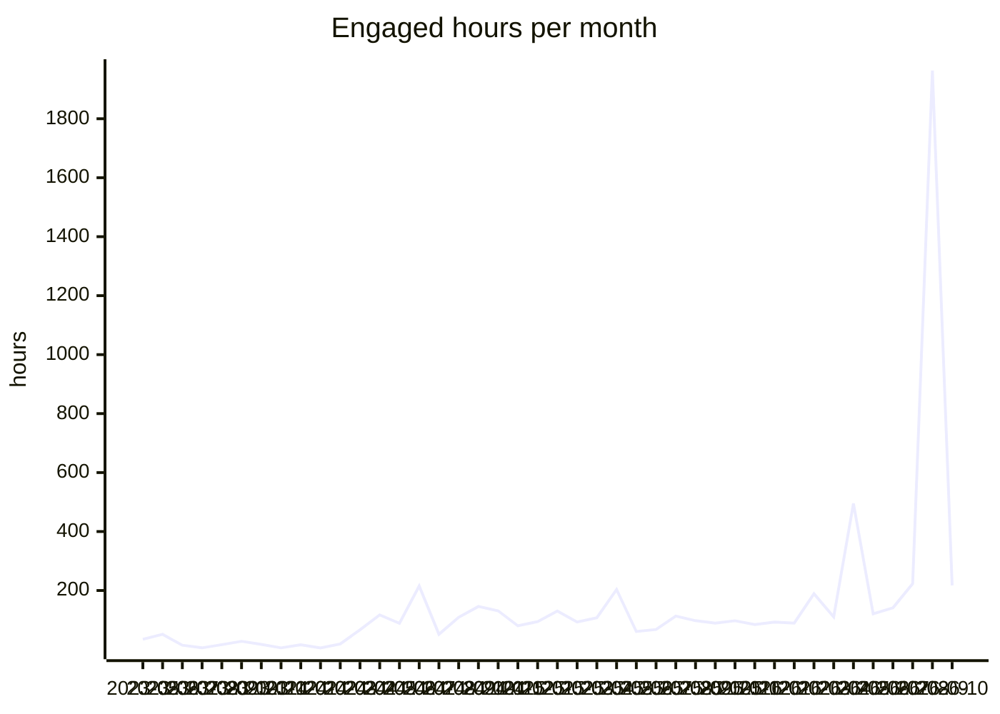

# VFB usage report

Generated 2026-10-09 from aggregate Google Analytics 4 counts for property 375054915, covering 2023-05-10 to 2026-10-08. Source tables: [`analytics/ga4/`](analytics/ga4/). Only summed counts are stored; nothing here identifies a user.

**Reading the numbers.** A large and growing share of 'users' and 'sessions' is automated traffic that loads one page and leaves within a second. Engaged hours (time with the page in the foreground) is barely touched by that traffic and is the most reliable measure of real use; seconds per session shows how bot-heavy a row is.

## Yearly totals

| year | peak monthly users | sessions | screenPageViews | engaged hours | sec/session |
|---|---|---|---|---|---|
| 2023 | 1,332 | 13,668 | 42,490 | 172.9 | 45.5 |
| 2024 | 4,045 | 62,091 | 465,976 | 1,046.3 | 60.7 |
| 2025 | 53,078 | 174,980 | 961,769 | 1,240.7 | 25.5 |
| 2026 | 330,801 | 1,309,310 | 3,481,207 | 3,643.7 | 10.0 |

## Monthly trend

| month | activeUsers | newUsers | sessions | screenPageViews | engaged hours | sec/session |
|---|---|---|---|---|---|---|
| 2024-11 | 2,756 | 2,307 | 7,746 | 71,342 | 131.2 | 61.0 |
| 2024-12 | 2,996 | 2,325 | 6,433 | 42,248 | 80.3 | 45.0 |
| 2025-01 | 2,711 | 1,830 | 7,149 | 57,703 | 94.5 | 47.6 |
| 2025-02 | 2,483 | 1,473 | 6,460 | 69,682 | 130.5 | 72.7 |
| 2025-03 | 2,594 | 1,923 | 7,298 | 70,667 | 93.3 | 46.0 |
| 2025-04 | 2,961 | 2,158 | 5,752 | 46,050 | 107.5 | 67.3 |
| 2025-05 | 2,634 | 1,976 | 5,584 | 49,953 | 203.4 | 131.1 |
| 2025-06 | 2,044 | 1,803 | 5,615 | 39,033 | 60.9 | 39.0 |
| 2025-07 | 1,950 | 1,514 | 6,599 | 43,636 | 67.9 | 37.0 |
| 2025-08 | 3,396 | 3,134 | 8,653 | 67,983 | 113.5 | 47.2 |
| 2025-09 | 8,753 | 10,370 | 15,167 | 293,319 | 97.7 | 23.2 |
| 2025-10 | 15,773 | 15,259 | 19,431 | 62,052 | 89.3 | 16.5 |
| 2025-11 | 53,078 | 51,557 | 55,532 | 92,601 | 97.5 | 6.3 |
| 2025-12 | 27,089 | 26,632 | 30,314 | 69,090 | 84.8 | 10.1 |
| 2026-01 | 35,882 | 35,655 | 41,654 | 84,515 | 93.1 | 8.0 |
| 2026-02 | 33,896 | 33,815 | 38,136 | 81,618 | 89.5 | 8.5 |
| 2026-03 | 90,461 | 89,967 | 95,391 | 204,564 | 189.0 | 7.1 |
| 2026-04 | 81,384 | 81,647 | 85,778 | 152,209 | 110.6 | 4.6 |
| 2026-05 | 330,801 | 328,117 | 328,909 | 419,823 | 495.2 | 5.4 |
| 2026-06 | 118,372 | 120,130 | 125,861 | 215,401 | 120.8 | 3.5 |
| 2026-07 | 202,893 | 200,564 | 203,206 | 285,273 | 141.3 | 2.5 |
| 2026-08 | 114,152 | 116,038 | 121,133 | 261,249 | 223.3 | 6.6 |
| 2026-09 | 180,888 | 183,665 | 230,953 | 1,586,357 | 1,963.3 | 30.6 |
| 2026-10 | 34,002 | 33,254 | 38,675 | 190,198 | 217.5 | 20.2 |

## By site, last 12 months

Page views with no host name are the v2 viewer's in-app term changes and are counted under the viewer.

| site | sessions | screenPageViews | engaged hours | sec/session |
|---|---|---|---|---|
| v2 viewer | 554,723 | 2,509,615 | 2,446.0 | 15.9 |
| www / docs | 716,212 | 805,774 | 944.7 | 4.7 |
| other VFB services | 192,656 | 203,404 | 451.6 | 8.4 |
| CATMAID | 38,217 | 38,057 | 38.7 | 3.6 |
| other / mirrors | 83,422 | 8,202 | 18.4 | 0.8 |
| legacy Edinburgh hosts | 139,411 | 139,869 | 15.8 | 0.4 |
| VFBchat | 25 | 29 | 0.0 | 0.4 |

## Countries, last 12 months

Ranked by engaged hours. 210 countries in total.

| country | users (sum of months) | sessions | engaged hours | sec/session |
|---|---|---|---|---|
| United States | 105,864 | 145,317 | 1,243.3 | 30.8 |
| United Kingdom | 15,300 | 25,231 | 634.2 | 90.5 |
| Germany | 13,610 | 21,403 | 182.2 | 30.7 |
| India | 13,891 | 16,760 | 173.5 | 37.3 |
| Puerto Rico | 214 | 1,641 | 154.6 | 339.1 |
| China | 233,284 | 236,349 | 133.5 | 2.0 |
| Canada | 7,106 | 10,528 | 97.4 | 33.3 |
| Brazil | 18,402 | 19,932 | 78.0 | 14.1 |
| Russia | 5,917 | 7,589 | 70.8 | 33.6 |
| Australia | 3,701 | 5,609 | 65.1 | 41.8 |
| Singapore | 797,493 | 791,582 | 60.2 | 0.3 |
| Japan | 9,365 | 11,283 | 54.4 | 17.3 |
| Türkiye | 4,973 | 6,201 | 46.0 | 26.7 |
| France | 3,979 | 5,445 | 44.0 | 29.1 |
| Mexico | 6,201 | 6,947 | 43.3 | 22.5 |
| Poland | 3,282 | 4,312 | 41.0 | 34.2 |
| Spain | 2,835 | 3,795 | 37.5 | 35.6 |
| Italy | 2,380 | 3,016 | 34.1 | 40.7 |
| South Korea | 1,493 | 2,906 | 32.3 | 40.1 |
| Pakistan | 4,055 | 4,272 | 30.5 | 25.7 |
| Indonesia | 12,378 | 12,910 | 29.5 | 8.2 |
| Netherlands | 3,038 | 3,744 | 28.4 | 27.3 |
| Chile | 2,448 | 2,947 | 26.9 | 32.9 |
| (not set) | 937 | 895 | 26.5 | 106.5 |
| Philippines | 4,720 | 5,036 | 23.9 | 17.1 |
| Argentina | 4,593 | 5,014 | 22.8 | 16.4 |
| Israel | 1,465 | 2,110 | 22.7 | 38.7 |
| Taiwan | 896 | 1,563 | 21.5 | 49.6 |
| Ukraine | 3,469 | 3,945 | 19.3 | 17.6 |
| Thailand | 2,057 | 2,447 | 17.6 | 25.8 |

## Cities, last 12 months

GA4 has no institution or network dimension, so city is the nearest proxy for where labs are. Cities with fewer than 5 users in a month are not stored. Data-centre cities (Ashburn, Council Bluffs, Singapore and similar) show up with near-zero seconds per session.

| city | country | months seen | sessions | engaged hours | sec/session |
|---|---|---|---|---|---|
| Dunblane | United Kingdom | 1 | 84 | 361.1 | 15,475.0 |
| San Juan | Puerto Rico | 6 | 688 | 51.8 | 270.8 |
| Singapore | Singapore | 13 | 771,091 | 51.0 | 0.2 |
| London | United Kingdom | 13 | 4,637 | 39.6 | 30.7 |
| New York | United States | 13 | 4,045 | 33.4 | 29.7 |
| Los Angeles | United States | 13 | 2,772 | 27.3 | 35.5 |
| Chicago | United States | 13 | 5,109 | 26.1 | 18.4 |
| Frederick | United States | 1 | 17 | 24.7 | 5,235.5 |
| Munich | Germany | 11 | 462 | 24.4 | 189.8 |
| Moscow | Russia | 11 | 2,217 | 23.5 | 38.2 |
| Bengaluru | India | 11 | 1,796 | 21.6 | 43.4 |
| Karachi | Pakistan | 9 | 862 | 21.0 | 87.7 |
| Cambridge | United Kingdom | 13 | 1,832 | 18.8 | 36.9 |
| Istanbul | Türkiye | 12 | 2,120 | 17.2 | 29.2 |
| San Jose | United States | 13 | 4,347 | 16.8 | 13.9 |
| Cologne | Germany | 11 | 715 | 16.0 | 80.4 |
| Sydney | Australia | 9 | 1,689 | 15.9 | 33.9 |
| Phoenix | United States | 9 | 3,870 | 15.4 | 14.3 |
| Miami | United States | 10 | 660 | 15.2 | 83.1 |
| Toronto | Canada | 13 | 1,516 | 14.8 | 35.1 |
| Boston | United States | 13 | 1,884 | 14.6 | 28.0 |
| Santiago | Chile | 11 | 1,571 | 14.5 | 33.1 |
| Edinburgh | United Kingdom | 10 | 369 | 14.3 | 139.9 |
| Athens | United States | 4 | 318 | 14.0 | 157.9 |
| Melbourne | Australia | 9 | 1,277 | 13.9 | 39.1 |
| Houston | United States | 13 | 1,877 | 13.8 | 26.5 |
| Dallas | United States | 13 | 1,619 | 13.8 | 30.6 |
| Flint Hill | United States | 7 | 4,081 | 13.4 | 11.8 |
| Atlanta | United States | 12 | 1,030 | 12.8 | 44.9 |
| Philadelphia | United States | 13 | 1,215 | 12.5 | 36.9 |
| Hong Kong | Hong Kong | 13 | 13,045 | 12.0 | 3.3 |
| Shanghai | China | 13 | 7,668 | 11.6 | 5.5 |
| Seoul | South Korea | 13 | 1,037 | 11.5 | 40.0 |
| Warsaw | Poland | 13 | 1,433 | 11.4 | 28.8 |
| Brisbane | Australia | 8 | 831 | 11.2 | 48.6 |
| Berlin | Germany | 13 | 983 | 11.2 | 41.0 |
| Rostock | Germany | 2 | 144 | 10.7 | 268.7 |
| Paris | France | 13 | 1,044 | 10.4 | 35.9 |
| Beijing | China | 13 | 2,484 | 10.3 | 14.9 |
| Seattle | United States | 12 | 1,214 | 9.9 | 29.3 |
| Vienna | Austria | 13 | 642 | 9.9 | 55.3 |
| Shenzhen | China | 13 | 1,794 | 9.8 | 19.6 |
| Mexico City | Mexico | 10 | 1,320 | 9.2 | 25.0 |
| Mumbai | India | 12 | 890 | 8.9 | 35.9 |
| Ashburn | United States | 13 | 4,859 | 8.8 | 6.5 |
| Sao Paulo | Brazil | 11 | 1,725 | 8.7 | 18.2 |
| Bangkok | Thailand | 8 | 1,079 | 8.5 | 28.5 |
| San Francisco | United States | 11 | 1,350 | 8.5 | 22.7 |
| Delhi | India | 9 | 1,081 | 8.3 | 27.6 |
| Des Moines | United States | 10 | 3,012 | 8.1 | 9.6 |

## Most viewed terms

Taken from the term id in viewer URLs and `/reports/` and `/term/` pages. The adult brain template leads because it is the default scene, not because people search for it.

### Last 30 days

| term | label | views | engaged hours | days seen |
|---|---|---|---|---|
| VFB_00101567 | JRC2018Unisex | 495,081 | 859.1 | 30 |
| FBbt_00003624 | adult brain | 60,409 | 30.1 | 30 |
| FBbt_00003748 | medulla | 46,319 | 21.3 | 30 |
| FBbt_00003681 | adult lateral accessory lobe | 40,153 | 15.9 | 30 |
| FBbt_00040041 | vest | 34,386 | 12.2 | 30 |
| FBbt_00005093 | nervous system | 28,846 | 11.8 | 30 |
| FBbt_00045048 | saddle | 27,485 | 8.6 | 30 |
| FBbt_00040043 | anterior ventrolateral protocerebrum | 27,358 | 11.5 | 30 |
| FBbt_00003004 | adult | 26,441 | 10.0 | 30 |
| FBbt_00003680 | nodulus | 25,618 | 4.6 | 30 |
| FBbt_00047887 | adult central brain | 20,594 | 5.1 | 30 |
| FBbt_00040042 | posterior ventrolateral protocerebrum | 19,846 | 7.0 | 30 |
| FBbt_00003678 | ellipsoid body | 14,780 | 6.0 | 30 |
| FBbt_00014013 | adult gnathal ganglion | 14,633 | 5.3 | 30 |
| FBbt_00045027 | wedge | 14,390 | 5.1 | 30 |
| VFB_00108w0p | BANC:brain_neuropil on JRC2018Unisex | 13,703 | 5.7 | 30 |
| FBbt_00007050 | adult cerebrum | 12,062 | 3.0 | 30 |
| FBbt_00045050 | flange | 10,655 | 3.9 | 30 |
| FBbt_00003632 | adult central complex | 10,141 | 2.2 | 30 |
| VFB_00102107 | ME on JRC2018Unisex adult brain | 9,769 | 4.3 | 30 |
| VFB_00102140 | LAL on JRC2018Unisex adult brain | 9,614 | 3.1 | 30 |
| FBbt_00003679 | fan-shaped body | 9,026 | 3.4 | 30 |
| FBbt_00110636 | adult cerebral ganglion | 9,024 | 2.6 | 30 |
| VFB_00102212 | VES on JRC2018Unisex adult brain | 8,967 | 3.1 | 30 |
| FBbt_00053384 | adult primary visual center | 8,826 | 3.6 | 30 |

### Last 12 months

| term | label | views | engaged hours | days seen |
|---|---|---|---|---|
| VFB_00101567 | JRC2018Unisex | 749,018 | 1,511.6 | 365 |
| FBbt_00003624 | adult brain | 69,885 | 41.6 | 329 |
| FBbt_00003748 | medulla | 59,839 | 36.5 | 342 |
| FBbt_00003681 | adult lateral accessory lobe | 48,562 | 26.4 | 336 |
| FBbt_00040041 | vest | 41,464 | 21.4 | 322 |
| FBbt_00005093 | nervous system | 34,871 | 18.3 | 300 |
| FBbt_00040043 | anterior ventrolateral protocerebrum | 34,290 | 18.2 | 294 |
| FBbt_00045048 | saddle | 32,841 | 14.8 | 299 |
| FBbt_00003680 | nodulus | 30,919 | 7.7 | 242 |
| FBbt_00003004 | adult | 30,893 | 14.9 | 278 |
| FBbt_00047887 | adult central brain | 24,938 | 8.6 | 274 |
| FBbt_00040042 | posterior ventrolateral protocerebrum | 23,492 | 11.4 | 279 |
| FBbt_00003678 | ellipsoid body | 19,050 | 12.3 | 283 |
| VFB_jrchk7yg | WEDPN2A_R (FlyEM-HB:885788485) | 18,261 | 5.6 | 143 |
| FBbt_00014013 | adult gnathal ganglion | 18,099 | 11.9 | 272 |
| FBbt_00045027 | wedge | 17,357 | 8.1 | 272 |
| VFB_00050000 | L1 larval CNS ssTEM - Cardona/Janelia | 16,902 | 28.0 | 319 |
| FBbt_00007050 | adult cerebrum | 15,216 | 5.8 | 257 |
| VFB_00102107 | ME on JRC2018Unisex adult brain | 14,304 | 10.4 | 237 |
| VFB_00108w0p | BANC:brain_neuropil on JRC2018Unisex | 13,751 | 5.7 | 32 |
| FBbt_00045050 | flange | 12,967 | 6.2 | 237 |
| FBbt_00003632 | adult central complex | 12,320 | 4.3 | 194 |
| VFB_00102140 | LAL on JRC2018Unisex adult brain | 12,053 | 5.3 | 185 |
| FBbt_00110636 | adult cerebral ganglion | 11,840 | 4.4 | 238 |
| FBbt_00003679 | fan-shaped body | 11,702 | 6.4 | 256 |

### All time

| term | label | views | engaged hours | days seen |
|---|---|---|---|---|
| VFB_00101567 | JRC2018Unisex | 941,238 | 1,741.1 | 967 |
| FBbt_00003624 | adult brain | 82,756 | 64.6 | 854 |
| FBbt_00003748 | medulla | 69,259 | 56.6 | 845 |
| FBbt_00003681 | adult lateral accessory lobe | 54,901 | 40.1 | 817 |
| FBbt_00040041 | vest | 47,530 | 32.5 | 789 |
| FBbt_00040043 | anterior ventrolateral protocerebrum | 39,415 | 27.8 | 712 |
| FBbt_00045048 | saddle | 37,124 | 23.3 | 723 |
| FBbt_00005093 | nervous system | 36,383 | 20.6 | 425 |
| FBbt_00003004 | adult | 33,206 | 17.3 | 465 |
| FBbt_00003680 | nodulus | 32,643 | 11.4 | 518 |
| FBbt_00047887 | adult central brain | 29,391 | 14.9 | 639 |
| FBbt_00040042 | posterior ventrolateral protocerebrum | 26,713 | 18.3 | 665 |
| VFB_00050000 | L1 larval CNS ssTEM - Cardona/Janelia | 24,486 | 40.7 | 785 |
| FBbt_00003678 | ellipsoid body | 22,029 | 18.7 | 624 |
| FBbt_00014013 | adult gnathal ganglion | 21,720 | 19.9 | 624 |
| FBbt_00045027 | wedge | 19,954 | 14.1 | 620 |
| VFB_jrchk7yg | WEDPN2A_R (FlyEM-HB:885788485) | 18,432 | 6.4 | 156 |
| FBbt_00007050 | adult cerebrum | 17,974 | 9.9 | 538 |
| VFB_00102107 | ME on JRC2018Unisex adult brain | 17,892 | 15.0 | 514 |
| VFB_00030867 | adult mushroom body on adult brain template JFRC2 | 16,925 | 13.0 | 430 |
| FBbt_00003679 | fan-shaped body | 16,814 | 12.3 | 580 |
| FBbt_00045050 | flange | 14,900 | 10.5 | 519 |
| VFB_00102140 | LAL on JRC2018Unisex adult brain | 14,647 | 8.8 | 406 |
| FBbt_00110636 | adult cerebral ganglion | 14,307 | 7.4 | 524 |
| FBbt_00003632 | adult central complex | 14,191 | 7.9 | 392 |

### Templates in use, last 12 months

| template | label | views |
|---|---|---|
| VFB_00101567 | JRC2018Unisex | 1,226,697 |
| VFB_00050000 | L1 larval CNS ssTEM - Cardona/Janelia | 32,934 |
| VFB_00017894 | adult brain template JFRC2 | 18,059 |
| VFB_00200000 | JRC2018UnisexVNC | 12,350 |
| VFB_00049000 | L3 CNS template - Wood2018 | 8,876 |
| VFB_00110000 | Adult Head (McKellar2020) | 3,200 |
| VFB_00101384 | JRC_FlyEM_Hemibrain | 2,276 |
| FBbt_00003624 | adult brain | 1,383 |
| VFB_00120000 | Adult T1 Leg (Kuan2020) | 1,329 |
| VFB_00030786 | adult brain template Ito2014 | 917 |

## Website and documentation pages, last 12 months

| pagePath | screenPageViews | engaged hours |
|---|---|---|
| / | 178,514 | 543.8 |
| /docs/ | 16,951 | 38.7 |
| /about/ | 5,761 | 25.3 |
| /blog/releases/catmaid/ | 511 | 22.1 |
| /docs/overview/ | 3,711 | 21.3 |
| /docs/data/ | 5,578 | 18.4 |
| /docs/tutorials/vfb-mcp-guide/ | 1,640 | 9.5 |
| /docs/website-features/3dviewer/ | 2,384 | 9.0 |
| /hosted/ | 2,664 | 5.3 |
| /docs/tutorials/ | 2,252 | 5.2 |
| /about/whichfly/ | 440 | 4.7 |
| /docs/contribution-guidelines/ | 1,169 | 4.6 |
| /docs/concepts/flylight_tiles/ | 579 | 3.4 |
| /docs/apis/ | 669 | 3.4 |
| /docs/tutorials/apis/ | 733 | 3.4 |
| /about/hosted/ | 951 | 3.1 |
| /blog/news/ | 1,384 | 3.0 |
| /docs/website-features/search_query/ | 712 | 3.0 |
| /blog/2026/09/06/vfb-self-led-learning-sessions-a-free-online-workshop-open-to-everyone/ | 906 | 2.8 |
| /docs/website-features/ | 948 | 2.6 |
| /docs/concepts/ | 528 | 2.5 |
| /docs/data/em/ | 415 | 2.2 |
| /docs/concepts/neuron-counts/ | 268 | 2.2 |
| /docs/tutorials/apis/vfb_api_overview/ | 332 | 2.1 |
| /docs/concepts/cell_types/ | 351 | 2.1 |
| /docs/tutorials/website/similarityscore/ | 320 | 2.0 |
| /search/ | 591 | 2.0 |
| /docs/concepts/bridging/ | 217 | 1.9 |
| /docs/tools/ | 363 | 1.9 |
| /docs/data/connectivity/ | 267 | 1.8 |

## How people arrive

Engaged sessions by channel and year.

| channel | 2023 | 2024 | 2025 | 2026 |
|---|---|---|---|---|
| AI Assistant | 0 | 0 | 0 | 2,304 |
| Direct | 1,628 | 10,737 | 124,445 | 1,110,151 |
| Organic Search | 3,198 | 18,605 | 30,520 | 171,173 |
| Organic Shopping | 0 | 3 | 2 | 0 |
| Organic Social | 7 | 454 | 125 | 1,353 |
| Organic Video | 0 | 2 | 0 | 40 |
| Referral | 495 | 18,973 | 11,071 | 8,679 |
| Unassigned | 0 | 6 | 60 | 1,467 |

Top sources, last 12 months.

| sessionSource | sessions | engaged hours |
|---|---|---|
| google | 167,348 | 2,114.5 |
| (direct) | 1,205,342 | 1,166.7 |
| bing | 11,296 | 239.0 |
| (not set) | 9,109 | 52.8 |
| chatgpt.com | 2,710 | 39.2 |
| yahoo | 708 | 29.9 |
| cn.bing.com | 799 | 27.7 |
| duckduckgo | 2,338 | 27.2 |
| splitgal4.janelia.org | 1,581 | 15.7 |
| flybase.org | 960 | 15.7 |
| codex.flywire.ai | 1,944 | 14.2 |
| gemini.google.com | 520 | 12.0 |
| ecosia.org | 729 | 8.9 |
| github.com | 606 | 8.7 |
| moodle.carleton.edu | 120 | 6.3 |
| science.org | 163 | 6.2 |
| trafficheap.cc | 502 | 5.8 |
| trafficheap.com | 502 | 5.8 |
| en.wikipedia.org | 323 | 5.3 |
| janelia.org | 241 | 4.6 |
| neuronbridge.janelia.org | 124 | 4.3 |
| search.brave.com | 256 | 4.0 |
| yandex.ru | 241 | 3.9 |
| doubao.com | 79 | 3.4 |
| flweb.janelia.org | 223 | 3.3 |

## Queries run in the viewer, last 12 months

| query | runs |
|---|---|
| allalignedimages | 3,726 |
| imagesneurons | 1,117 |
| alldatasets | 560 |
| aligneddatasets | 547 |
| neuronsparthere | 468 |
| listallavailableimages | 431 |
| painteddomains | 250 |
| partsof | 245 |
| neuronssynaptic | 135 |
| subclassesof | 122 |
| neuronneuronconnectivit | 103 |
| datasetimages | 92 |
| neuronspresynaptichere | 87 |
| neuronspostsynaptichere | 86 |
| transgeneexpressionhere | 62 |
| expressioncluster | 53 |
| tractsnervesinnervating | 49 |
| similarmorphologyto | 40 |
| lineageclonesin | 33 |
| findstocks | 32 |
| termsforpub | 28 |
| upstreamclassconnectivi | 23 |
| anatscrnaseqquery | 19 |
| neuronregionconnectivit | 19 |
| splitstargeting | 15 |

## VFBchat and MCP

| month | chat_query | mcp_tool_call |
|---|---|---|
| 2026-02 | 70 | 492 |
| 2026-03 | 354 | 2,258 |
| 2026-04 | 575 | 7,992 |
| 2026-05 | 17 | 971 |
| 2026-06 | 358 | 30,858 |
| 2026-07 | 9 | 18,938 |
| 2026-08 | 1,017 | 89,583 |
| 2026-09 | 797 | 84,835 |
| 2026-10 | 59 | 1,690 |

## Viewer reliability

| month | session_start | disconnected | reconnected-resumed | reconnect-failed-reloading | reconnect-exhausted | disconnects per 100 sessions |
|---|---|---|---|---|---|---|
| 2025-05 | 2,675 | 1,436 | 0 | 101 | 0 | 53.7 |
| 2025-06 | 3,466 | 1,365 | 0 | 12 | 0 | 39.4 |
| 2025-07 | 4,662 | 2,057 | 0 | 18 | 0 | 44.1 |
| 2025-08 | 6,571 | 1,680 | 0 | 17 | 0 | 25.6 |
| 2025-09 | 6,265 | 1,170 | 0 | 24 | 0 | 18.7 |
| 2025-10 | 7,777 | 1,232 | 0 | 17 | 0 | 15.8 |
| 2025-11 | 8,460 | 1,163 | 0 | 24 | 0 | 13.7 |
| 2025-12 | 10,434 | 1,359 | 0 | 8 | 0 | 13.0 |
| 2026-01 | 21,913 | 1,530 | 0 | 30 | 0 | 7.0 |
| 2026-02 | 24,790 | 1,536 | 0 | 31 | 0 | 6.2 |
| 2026-03 | 23,808 | 5,059 | 0 | 465 | 0 | 21.2 |
| 2026-04 | 23,996 | 2,933 | 0 | 33 | 0 | 12.2 |
| 2026-05 | 55,407 | 2,314 | 0 | 44 | 0 | 4.2 |
| 2026-06 | 23,505 | 2,149 | 0 | 158 | 0 | 9.1 |
| 2026-07 | 45,208 | 2,280 | 0 | 49 | 0 | 5.0 |
| 2026-08 | 24,841 | 3,675 | 0 | 530 | 0 | 14.8 |
| 2026-09 | 51,588 | 75,199 | 30,436 | 38,791 | 1,919 | 145.8 |
| 2026-10 | 9,115 | 10,437 | 3,770 | 6,338 | 118 | 114.5 |

Load times from the timing suffix on viewer events (months with at least 100 samples).

| month | event | n | median s | p95 s |
|---|---|---|---|---|
| 2026-09 | direct-geom:obj:ok | 61,923 | 1.4 | 25.4 |
| 2026-10 | direct-geom:obj:ok | 17,400 | 1.6 | 54.4 |
| 2026-09 | direct-terminfo:ok | 109,210 | 0.4 | 3.0 |
| 2026-10 | direct-terminfo:ok | 32,406 | 0.4 | 3.2 |
| 2026-09 | startup-first-term | 50,164 | 5.2 | 58.0 |
| 2026-10 | startup-first-term | 14,225 | 5.2 | 58.0 |
| 2026-09 | startup-model | 54,086 | 2.8 | 25.0 |
| 2026-10 | startup-model | 15,512 | 2.8 | 10.0 |
| 2026-09 | term-load:ok | 104,726 | 1.0 | 45.0 |
| 2026-10 | term-load:ok | 30,414 | 0.9 | 55.0 |

## Outbound links clicked, last 12 months

| linkDomain | clicks |
|---|---|
| neuronbridge.janelia.org | 1,415 |
| pypi.org | 1,208 |
| virtualflybrain.org | 979 |
| github.com | 830 |
| v2.virtualflybrain.org | 638 |
| insectbraindb.org | 553 |
| flweb.janelia.org | 429 |
| colab.research.google.com | 339 |
| translate.google.com | 307 |
| doi.org | 287 |
| flybase.org | 187 |
| virtualflybrain.bsky.social | 78 |
| chat.virtualflybrain.org | 78 |
| codex.flywire.ai | 73 |
| google.com | 57 |
| vfb3-mcp.virtualflybrain.org | 51 |
| neurofly.org | 48 |
| neuprint.janelia.org | 41 |
| janelia.org | 40 |
| facebook.com | 23 |

## Devices and browsers, last 12 months

| deviceCategory | browser | sessions | engaged hours |
|---|---|---|---|
| desktop | Chrome | 1,277,685 | 2,428.0 |
| desktop | Edge | 18,458 | 398.0 |
| mobile | Chrome | 42,480 | 302.5 |
| desktop | Safari | 13,188 | 191.8 |
| desktop | Firefox | 10,892 | 188.8 |
| desktop | Opera | 12,652 | 152.6 |
| mobile | Safari | 29,917 | 142.8 |
| tablet | Chrome | 2,344 | 31.2 |
| tablet | Safari | 861 | 10.4 |
| mobile | Firefox | 1,158 | 10.1 |
| mobile | Samsung Internet | 1,378 | 9.9 |
| desktop | YaBrowser | 484 | 7.6 |

## What this data cannot show

- **Institutions.** GA4 dropped the network-domain dimension and never exposes IP addresses. City is as close as it gets.
- **Search terms typed into VFB.** The viewer does not send a `search` event, so `searchTerm` is empty. Term popularity above comes from term ids in URLs.
- **Event detail.** No custom dimensions are registered on the property, so event parameters (`event_label`, `event_category`, and the VFBchat and MCP parameters such as tool name and topic) are discarded from reports. Registration is not retroactive.
- **Yearly unique users.** Users do not add up across days or months; only daily and monthly uniques are stored.
