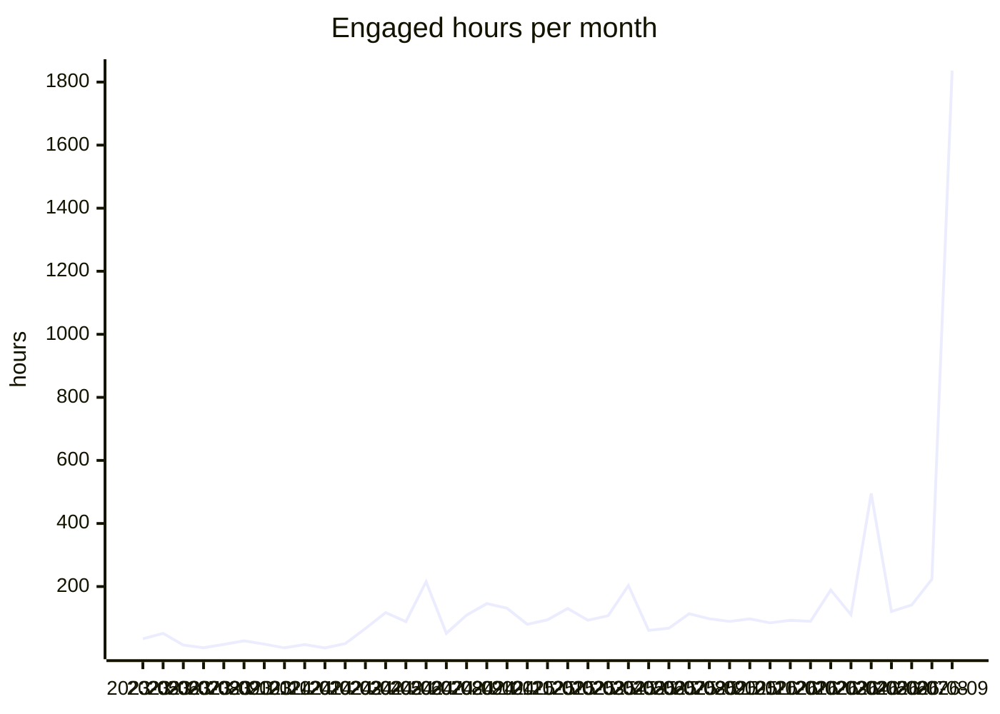
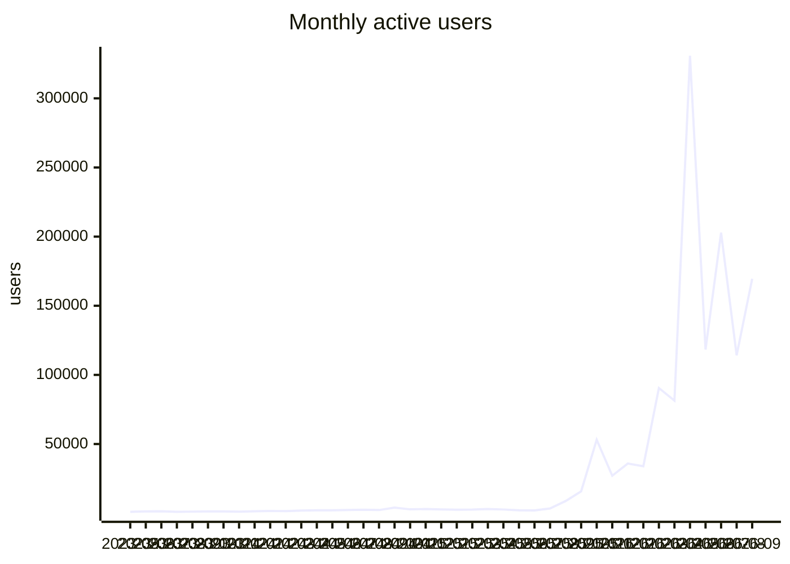

# VFB usage report

Generated 2026-09-28 from aggregate Google Analytics 4 counts for property 375054915, covering 2023-05-10 to 2026-09-27. Source tables: [`analytics/ga4/`](analytics/ga4/). Only summed counts are stored; nothing here identifies a user.

**Reading the numbers.** A large and growing share of 'users' and 'sessions' is automated traffic that loads one page and leaves within a second. Engaged hours (time with the page in the foreground) is barely touched by that traffic and is the most reliable measure of real use; seconds per session shows how bot-heavy a row is.

## Yearly totals

| year | peak monthly users | sessions | screenPageViews | engaged hours | sec/session |
|---|---|---|---|---|---|
| 2023 | 1,332 | 13,668 | 42,490 | 172.9 | 45.5 |
| 2024 | 4,045 | 62,091 | 465,976 | 1,046.3 | 60.7 |
| 2025 | 53,078 | 174,980 | 961,769 | 1,240.7 | 25.5 |
| 2026 | 330,801 | 1,256,099 | 3,203,567 | 3,299.3 | 9.5 |

## Monthly trend

| month | activeUsers | newUsers | sessions | screenPageViews | engaged hours | sec/session |
|---|---|---|---|---|---|---|
| 2024-10 | 4,045 | 3,373 | 9,268 | 83,842 | 145.8 | 56.6 |
| 2024-11 | 2,756 | 2,307 | 7,746 | 71,342 | 131.2 | 61.0 |
| 2024-12 | 2,996 | 2,325 | 6,433 | 42,248 | 80.3 | 45.0 |
| 2025-01 | 2,711 | 1,830 | 7,149 | 57,703 | 94.5 | 47.6 |
| 2025-02 | 2,483 | 1,473 | 6,460 | 69,682 | 130.5 | 72.7 |
| 2025-03 | 2,594 | 1,923 | 7,298 | 70,667 | 93.3 | 46.0 |
| 2025-04 | 2,961 | 2,158 | 5,752 | 46,050 | 107.5 | 67.3 |
| 2025-05 | 2,634 | 1,976 | 5,584 | 49,953 | 203.4 | 131.1 |
| 2025-06 | 2,044 | 1,803 | 5,615 | 39,033 | 60.9 | 39.0 |
| 2025-07 | 1,950 | 1,514 | 6,599 | 43,636 | 67.9 | 37.0 |
| 2025-08 | 3,396 | 3,134 | 8,653 | 67,983 | 113.5 | 47.2 |
| 2025-09 | 8,753 | 10,370 | 15,167 | 293,319 | 97.7 | 23.2 |
| 2025-10 | 15,773 | 15,259 | 19,431 | 62,052 | 89.3 | 16.5 |
| 2025-11 | 53,078 | 51,557 | 55,532 | 92,601 | 97.5 | 6.3 |
| 2025-12 | 27,089 | 26,632 | 30,314 | 69,090 | 84.8 | 10.1 |
| 2026-01 | 35,882 | 35,655 | 41,654 | 84,515 | 93.1 | 8.0 |
| 2026-02 | 33,896 | 33,815 | 38,136 | 81,618 | 89.5 | 8.5 |
| 2026-03 | 90,461 | 89,967 | 95,391 | 204,564 | 189.0 | 7.1 |
| 2026-04 | 81,384 | 81,647 | 85,778 | 152,209 | 110.6 | 4.6 |
| 2026-05 | 330,801 | 328,117 | 328,909 | 419,823 | 495.2 | 5.4 |
| 2026-06 | 118,372 | 120,130 | 125,861 | 215,401 | 120.8 | 3.5 |
| 2026-07 | 202,893 | 200,564 | 203,206 | 285,273 | 141.3 | 2.5 |
| 2026-08 | 114,152 | 116,038 | 121,133 | 261,249 | 223.3 | 6.6 |
| 2026-09 | 169,429 | 171,729 | 217,892 | 1,498,915 | 1,836.4 | 30.3 |

## By site, last 12 months

Page views with no host name are the v2 viewer's in-app term changes and are counted under the viewer.

| site | sessions | screenPageViews | engaged hours | sec/session |
|---|---|---|---|---|
| v2 viewer | 537,934 | 2,338,166 | 2,282.6 | 15.3 |
| www / docs | 687,561 | 916,357 | 848.9 | 4.4 |
| other VFB services | 193,414 | 254,116 | 465.8 | 8.7 |
| CATMAID | 38,240 | 42,396 | 35.7 | 3.4 |
| legacy Edinburgh hosts | 139,307 | 161,399 | 18.6 | 0.5 |
| other / mirrors | 82,906 | 8,180 | 16.8 | 0.7 |
| VFBchat | 11 | 15 | 0.0 | 0.8 |

## Countries, last 12 months

Ranked by engaged hours. 209 countries in total.

| country | users (sum of months) | sessions | engaged hours | sec/session |
|---|---|---|---|---|
| United States | 102,897 | 141,250 | 1,113.9 | 28.4 |
| United Kingdom | 14,251 | 23,832 | 618.6 | 93.4 |
| Germany | 13,113 | 21,339 | 176.9 | 29.8 |
| India | 13,217 | 16,088 | 164.6 | 36.8 |
| Puerto Rico | 206 | 1,631 | 154.8 | 341.7 |
| China | 217,323 | 221,008 | 140.6 | 2.3 |
| Canada | 6,553 | 9,703 | 86.7 | 32.2 |
| Brazil | 17,974 | 19,362 | 72.4 | 13.5 |
| Russia | 5,616 | 7,064 | 64.9 | 33.1 |
| Australia | 3,392 | 5,192 | 60.1 | 41.7 |
| Singapore | 788,781 | 783,176 | 59.5 | 0.3 |
| Japan | 9,300 | 11,325 | 53.9 | 17.1 |
| Türkiye | 4,780 | 5,864 | 43.2 | 26.5 |
| France | 3,891 | 5,363 | 42.2 | 28.3 |
| Poland | 3,040 | 3,941 | 38.1 | 34.8 |
| Mexico | 5,919 | 6,573 | 37.7 | 20.7 |
| South Korea | 1,415 | 2,785 | 36.8 | 47.6 |
| Spain | 2,666 | 3,581 | 35.7 | 35.9 |
| Italy | 2,261 | 2,837 | 31.9 | 40.5 |
| Pakistan | 3,975 | 4,165 | 29.7 | 25.7 |
| Indonesia | 12,172 | 12,651 | 26.9 | 7.7 |
| (not set) | 955 | 913 | 26.4 | 104.0 |
| Netherlands | 2,855 | 3,443 | 25.5 | 26.6 |
| Philippines | 4,570 | 4,854 | 21.9 | 16.2 |
| Israel | 1,394 | 2,023 | 21.7 | 38.6 |
| Chile | 2,253 | 2,690 | 21.5 | 28.7 |
| Taiwan | 876 | 1,563 | 21.3 | 49.1 |
| Argentina | 4,430 | 4,768 | 19.1 | 14.4 |
| Ukraine | 3,351 | 3,777 | 18.2 | 17.4 |
| Austria | 685 | 1,191 | 18.2 | 55.0 |

## Cities, last 12 months

GA4 has no institution or network dimension, so city is the nearest proxy for where labs are. Cities with fewer than 5 users in a month are not stored. Data-centre cities (Ashburn, Council Bluffs, Singapore and similar) show up with near-zero seconds per session.

| city | country | months seen | sessions | engaged hours | sec/session |
|---|---|---|---|---|---|
| Dunblane | United Kingdom | 1 | 84 | 361.1 | 15,475.0 |
| San Juan | Puerto Rico | 6 | 683 | 51.7 | 272.7 |
| Singapore | Singapore | 13 | 762,655 | 50.2 | 0.2 |
| London | United Kingdom | 13 | 4,395 | 37.0 | 30.3 |
| New York | United States | 13 | 3,791 | 32.3 | 30.6 |
| Los Angeles | United States | 13 | 2,795 | 25.7 | 33.1 |
| Chicago | United States | 13 | 4,645 | 24.3 | 18.8 |
| Munich | Germany | 10 | 436 | 24.2 | 199.9 |
| Moscow | Russia | 10 | 2,040 | 21.4 | 37.7 |
| Karachi | Pakistan | 8 | 840 | 20.8 | 89.2 |
| Bengaluru | India | 10 | 1,657 | 20.0 | 43.6 |
| Flint Hill | United States | 7 | 7,992 | 19.4 | 8.8 |
| Cambridge | United Kingdom | 13 | 1,852 | 19.0 | 36.8 |
| Seoul | South Korea | 13 | 1,017 | 16.7 | 59.3 |
| San Jose | United States | 13 | 4,096 | 16.5 | 14.5 |
| Cologne | Germany | 11 | 709 | 16.1 | 81.8 |
| Istanbul | Türkiye | 11 | 1,977 | 16.1 | 29.4 |
| Shenzhen | China | 13 | 1,812 | 15.4 | 30.5 |
| Miami | United States | 9 | 603 | 14.9 | 89.2 |
| Sydney | Australia | 9 | 1,583 | 14.7 | 33.5 |
| Shanghai | China | 13 | 7,865 | 14.5 | 6.6 |
| Hong Kong | Hong Kong | 13 | 13,376 | 14.3 | 3.8 |
| Boston | United States | 13 | 1,793 | 14.1 | 28.2 |
| Edinburgh | United Kingdom | 9 | 332 | 14.0 | 151.7 |
| Phoenix | United States | 8 | 3,379 | 14.0 | 14.9 |
| Toronto | Canada | 13 | 1,400 | 14.0 | 36.0 |
| Dallas | United States | 13 | 1,490 | 13.2 | 31.8 |
| Houston | United States | 13 | 1,796 | 12.7 | 25.4 |
| Melbourne | Australia | 8 | 1,151 | 12.7 | 39.7 |
| Athens | United States | 3 | 267 | 12.5 | 168.8 |
| Philadelphia | United States | 13 | 1,135 | 12.3 | 39.1 |
| Vienna | Austria | 13 | 636 | 12.2 | 68.9 |
| Atlanta | United States | 12 | 950 | 11.9 | 45.2 |
| Santiago | Chile | 10 | 1,428 | 11.5 | 29.0 |
| Berlin | Germany | 13 | 929 | 10.9 | 42.1 |
| Rostock | Germany | 2 | 144 | 10.7 | 268.7 |
| Warsaw | Poland | 13 | 1,314 | 10.5 | 28.9 |
| Beijing | China | 13 | 2,113 | 10.4 | 17.8 |
| Brisbane | Australia | 7 | 757 | 10.2 | 48.4 |
| Paris | France | 13 | 1,063 | 9.9 | 33.5 |
| Pune | India | 9 | 551 | 9.5 | 62.1 |
| Seattle | United States | 12 | 1,160 | 9.1 | 28.1 |
| Ashburn | United States | 13 | 4,665 | 8.9 | 6.9 |
| San Francisco | United States | 11 | 1,312 | 8.4 | 23.2 |
| Sao Paulo | Brazil | 11 | 1,672 | 8.3 | 18.0 |
| Mumbai | India | 11 | 828 | 8.1 | 35.3 |
| Delhi | India | 9 | 1,063 | 8.1 | 27.6 |
| Des Moines | United States | 10 | 2,901 | 8.0 | 9.9 |
| Mexico City | Mexico | 9 | 1,231 | 7.9 | 23.2 |
| Leipzig | Germany | 11 | 440 | 7.7 | 62.6 |

## Most viewed terms

Taken from the term id in viewer URLs and `/reports/` and `/term/` pages. The adult brain template leads because it is the default scene, not because people search for it.

### Last 30 days

| term | label | views | engaged hours | days seen |
|---|---|---|---|---|
| VFB_00101567 | JRC2018Unisex | 452,046 | 788.1 | 30 |
| FBbt_00003624 | adult brain | 47,022 | 22.6 | 30 |
| FBbt_00003748 | medulla | 41,592 | 19.1 | 30 |
| FBbt_00003681 | adult lateral accessory lobe | 36,715 | 14.6 | 30 |
| FBbt_00040041 | vest | 29,492 | 11.4 | 30 |
| FBbt_00040043 | anterior ventrolateral protocerebrum | 25,951 | 10.5 | 30 |
| FBbt_00045048 | saddle | 25,115 | 7.6 | 30 |
| FBbt_00005093 | nervous system | 25,088 | 9.9 | 30 |
| FBbt_00003004 | adult | 24,364 | 9.4 | 30 |
| FBbt_00003680 | nodulus | 22,074 | 4.2 | 30 |
| FBbt_00047887 | adult central brain | 19,009 | 4.9 | 30 |
| FBbt_00040042 | posterior ventrolateral protocerebrum | 18,351 | 6.4 | 30 |
| FBbt_00003678 | ellipsoid body | 13,563 | 5.2 | 29 |
| FBbt_00014013 | adult gnathal ganglion | 13,410 | 4.7 | 30 |
| FBbt_00045027 | wedge | 13,179 | 4.5 | 30 |
| FBbt_00007050 | adult cerebrum | 11,163 | 2.9 | 30 |
| VFB_00108w0p | BANC:brain_neuropil on JRC2018Unisex | 10,101 | 4.0 | 21 |
| FBbt_00045050 | flange | 9,746 | 3.3 | 29 |
| VFB_00102140 | LAL on JRC2018Unisex adult brain | 9,030 | 3.1 | 27 |
| FBbt_00003632 | adult central complex | 8,904 | 2.4 | 30 |
| VFB_00102107 | ME on JRC2018Unisex adult brain | 8,825 | 4.0 | 30 |
| FBbt_00003679 | fan-shaped body | 8,424 | 3.4 | 30 |
| VFB_00102212 | VES on JRC2018Unisex adult brain | 8,267 | 3.0 | 26 |
| FBbt_00110636 | adult cerebral ganglion | 8,262 | 2.5 | 29 |
| FBbt_00053384 | adult primary visual center | 7,980 | 3.4 | 30 |

### Last 12 months

| term | label | views | engaged hours | days seen |
|---|---|---|---|---|
| VFB_00101567 | JRC2018Unisex | 679,994 | 1,384.1 | 365 |
| FBbt_00003624 | adult brain | 56,143 | 33.8 | 327 |
| FBbt_00003748 | medulla | 53,070 | 33.9 | 341 |
| FBbt_00003681 | adult lateral accessory lobe | 43,144 | 24.3 | 336 |
| FBbt_00040041 | vest | 35,157 | 19.9 | 321 |
| FBbt_00040043 | anterior ventrolateral protocerebrum | 30,716 | 16.7 | 293 |
| FBbt_00005093 | nervous system | 30,275 | 16.2 | 299 |
| FBbt_00045048 | saddle | 29,399 | 13.6 | 297 |
| FBbt_00003004 | adult | 27,821 | 13.9 | 274 |
| FBbt_00003680 | nodulus | 24,834 | 7.1 | 237 |
| FBbt_00047887 | adult central brain | 22,399 | 8.1 | 270 |
| FBbt_00040042 | posterior ventrolateral protocerebrum | 21,159 | 10.6 | 275 |
| FBbt_00003678 | ellipsoid body | 17,219 | 11.2 | 279 |
| VFB_jrchk7yg | WEDPN2A_R (FlyEM-HB:885788485) | 17,003 | 5.5 | 132 |
| FBbt_00014013 | adult gnathal ganglion | 16,302 | 11.2 | 268 |
| VFB_00050000 | L1 larval CNS ssTEM - Cardona/Janelia | 16,066 | 26.3 | 317 |
| FBbt_00045027 | wedge | 15,418 | 7.3 | 269 |
| FBbt_00007050 | adult cerebrum | 13,774 | 5.5 | 251 |
| VFB_00102107 | ME on JRC2018Unisex adult brain | 12,920 | 9.9 | 232 |
| FBbt_00045050 | flange | 11,626 | 5.6 | 232 |
| VFB_00102140 | LAL on JRC2018Unisex adult brain | 11,155 | 5.7 | 178 |
| FBbt_00003632 | adult central complex | 10,664 | 4.0 | 186 |
| FBbt_00003679 | fan-shaped body | 10,630 | 6.1 | 249 |
| FBbt_00110636 | adult cerebral ganglion | 10,629 | 4.0 | 231 |
| VFB_00102282 | NO on JRC2018Unisex adult brain | 10,404 | 3.3 | 167 |

### All time

| term | label | views | engaged hours | days seen |
|---|---|---|---|---|
| VFB_00101567 | JRC2018Unisex | 869,730 | 1,610.3 | 956 |
| FBbt_00003624 | adult brain | 68,806 | 56.7 | 843 |
| FBbt_00003748 | medulla | 62,356 | 53.5 | 834 |
| FBbt_00003681 | adult lateral accessory lobe | 49,347 | 37.7 | 806 |
| FBbt_00040041 | vest | 41,136 | 31.0 | 778 |
| FBbt_00040043 | anterior ventrolateral protocerebrum | 35,782 | 26.3 | 701 |
| FBbt_00045048 | saddle | 33,637 | 22.0 | 712 |
| FBbt_00005093 | nervous system | 31,674 | 18.3 | 414 |
| FBbt_00003004 | adult | 30,078 | 16.3 | 454 |
| FBbt_00047887 | adult central brain | 26,792 | 14.3 | 628 |
| FBbt_00003680 | nodulus | 26,512 | 10.8 | 507 |
| FBbt_00040042 | posterior ventrolateral protocerebrum | 24,343 | 17.5 | 654 |
| VFB_00050000 | L1 larval CNS ssTEM - Cardona/Janelia | 23,474 | 38.7 | 774 |
| FBbt_00003678 | ellipsoid body | 20,152 | 17.6 | 613 |
| FBbt_00014013 | adult gnathal ganglion | 19,870 | 19.2 | 613 |
| FBbt_00045027 | wedge | 17,979 | 13.2 | 609 |
| VFB_jrchk7yg | WEDPN2A_R (FlyEM-HB:885788485) | 17,174 | 6.3 | 145 |
| FBbt_00007050 | adult cerebrum | 16,509 | 9.6 | 527 |
| VFB_00102107 | ME on JRC2018Unisex adult brain | 16,457 | 14.5 | 503 |
| VFB_00030867 | adult mushroom body on adult brain template JFRC2 | 16,396 | 12.8 | 419 |
| FBbt_00003679 | fan-shaped body | 15,720 | 12.0 | 569 |
| VFB_00102140 | LAL on JRC2018Unisex adult brain | 13,708 | 8.7 | 395 |
| FBbt_00045050 | flange | 13,519 | 9.8 | 508 |
| FBbt_00110636 | adult cerebral ganglion | 13,074 | 7.1 | 513 |
| FBbt_00003632 | adult central complex | 12,519 | 7.6 | 381 |

### Templates in use, last 12 months

| template | label | views |
|---|---|---|
| VFB_00101567 | JRC2018Unisex | 1,105,719 |
| VFB_00050000 | L1 larval CNS ssTEM - Cardona/Janelia | 32,204 |
| VFB_00017894 | adult brain template JFRC2 | 16,471 |
| VFB_00200000 | JRC2018UnisexVNC | 11,629 |
| VFB_00049000 | L3 CNS template - Wood2018 | 8,574 |
| VFB_00110000 | Adult Head (McKellar2020) | 2,893 |
| VFB_00101384 | JRC_FlyEM_Hemibrain | 2,028 |
| FBbt_00003624 | adult brain | 1,381 |
| VFB_00120000 | Adult T1 Leg (Kuan2020) | 1,230 |
| VFB_00030786 | adult brain template Ito2014 | 850 |

## Website and documentation pages, last 12 months

| pagePath | screenPageViews | engaged hours |
|---|---|---|
| / | 159,912 | 483.4 |
| /docs/ | 15,083 | 34.4 |
| /about/ | 5,271 | 23.1 |
| /docs/overview/ | 3,322 | 19.4 |
| /docs/data/ | 4,812 | 15.8 |
| /docs/tutorials/vfb-mcp-guide/ | 1,438 | 8.6 |
| /docs/website-features/3dviewer/ | 2,045 | 7.7 |
| /hosted/ | 2,336 | 4.8 |
| /docs/tutorials/ | 1,940 | 4.4 |
| /about/whichfly/ | 388 | 4.3 |
| /docs/contribution-guidelines/ | 1,005 | 3.9 |
| /docs/concepts/flylight_tiles/ | 551 | 3.2 |
| /about/hosted/ | 927 | 3.1 |
| /docs/tutorials/apis/ | 663 | 3.1 |
| /docs/apis/ | 577 | 2.9 |
| /docs/website-features/search_query/ | 620 | 2.7 |
| /blog/news/ | 1,158 | 2.7 |
| /blog/2026/09/06/vfb-self-led-learning-sessions-a-free-online-workshop-open-to-everyone/ | 739 | 2.3 |
| /docs/website-features/ | 837 | 2.3 |
| /docs/concepts/ | 472 | 2.3 |
| /docs/concepts/neuron-counts/ | 255 | 2.1 |
| /docs/data/em/ | 369 | 2.0 |
| /docs/tutorials/apis/vfb_api_overview/ | 309 | 2.0 |
| /search/ | 601 | 2.0 |
| /docs/concepts/bridging/ | 218 | 1.9 |
| /docs/concepts/cell_types/ | 334 | 1.8 |
| /docs/tools/ | 323 | 1.8 |
| /docs/tutorials/website/similarityscore/ | 291 | 1.7 |
| /blog/releases/catmaid/ | 481 | 1.7 |
| /blog/2025/12/17/neurofly-2026-21st-biennial-european-drosophila-neurobiology-conference/ | 461 | 1.7 |

## How people arrive

Engaged sessions by channel and year.

| channel | 2023 | 2024 | 2025 | 2026 |
|---|---|---|---|---|
| (other) | 0 | 0 | 0 | 0 |
| AI Assistant | 0 | 0 | 0 | 2,077 |
| Cross-network | 0 | 0 | 0 | 1 |
| Direct | 1,628 | 10,737 | 124,445 | 1,077,116 |
| Organic Search | 3,198 | 18,605 | 30,520 | 153,670 |
| Organic Shopping | 0 | 3 | 2 | 0 |
| Organic Social | 7 | 454 | 125 | 1,224 |
| Organic Video | 0 | 2 | 0 | 22 |
| Referral | 495 | 18,973 | 11,071 | 8,202 |
| Unassigned | 0 | 6 | 60 | 1,459 |

Top sources, last 12 months.

| sessionSource | sessions | engaged hours |
|---|---|---|
| google | 151,972 | 1,897.9 |
| (direct) | 1,174,311 | 1,138.3 |
| bing | 9,449 | 203.1 |
| chatgpt.com | 2,532 | 36.9 |
| (not set) | 8,517 | 28.3 |
| yahoo | 596 | 27.5 |
| cn.bing.com | 741 | 26.3 |
| duckduckgo | 2,033 | 24.2 |
| flybase.org | 954 | 15.7 |
| splitgal4.janelia.org | 1,598 | 15.6 |
| codex.flywire.ai | 1,933 | 13.9 |
| gemini.google.com | 489 | 11.6 |
| github.com | 577 | 8.3 |
| ecosia.org | 670 | 8.2 |
| moodle.carleton.edu | 120 | 6.3 |
| trafficheap.com | 502 | 5.8 |
| science.org | 148 | 5.8 |
| trafficheap.cc | 502 | 5.8 |
| en.wikipedia.org | 306 | 5.1 |
| neuronbridge.janelia.org | 136 | 4.3 |
| janelia.org | 233 | 4.2 |
| yandex.ru | 222 | 3.7 |
| search.brave.com | 227 | 3.6 |
| doubao.com | 71 | 3.4 |
| flweb.janelia.org | 247 | 3.4 |

## Queries run in the viewer, last 12 months

| query | runs |
|---|---|
| allalignedimages | 2,816 |
| imagesneurons | 753 |
| alldatasets | 405 |
| aligneddatasets | 370 |
| listallavailableimages | 295 |
| neuronsparthere | 268 |
| partsof | 161 |
| painteddomains | 159 |
| subclassesof | 82 |
| neuronssynaptic | 81 |
| neuronspresynaptichere | 63 |
| datasetimages | 53 |
| neuronspostsynaptichere | 50 |
| expressioncluster | 48 |
| transgeneexpressionhere | 40 |
| neuronneuronconnectivit | 38 |
| tractsnervesinnervating | 32 |
| similarmorphologyto | 26 |
| lineageclonesin | 23 |
| termsforpub | 20 |
| neuronregionconnectivit | 17 |
| findstocks | 17 |
| upstreamclassconnectivi | 13 |
| splitstargeting | 10 |
| anatscrnaseqquery | 10 |

## VFBchat and MCP

| month | chat_query | mcp_tool_call |
|---|---|---|
| 2026-02 | 70 | 492 |
| 2026-03 | 354 | 2,258 |
| 2026-04 | 575 | 7,992 |
| 2026-05 | 17 | 971 |
| 2026-06 | 358 | 30,858 |
| 2026-07 | 9 | 18,938 |
| 2026-08 | 1,017 | 89,583 |
| 2026-09 | 761 | 83,849 |

## Viewer reliability

| month | session_start | disconnected | reconnected-resumed | reconnect-failed-reloading | reconnect-exhausted | disconnects per 100 sessions |
|---|---|---|---|---|---|---|
| 2025-04 | 2,900 | 1,022 | 0 | 30 | 0 | 35.2 |
| 2025-05 | 2,675 | 1,436 | 0 | 101 | 0 | 53.7 |
| 2025-06 | 3,466 | 1,365 | 0 | 12 | 0 | 39.4 |
| 2025-07 | 4,662 | 2,057 | 0 | 18 | 0 | 44.1 |
| 2025-08 | 6,571 | 1,680 | 0 | 17 | 0 | 25.6 |
| 2025-09 | 6,265 | 1,170 | 0 | 24 | 0 | 18.7 |
| 2025-10 | 7,777 | 1,232 | 0 | 17 | 0 | 15.8 |
| 2025-11 | 8,460 | 1,163 | 0 | 24 | 0 | 13.7 |
| 2025-12 | 10,434 | 1,359 | 0 | 8 | 0 | 13.0 |
| 2026-01 | 21,913 | 1,530 | 0 | 30 | 0 | 7.0 |
| 2026-02 | 24,790 | 1,536 | 0 | 31 | 0 | 6.2 |
| 2026-03 | 23,808 | 5,059 | 0 | 465 | 0 | 21.2 |
| 2026-04 | 23,996 | 2,933 | 0 | 33 | 0 | 12.2 |
| 2026-05 | 55,407 | 2,314 | 0 | 44 | 0 | 4.2 |
| 2026-06 | 23,505 | 2,149 | 0 | 158 | 0 | 9.1 |
| 2026-07 | 45,208 | 2,280 | 0 | 49 | 0 | 5.0 |
| 2026-08 | 24,841 | 3,675 | 0 | 530 | 0 | 14.8 |
| 2026-09 | 48,337 | 68,979 | 27,776 | 36,054 | 1,858 | 142.7 |

Load times from the timing suffix on viewer events (months with at least 100 samples).

| month | event | n | median s | p95 s |
|---|---|---|---|---|
| 2026-09 | direct-geom:obj:ok | 52,713 | 1.4 | 21.5 |
| 2026-09 | direct-terminfo:ok | 93,935 | 0.4 | 2.9 |
| 2026-09 | startup-first-term | 42,980 | 5.2 | 57.0 |
| 2026-09 | startup-model | 46,394 | 2.8 | 26.0 |
| 2026-09 | term-load:ok | 89,972 | 1.0 | 31.0 |

## Outbound links clicked, last 12 months

| linkDomain | clicks |
|---|---|
| neuronbridge.janelia.org | 1,410 |
| pypi.org | 1,076 |
| github.com | 740 |
| virtualflybrain.org | 645 |
| v2.virtualflybrain.org | 563 |
| insectbraindb.org | 498 |
| flweb.janelia.org | 426 |
| colab.research.google.com | 299 |
| translate.google.com | 255 |
| doi.org | 240 |
| flybase.org | 171 |
| chat.virtualflybrain.org | 70 |
| virtualflybrain.bsky.social | 67 |
| codex.flywire.ai | 64 |
| google.com | 57 |
| neurofly.org | 46 |
| vfb3-mcp.virtualflybrain.org | 43 |
| janelia.org | 38 |
| neuprint.janelia.org | 37 |
| ncbi.nlm.nih.gov | 21 |

## Devices and browsers, last 12 months

| deviceCategory | browser | sessions | engaged hours |
|---|---|---|---|
| desktop | Chrome | 1,240,197 | 2,235.5 |
| desktop | Edge | 16,031 | 352.1 |
| mobile | Chrome | 39,406 | 278.3 |
| desktop | Safari | 11,685 | 180.1 |
| desktop | Firefox | 10,081 | 176.4 |
| desktop | Opera | 11,459 | 141.0 |
| mobile | Safari | 27,237 | 129.4 |
| tablet | Chrome | 2,030 | 26.4 |
| mobile | Firefox | 1,069 | 9.7 |
| mobile | Samsung Internet | 1,286 | 9.4 |
| tablet | Safari | 747 | 8.0 |
| desktop | YaBrowser | 441 | 7.0 |

## What this data cannot show

- **Institutions.** GA4 dropped the network-domain dimension and never exposes IP addresses. City is as close as it gets.
- **Search terms typed into VFB.** The viewer does not send a `search` event, so `searchTerm` is empty. Term popularity above comes from term ids in URLs.
- **Event detail.** No custom dimensions are registered on the property, so event parameters (`event_label`, `event_category`, and the VFBchat and MCP parameters such as tool name and topic) are discarded from reports. Registration is not retroactive.
- **Yearly unique users.** Users do not add up across days or months; only daily and monthly uniques are stored.
