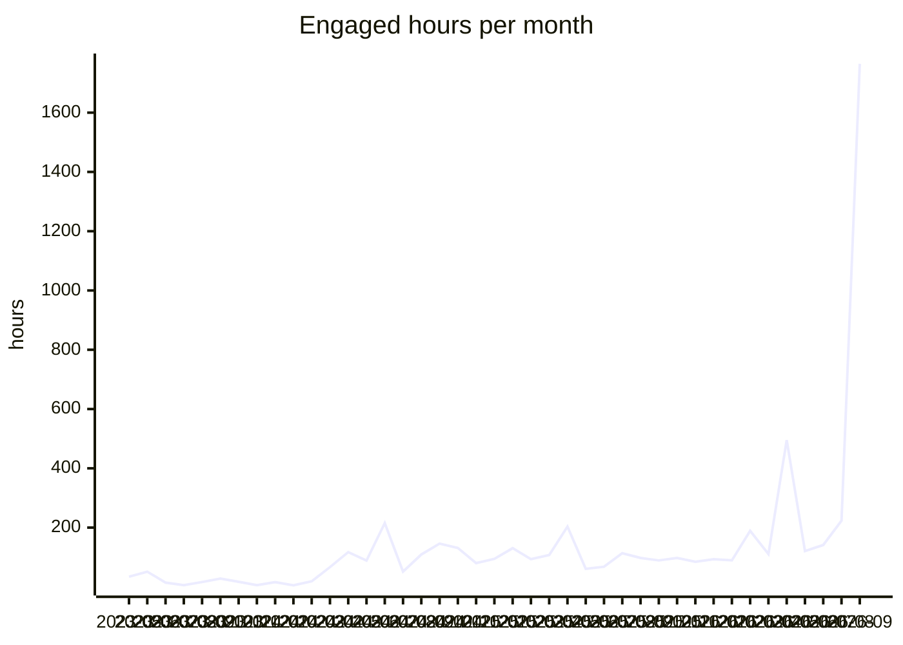

# VFB usage report

Generated 2026-09-26 from aggregate Google Analytics 4 counts for property 375054915, covering 2023-05-10 to 2026-09-25. Source tables: [`analytics/ga4/`](analytics/ga4/). Only summed counts are stored; nothing here identifies a user.

**Reading the numbers.** A large and growing share of 'users' and 'sessions' is automated traffic that loads one page and leaves within a second. Engaged hours (time with the page in the foreground) is barely touched by that traffic and is the most reliable measure of real use; seconds per session shows how bot-heavy a row is.

## Yearly totals

| year | peak monthly users | sessions | screenPageViews | engaged hours | sec/session |
|---|---|---|---|---|---|
| 2023 | 1,332 | 13,668 | 42,490 | 172.9 | 45.5 |
| 2024 | 4,045 | 62,091 | 465,976 | 1,046.3 | 60.7 |
| 2025 | 53,078 | 174,980 | 961,769 | 1,240.7 | 25.5 |
| 2026 | 330,801 | 1,247,773 | 3,129,572 | 3,227.8 | 9.3 |

## Monthly trend

| month | activeUsers | newUsers | sessions | screenPageViews | engaged hours | sec/session |
|---|---|---|---|---|---|---|
| 2024-10 | 4,045 | 3,373 | 9,268 | 83,842 | 145.8 | 56.6 |
| 2024-11 | 2,756 | 2,307 | 7,746 | 71,342 | 131.2 | 61.0 |
| 2024-12 | 2,996 | 2,325 | 6,433 | 42,248 | 80.3 | 45.0 |
| 2025-01 | 2,711 | 1,830 | 7,149 | 57,703 | 94.5 | 47.6 |
| 2025-02 | 2,483 | 1,473 | 6,460 | 69,682 | 130.5 | 72.7 |
| 2025-03 | 2,594 | 1,923 | 7,298 | 70,667 | 93.3 | 46.0 |
| 2025-04 | 2,961 | 2,158 | 5,752 | 46,050 | 107.5 | 67.3 |
| 2025-05 | 2,634 | 1,976 | 5,584 | 49,953 | 203.4 | 131.1 |
| 2025-06 | 2,044 | 1,803 | 5,615 | 39,033 | 60.9 | 39.0 |
| 2025-07 | 1,950 | 1,514 | 6,599 | 43,636 | 67.9 | 37.0 |
| 2025-08 | 3,396 | 3,134 | 8,653 | 67,983 | 113.5 | 47.2 |
| 2025-09 | 8,753 | 10,370 | 15,167 | 293,319 | 97.7 | 23.2 |
| 2025-10 | 15,773 | 15,259 | 19,431 | 62,052 | 89.3 | 16.5 |
| 2025-11 | 53,078 | 51,557 | 55,532 | 92,601 | 97.5 | 6.3 |
| 2025-12 | 27,089 | 26,632 | 30,314 | 69,090 | 84.8 | 10.1 |
| 2026-01 | 35,882 | 35,655 | 41,654 | 84,515 | 93.1 | 8.0 |
| 2026-02 | 33,896 | 33,815 | 38,136 | 81,618 | 89.5 | 8.5 |
| 2026-03 | 90,461 | 89,967 | 95,391 | 204,564 | 189.0 | 7.1 |
| 2026-04 | 81,384 | 81,647 | 85,778 | 152,209 | 110.6 | 4.6 |
| 2026-05 | 330,801 | 328,117 | 328,909 | 419,823 | 495.2 | 5.4 |
| 2026-06 | 118,372 | 120,130 | 125,861 | 215,401 | 120.8 | 3.5 |
| 2026-07 | 202,893 | 200,564 | 203,206 | 285,273 | 141.3 | 2.5 |
| 2026-08 | 114,152 | 116,038 | 121,133 | 261,249 | 223.3 | 6.6 |
| 2026-09 | 163,025 | 165,390 | 211,406 | 1,424,920 | 1,764.9 | 30.1 |

## By site, last 12 months

Page views with no host name are the v2 viewer's in-app term changes and are counted under the viewer.

| site | sessions | screenPageViews | engaged hours | sec/session |
|---|---|---|---|---|
| v2 viewer | 532,784 | 2,274,519 | 2,237.3 | 15.1 |
| www / docs | 682,784 | 907,780 | 825.7 | 4.4 |
| other VFB services | 192,943 | 253,547 | 465.0 | 8.7 |
| CATMAID | 38,179 | 42,335 | 35.6 | 3.4 |
| legacy Edinburgh hosts | 139,194 | 161,276 | 18.6 | 0.5 |
| other / mirrors | 82,623 | 7,162 | 14.9 | 0.6 |
| VFBchat | 11 | 15 | 0.0 | 0.8 |

## Countries, last 12 months

Ranked by engaged hours. 208 countries in total.

| country | users (sum of months) | sessions | engaged hours | sec/session |
|---|---|---|---|---|
| United States | 100,785 | 138,942 | 1,085.8 | 28.1 |
| United Kingdom | 13,989 | 23,346 | 614.1 | 94.7 |
| Germany | 12,960 | 21,093 | 174.8 | 29.8 |
| India | 12,954 | 15,681 | 159.8 | 36.7 |
| Puerto Rico | 201 | 1,626 | 154.5 | 342.0 |
| China | 215,968 | 219,759 | 138.9 | 2.3 |
| Canada | 6,396 | 9,424 | 84.1 | 32.1 |
| Brazil | 17,877 | 19,240 | 70.8 | 13.3 |
| Russia | 5,532 | 6,914 | 63.1 | 32.8 |
| Singapore | 788,309 | 782,643 | 59.1 | 0.3 |
| Australia | 3,314 | 5,025 | 58.7 | 42.0 |
| Japan | 9,279 | 11,296 | 52.5 | 16.7 |
| Türkiye | 4,716 | 5,834 | 42.4 | 26.2 |
| France | 3,848 | 5,298 | 41.6 | 28.2 |
| Poland | 2,962 | 3,846 | 37.4 | 35.0 |
| Mexico | 5,835 | 6,463 | 36.7 | 20.4 |
| South Korea | 1,396 | 2,750 | 36.5 | 47.8 |
| Spain | 2,605 | 3,498 | 34.7 | 35.7 |
| Italy | 2,223 | 2,787 | 31.4 | 40.6 |
| Pakistan | 3,963 | 4,136 | 29.1 | 25.3 |
| (not set) | 955 | 913 | 26.4 | 104.0 |
| Indonesia | 12,122 | 12,587 | 26.2 | 7.5 |
| Netherlands | 2,815 | 3,369 | 25.1 | 26.8 |
| Philippines | 4,522 | 4,796 | 21.3 | 16.0 |
| Israel | 1,366 | 1,978 | 21.3 | 38.7 |
| Taiwan | 871 | 1,557 | 21.3 | 49.2 |
| Chile | 2,170 | 2,590 | 20.2 | 28.1 |
| Austria | 671 | 1,174 | 18.0 | 55.3 |
| Argentina | 4,381 | 4,707 | 17.8 | 13.6 |
| Ukraine | 3,321 | 3,735 | 17.8 | 17.1 |

## Cities, last 12 months

GA4 has no institution or network dimension, so city is the nearest proxy for where labs are. Cities with fewer than 5 users in a month are not stored. Data-centre cities (Ashburn, Council Bluffs, Singapore and similar) show up with near-zero seconds per session.

| city | country | months seen | sessions | engaged hours | sec/session |
|---|---|---|---|---|---|
| Dunblane | United Kingdom | 1 | 84 | 361.1 | 15,475.0 |
| San Juan | Puerto Rico | 6 | 679 | 51.4 | 272.7 |
| Singapore | Singapore | 13 | 762,124 | 49.9 | 0.2 |
| London | United Kingdom | 13 | 4,333 | 36.2 | 30.1 |
| New York | United States | 13 | 3,724 | 32.1 | 31.0 |
| Los Angeles | United States | 13 | 2,748 | 25.3 | 33.1 |
| Munich | Germany | 10 | 417 | 24.1 | 208.2 |
| Chicago | United States | 13 | 4,433 | 23.7 | 19.3 |
| Moscow | Russia | 10 | 1,990 | 21.1 | 38.2 |
| Karachi | Pakistan | 8 | 831 | 20.7 | 89.5 |
| Bengaluru | India | 10 | 1,614 | 19.9 | 44.3 |
| Flint Hill | United States | 7 | 7,991 | 19.4 | 8.8 |
| Cambridge | United Kingdom | 13 | 1,851 | 19.0 | 36.9 |
| Seoul | South Korea | 13 | 1,007 | 16.7 | 59.6 |
| San Jose | United States | 13 | 4,029 | 16.2 | 14.5 |
| Istanbul | Türkiye | 11 | 1,952 | 16.0 | 29.5 |
| Cologne | Germany | 11 | 707 | 16.0 | 81.6 |
| Miami | United States | 9 | 584 | 14.9 | 91.8 |
| Shenzhen | China | 13 | 1,802 | 14.9 | 29.8 |
| Shanghai | China | 13 | 7,860 | 14.5 | 6.6 |
| Sydney | Australia | 9 | 1,534 | 14.5 | 34.0 |
| Hong Kong | Hong Kong | 13 | 13,354 | 14.1 | 3.8 |
| Edinburgh | United Kingdom | 9 | 326 | 14.0 | 154.1 |
| Boston | United States | 13 | 1,769 | 13.9 | 28.2 |
| Phoenix | United States | 8 | 3,359 | 13.8 | 14.8 |
| Toronto | Canada | 13 | 1,358 | 13.7 | 36.4 |
| Melbourne | Australia | 8 | 1,126 | 12.5 | 39.9 |
| Athens | United States | 3 | 264 | 12.5 | 170.7 |
| Houston | United States | 13 | 1,776 | 12.4 | 25.2 |
| Dallas | United States | 13 | 1,427 | 12.3 | 31.1 |
| Philadelphia | United States | 13 | 1,079 | 12.1 | 40.4 |
| Vienna | Austria | 13 | 623 | 12.0 | 69.5 |
| Atlanta | United States | 12 | 926 | 11.3 | 44.1 |
| Santiago | Chile | 10 | 1,385 | 10.9 | 28.4 |
| Berlin | Germany | 13 | 898 | 10.8 | 43.3 |
| Rostock | Germany | 2 | 144 | 10.7 | 268.7 |
| Beijing | China | 13 | 2,097 | 10.4 | 17.8 |
| Warsaw | Poland | 13 | 1,278 | 10.3 | 29.1 |
| Paris | France | 13 | 1,057 | 9.8 | 33.4 |
| Brisbane | Australia | 7 | 737 | 9.8 | 47.6 |
| Pune | India | 9 | 540 | 9.2 | 61.4 |
| Ashburn | United States | 13 | 4,620 | 8.8 | 6.9 |
| Seattle | United States | 12 | 1,124 | 8.7 | 28.0 |
| San Francisco | United States | 11 | 1,298 | 8.4 | 23.2 |
| Sao Paulo | Brazil | 11 | 1,662 | 8.0 | 17.2 |
| Delhi | India | 9 | 1,037 | 8.0 | 27.8 |
| Des Moines | United States | 10 | 2,889 | 7.9 | 9.8 |
| Mexico City | Mexico | 9 | 1,210 | 7.7 | 22.9 |
| Mumbai | India | 11 | 805 | 7.7 | 34.5 |
| Leipzig | Germany | 11 | 439 | 7.6 | 62.7 |

## Most viewed terms

Taken from the term id in viewer URLs and `/reports/` and `/term/` pages. The adult brain template leads because it is the default scene, not because people search for it.

### Last 30 days

| term | label | views | engaged hours | days seen |
|---|---|---|---|---|
| VFB_00101567 | JRC2018Unisex | 430,153 | 761.5 | 30 |
| FBbt_00003624 | adult brain | 43,252 | 20.8 | 30 |
| FBbt_00003748 | medulla | 40,276 | 18.6 | 30 |
| FBbt_00003681 | adult lateral accessory lobe | 35,398 | 13.8 | 30 |
| FBbt_00040041 | vest | 28,668 | 11.3 | 30 |
| FBbt_00040043 | anterior ventrolateral protocerebrum | 25,076 | 10.2 | 30 |
| FBbt_00005093 | nervous system | 24,407 | 9.6 | 30 |
| FBbt_00045048 | saddle | 24,173 | 7.3 | 30 |
| FBbt_00003004 | adult | 21,908 | 8.9 | 30 |
| FBbt_00003680 | nodulus | 20,469 | 4.1 | 30 |
| FBbt_00047887 | adult central brain | 18,342 | 4.7 | 30 |
| FBbt_00040042 | posterior ventrolateral protocerebrum | 17,763 | 6.3 | 30 |
| FBbt_00003678 | ellipsoid body | 13,139 | 5.1 | 29 |
| FBbt_00014013 | adult gnathal ganglion | 13,035 | 4.6 | 30 |
| FBbt_00045027 | wedge | 12,691 | 4.5 | 30 |
| FBbt_00007050 | adult cerebrum | 10,868 | 2.9 | 30 |
| FBbt_00045050 | flange | 9,256 | 3.0 | 29 |
| VFB_00108w0p | brain_neuropil on JRC2018Unisex | 8,844 | 3.6 | 19 |
| VFB_00102140 | LAL on JRC2018Unisex adult brain | 8,713 | 3.0 | 26 |
| FBbt_00003632 | adult central complex | 8,695 | 2.3 | 30 |
| VFB_00102107 | ME on JRC2018Unisex adult brain | 8,527 | 4.5 | 30 |
| FBbt_00003679 | fan-shaped body | 8,105 | 3.3 | 30 |
| FBbt_00110636 | adult cerebral ganglion | 8,074 | 2.5 | 29 |
| VFB_00102212 | VES on JRC2018Unisex adult brain | 7,900 | 2.9 | 25 |
| FBbt_00053384 | adult primary visual center | 7,707 | 3.3 | 30 |

### Last 12 months

| term | label | views | engaged hours | days seen |
|---|---|---|---|---|
| VFB_00101567 | JRC2018Unisex | 654,778 | 1,352.6 | 365 |
| FBbt_00003624 | adult brain | 52,384 | 32.1 | 326 |
| FBbt_00003748 | medulla | 51,315 | 33.3 | 341 |
| FBbt_00003681 | adult lateral accessory lobe | 41,730 | 23.4 | 336 |
| FBbt_00040041 | vest | 34,105 | 19.6 | 321 |
| FBbt_00040043 | anterior ventrolateral protocerebrum | 29,744 | 16.3 | 292 |
| FBbt_00005093 | nervous system | 29,258 | 15.7 | 298 |
| FBbt_00045048 | saddle | 28,317 | 13.2 | 296 |
| FBbt_00003004 | adult | 25,272 | 13.5 | 273 |
| FBbt_00003680 | nodulus | 23,051 | 7.0 | 235 |
| FBbt_00047887 | adult central brain | 21,641 | 8.0 | 269 |
| FBbt_00040042 | posterior ventrolateral protocerebrum | 20,520 | 10.4 | 275 |
| VFB_jrchk7yg | WEDPN2A_R (FlyEM-HB:885788485) | 16,774 | 5.5 | 130 |
| FBbt_00003678 | ellipsoid body | 16,713 | 11.0 | 278 |
| FBbt_00014013 | adult gnathal ganglion | 15,895 | 11.1 | 268 |
| VFB_00050000 | L1 larval CNS ssTEM - Cardona/Janelia | 15,832 | 26.1 | 317 |
| FBbt_00045027 | wedge | 14,875 | 7.2 | 268 |
| FBbt_00007050 | adult cerebrum | 13,456 | 5.5 | 250 |
| VFB_00102107 | ME on JRC2018Unisex adult brain | 12,454 | 10.0 | 232 |
| FBbt_00045050 | flange | 11,088 | 5.3 | 232 |
| VFB_00102140 | LAL on JRC2018Unisex adult brain | 10,826 | 5.6 | 176 |
| FBbt_00003632 | adult central complex | 10,416 | 4.0 | 184 |
| FBbt_00110636 | adult cerebral ganglion | 10,383 | 4.0 | 229 |
| FBbt_00003679 | fan-shaped body | 10,232 | 6.0 | 247 |
| VFB_00102282 | NO on JRC2018Unisex adult brain | 10,211 | 3.3 | 165 |

### All time

| term | label | views | engaged hours | days seen |
|---|---|---|---|---|
| VFB_00101567 | JRC2018Unisex | 844,297 | 1,578.6 | 954 |
| FBbt_00003624 | adult brain | 65,035 | 54.9 | 841 |
| FBbt_00003748 | medulla | 60,595 | 52.7 | 832 |
| FBbt_00003681 | adult lateral accessory lobe | 47,894 | 36.9 | 804 |
| FBbt_00040041 | vest | 40,019 | 30.6 | 776 |
| FBbt_00040043 | anterior ventrolateral protocerebrum | 34,808 | 25.9 | 699 |
| FBbt_00045048 | saddle | 32,553 | 21.6 | 710 |
| FBbt_00005093 | nervous system | 30,655 | 17.9 | 412 |
| FBbt_00003004 | adult | 27,522 | 15.8 | 452 |
| FBbt_00047887 | adult central brain | 26,034 | 14.2 | 626 |
| FBbt_00003680 | nodulus | 24,729 | 10.7 | 505 |
| FBbt_00040042 | posterior ventrolateral protocerebrum | 23,698 | 17.3 | 652 |
| VFB_00050000 | L1 larval CNS ssTEM - Cardona/Janelia | 23,228 | 38.4 | 772 |
| FBbt_00003678 | ellipsoid body | 19,642 | 17.4 | 611 |
| FBbt_00014013 | adult gnathal ganglion | 19,455 | 19.1 | 611 |
| FBbt_00045027 | wedge | 17,432 | 13.1 | 607 |
| VFB_jrchk7yg | WEDPN2A_R (FlyEM-HB:885788485) | 16,945 | 6.2 | 143 |
| VFB_00030867 | adult mushroom body on adult brain template JFRC2 | 16,321 | 12.7 | 417 |
| FBbt_00007050 | adult cerebrum | 16,187 | 9.6 | 525 |
| VFB_00102107 | ME on JRC2018Unisex adult brain | 15,951 | 14.3 | 501 |
| FBbt_00003679 | fan-shaped body | 15,322 | 11.9 | 567 |
| VFB_00102140 | LAL on JRC2018Unisex adult brain | 13,379 | 8.6 | 393 |
| FBbt_00045050 | flange | 12,977 | 9.5 | 506 |
| FBbt_00110636 | adult cerebral ganglion | 12,828 | 7.0 | 511 |
| FBbt_00003632 | adult central complex | 12,271 | 7.5 | 379 |

### Templates in use, last 12 months

| template | label | views |
|---|---|---|
| VFB_00101567 | JRC2018Unisex | 1,069,888 |
| VFB_00050000 | L1 larval CNS ssTEM - Cardona/Janelia | 32,171 |
| VFB_00017894 | adult brain template JFRC2 | 15,084 |
| VFB_00200000 | JRC2018UnisexVNC | 11,525 |
| VFB_00049000 | L3 CNS template - Wood2018 | 8,505 |
| VFB_00110000 | Adult Head (McKellar2020) | 2,845 |
| VFB_00101384 | JRC_FlyEM_Hemibrain | 2,021 |
| FBbt_00003624 | adult brain | 1,381 |
| VFB_00120000 | Adult T1 Leg (Kuan2020) | 1,218 |
| VFB_00100000 | adult VNS template - Court2018 | 828 |

## Website and documentation pages, last 12 months

| pagePath | screenPageViews | engaged hours |
|---|---|---|
| / | 154,692 | 467.2 |
| /docs/ | 14,492 | 33.1 |
| /about/ | 5,134 | 22.4 |
| /docs/overview/ | 3,212 | 18.9 |
| /docs/data/ | 4,660 | 15.5 |
| /docs/tutorials/vfb-mcp-guide/ | 1,386 | 8.4 |
| /docs/website-features/3dviewer/ | 1,970 | 7.5 |
| /hosted/ | 2,253 | 4.6 |
| /about/whichfly/ | 375 | 4.2 |
| /docs/tutorials/ | 1,867 | 4.2 |
| /docs/contribution-guidelines/ | 938 | 3.5 |
| /about/hosted/ | 929 | 3.1 |
| /docs/concepts/flylight_tiles/ | 536 | 3.0 |
| /docs/tutorials/apis/ | 645 | 3.0 |
| /docs/apis/ | 553 | 2.8 |
| /docs/website-features/search_query/ | 591 | 2.6 |
| /blog/news/ | 1,116 | 2.5 |
| /docs/concepts/ | 459 | 2.3 |
| /docs/website-features/ | 800 | 2.2 |
| /docs/concepts/neuron-counts/ | 250 | 2.1 |
| /blog/2026/09/06/vfb-self-led-learning-sessions-a-free-online-workshop-open-to-everyone/ | 708 | 2.1 |
| /docs/tutorials/apis/vfb_api_overview/ | 294 | 2.0 |
| /search/ | 602 | 2.0 |
| /docs/data/em/ | 357 | 2.0 |
| /docs/concepts/bridging/ | 210 | 1.9 |
| /docs/tools/ | 312 | 1.8 |
| /blog/releases/catmaid/ | 478 | 1.7 |
| /docs/concepts/cell_types/ | 321 | 1.7 |
| /blog/2025/12/17/neurofly-2026-21st-biennial-european-drosophila-neurobiology-conference/ | 459 | 1.7 |
| /docs/concepts/registration/ | 134 | 1.6 |

## How people arrive

Engaged sessions by channel and year.

| channel | 2023 | 2024 | 2025 | 2026 |
|---|---|---|---|---|
| AI Assistant | 0 | 0 | 0 | 2,039 |
| Direct | 1,628 | 10,737 | 124,445 | 1,073,964 |
| Organic Search | 3,198 | 18,605 | 30,520 | 149,021 |
| Organic Shopping | 0 | 3 | 2 | 0 |
| Organic Social | 7 | 454 | 125 | 1,209 |
| Organic Video | 0 | 2 | 0 | 17 |
| Referral | 495 | 18,973 | 11,071 | 8,136 |
| Unassigned | 0 | 6 | 60 | 1,449 |

Top sources, last 12 months.

| sessionSource | sessions | engaged hours |
|---|---|---|
| google | 147,773 | 1,851.7 |
| (direct) | 1,171,444 | 1,130.0 |
| bing | 8,983 | 193.1 |
| chatgpt.com | 2,499 | 36.5 |
| (not set) | 8,427 | 27.9 |
| yahoo | 564 | 27.4 |
| cn.bing.com | 732 | 26.3 |
| duckduckgo | 1,967 | 23.5 |
| flybase.org | 957 | 15.7 |
| splitgal4.janelia.org | 1,593 | 15.6 |
| codex.flywire.ai | 1,928 | 13.9 |
| gemini.google.com | 486 | 11.6 |
| github.com | 567 | 8.3 |
| ecosia.org | 662 | 8.2 |
| moodle.carleton.edu | 120 | 6.3 |
| science.org | 148 | 5.8 |
| trafficheap.cc | 502 | 5.8 |
| trafficheap.com | 502 | 5.8 |
| en.wikipedia.org | 304 | 5.1 |
| neuronbridge.janelia.org | 144 | 4.4 |
| janelia.org | 233 | 4.2 |
| yandex.ru | 218 | 3.7 |
| doubao.com | 71 | 3.4 |
| flweb.janelia.org | 247 | 3.4 |
| search.brave.com | 215 | 3.3 |

## Queries run in the viewer, last 12 months

| query | runs |
|---|---|
| allalignedimages | 2,556 |
| imagesneurons | 701 |
| alldatasets | 359 |
| aligneddatasets | 325 |
| listallavailableimages | 254 |
| neuronsparthere | 223 |
| partsof | 144 |
| painteddomains | 135 |
| neuronssynaptic | 74 |
| subclassesof | 73 |
| neuronspresynaptichere | 56 |
| expressioncluster | 48 |
| datasetimages | 48 |
| neuronspostsynaptichere | 43 |
| neuronneuronconnectivit | 37 |
| transgeneexpressionhere | 33 |
| tractsnervesinnervating | 24 |
| similarmorphologyto | 23 |
| termsforpub | 19 |
| lineageclonesin | 18 |
| neuronregionconnectivit | 17 |
| findstocks | 16 |
| upstreamclassconnectivi | 13 |
| splitstargeting | 9 |
| downstreamclassconnecti | 8 |

## VFBchat and MCP

| month | chat_query | mcp_tool_call |
|---|---|---|
| 2026-02 | 70 | 492 |
| 2026-03 | 354 | 2,258 |
| 2026-04 | 575 | 7,992 |
| 2026-05 | 17 | 971 |
| 2026-06 | 358 | 30,858 |
| 2026-07 | 9 | 18,938 |
| 2026-08 | 1,017 | 89,583 |
| 2026-09 | 744 | 59,041 |

## Viewer reliability

| month | session_start | disconnected | reconnected-resumed | reconnect-failed-reloading | reconnect-exhausted | disconnects per 100 sessions |
|---|---|---|---|---|---|---|
| 2025-04 | 2,900 | 1,022 | 0 | 30 | 0 | 35.2 |
| 2025-05 | 2,675 | 1,436 | 0 | 101 | 0 | 53.7 |
| 2025-06 | 3,466 | 1,365 | 0 | 12 | 0 | 39.4 |
| 2025-07 | 4,662 | 2,057 | 0 | 18 | 0 | 44.1 |
| 2025-08 | 6,571 | 1,680 | 0 | 17 | 0 | 25.6 |
| 2025-09 | 6,265 | 1,170 | 0 | 24 | 0 | 18.7 |
| 2025-10 | 7,777 | 1,232 | 0 | 17 | 0 | 15.8 |
| 2025-11 | 8,460 | 1,163 | 0 | 24 | 0 | 13.7 |
| 2025-12 | 10,434 | 1,359 | 0 | 8 | 0 | 13.0 |
| 2026-01 | 21,913 | 1,530 | 0 | 30 | 0 | 7.0 |
| 2026-02 | 24,790 | 1,536 | 0 | 31 | 0 | 6.2 |
| 2026-03 | 23,808 | 5,059 | 0 | 465 | 0 | 21.2 |
| 2026-04 | 23,996 | 2,933 | 0 | 33 | 0 | 12.2 |
| 2026-05 | 55,407 | 2,314 | 0 | 44 | 0 | 4.2 |
| 2026-06 | 23,505 | 2,149 | 0 | 158 | 0 | 9.1 |
| 2026-07 | 45,208 | 2,280 | 0 | 49 | 0 | 5.0 |
| 2026-08 | 24,841 | 3,675 | 0 | 530 | 0 | 14.8 |
| 2026-09 | 46,594 | 61,615 | 25,578 | 31,327 | 1,819 | 132.2 |

Load times from the timing suffix on viewer events (months with at least 100 samples).

| month | event | n | median s | p95 s |
|---|---|---|---|---|
| 2026-09 | direct-geom:obj:ok | 43,218 | 1.4 | 13.2 |
| 2026-09 | direct-terminfo:ok | 79,094 | 0.4 | 3.0 |
| 2026-09 | startup-first-term | 35,130 | 5.3 | 52.0 |
| 2026-09 | startup-model | 38,056 | 2.8 | 27.0 |
| 2026-09 | term-load:ok | 75,782 | 1.0 | 18.0 |

## Outbound links clicked, last 12 months

| linkDomain | clicks |
|---|---|
| neuronbridge.janelia.org | 1,409 |
| pypi.org | 1,049 |
| github.com | 717 |
| virtualflybrain.org | 567 |
| v2.virtualflybrain.org | 550 |
| insectbraindb.org | 476 |
| flweb.janelia.org | 426 |
| colab.research.google.com | 289 |
| translate.google.com | 238 |
| doi.org | 237 |
| flybase.org | 168 |
| chat.virtualflybrain.org | 70 |
| virtualflybrain.bsky.social | 65 |
| codex.flywire.ai | 59 |
| google.com | 57 |
| neurofly.org | 46 |
| vfb3-mcp.virtualflybrain.org | 43 |
| neuprint.janelia.org | 37 |
| janelia.org | 36 |
| wiki.flybase.org | 20 |

## Devices and browsers, last 12 months

| deviceCategory | browser | sessions | engaged hours |
|---|---|---|---|
| desktop | Chrome | 1,236,125 | 2,207.0 |
| desktop | Edge | 15,471 | 340.5 |
| mobile | Chrome | 38,234 | 269.2 |
| desktop | Safari | 11,328 | 175.5 |
| desktop | Firefox | 9,920 | 173.7 |
| desktop | Opera | 11,033 | 137.0 |
| mobile | Safari | 26,374 | 125.1 |
| tablet | Chrome | 1,924 | 25.0 |
| mobile | Firefox | 1,056 | 9.3 |
| mobile | Samsung Internet | 1,251 | 9.3 |
| tablet | Safari | 708 | 7.6 |
| desktop | YaBrowser | 431 | 6.9 |

## What this data cannot show

- **Institutions.** GA4 dropped the network-domain dimension and never exposes IP addresses. City is as close as it gets.
- **Search terms typed into VFB.** The viewer does not send a `search` event, so `searchTerm` is empty. Term popularity above comes from term ids in URLs.
- **Event detail.** No custom dimensions are registered on the property, so event parameters (`event_label`, `event_category`, and the VFBchat and MCP parameters such as tool name and topic) are discarded from reports. Registration is not retroactive.
- **Yearly unique users.** Users do not add up across days or months; only daily and monthly uniques are stored.
