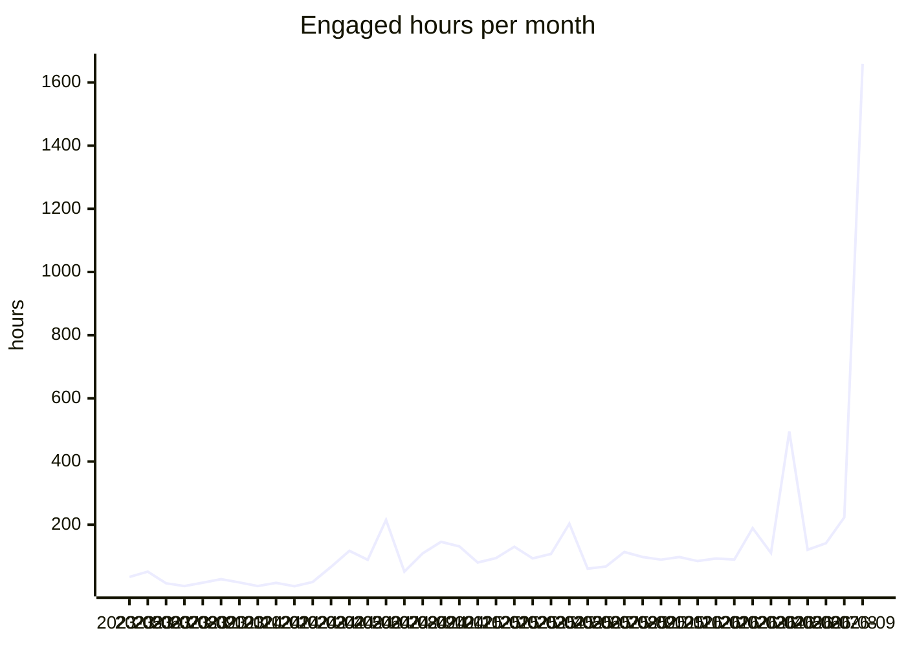

# VFB usage report

Generated 2026-09-24 from aggregate Google Analytics 4 counts for property 375054915, covering 2023-05-10 to 2026-09-23. Source tables: [`analytics/ga4/`](analytics/ga4/). Only summed counts are stored; nothing here identifies a user.

**Reading the numbers.** A large and growing share of 'users' and 'sessions' is automated traffic that loads one page and leaves within a second. Engaged hours (time with the page in the foreground) is barely touched by that traffic and is the most reliable measure of real use; seconds per session shows how bot-heavy a row is.

## Yearly totals

| year | peak monthly users | sessions | screenPageViews | engaged hours | sec/session |
|---|---|---|---|---|---|
| 2023 | 1,332 | 13,668 | 42,490 | 172.9 | 45.5 |
| 2024 | 4,045 | 62,091 | 465,976 | 1,046.3 | 60.7 |
| 2025 | 53,078 | 174,980 | 961,769 | 1,240.7 | 25.5 |
| 2026 | 330,801 | 1,237,423 | 3,042,807 | 3,121.7 | 9.1 |

## Monthly trend

| month | activeUsers | newUsers | sessions | screenPageViews | engaged hours | sec/session |
|---|---|---|---|---|---|---|
| 2024-10 | 4,045 | 3,373 | 9,268 | 83,842 | 145.8 | 56.6 |
| 2024-11 | 2,756 | 2,307 | 7,746 | 71,342 | 131.2 | 61.0 |
| 2024-12 | 2,996 | 2,325 | 6,433 | 42,248 | 80.3 | 45.0 |
| 2025-01 | 2,711 | 1,830 | 7,149 | 57,703 | 94.5 | 47.6 |
| 2025-02 | 2,483 | 1,473 | 6,460 | 69,682 | 130.5 | 72.7 |
| 2025-03 | 2,594 | 1,923 | 7,298 | 70,667 | 93.3 | 46.0 |
| 2025-04 | 2,961 | 2,158 | 5,752 | 46,050 | 107.5 | 67.3 |
| 2025-05 | 2,634 | 1,976 | 5,584 | 49,953 | 203.4 | 131.1 |
| 2025-06 | 2,044 | 1,803 | 5,615 | 39,033 | 60.9 | 39.0 |
| 2025-07 | 1,950 | 1,514 | 6,599 | 43,636 | 67.9 | 37.0 |
| 2025-08 | 3,396 | 3,134 | 8,653 | 67,983 | 113.5 | 47.2 |
| 2025-09 | 8,753 | 10,370 | 15,167 | 293,319 | 97.7 | 23.2 |
| 2025-10 | 15,773 | 15,259 | 19,431 | 62,052 | 89.3 | 16.5 |
| 2025-11 | 53,078 | 51,557 | 55,532 | 92,601 | 97.5 | 6.3 |
| 2025-12 | 27,089 | 26,632 | 30,314 | 69,090 | 84.8 | 10.1 |
| 2026-01 | 35,882 | 35,655 | 41,654 | 84,515 | 93.1 | 8.0 |
| 2026-02 | 33,896 | 33,815 | 38,136 | 81,618 | 89.5 | 8.5 |
| 2026-03 | 90,461 | 89,967 | 95,391 | 204,564 | 189.0 | 7.1 |
| 2026-04 | 81,384 | 81,647 | 85,778 | 152,209 | 110.6 | 4.6 |
| 2026-05 | 330,801 | 328,117 | 328,909 | 419,823 | 495.2 | 5.4 |
| 2026-06 | 118,372 | 120,130 | 125,861 | 215,401 | 120.8 | 3.5 |
| 2026-07 | 202,893 | 200,564 | 203,206 | 285,273 | 141.3 | 2.5 |
| 2026-08 | 114,152 | 116,038 | 121,133 | 261,249 | 223.3 | 6.6 |
| 2026-09 | 155,988 | 157,663 | 201,012 | 1,338,155 | 1,658.9 | 29.7 |

## By site, last 12 months

Page views with no host name are the v2 viewer's in-app term changes and are counted under the viewer.

| site | sessions | screenPageViews | engaged hours | sec/session |
|---|---|---|---|---|
| v2 viewer | 524,535 | 2,199,631 | 2,167.4 | 14.9 |
| www / docs | 673,898 | 896,906 | 794.2 | 4.2 |
| other VFB services | 192,445 | 252,874 | 463.5 | 8.7 |
| CATMAID | 38,129 | 42,283 | 32.7 | 3.1 |
| legacy Edinburgh hosts | 138,990 | 161,071 | 18.6 | 0.5 |
| other / mirrors | 82,417 | 7,090 | 14.6 | 0.6 |
| VFBchat | 10 | 14 | 0.0 | 0.9 |

## Countries, last 12 months

Ranked by engaged hours. 209 countries in total.

| country | users (sum of months) | sessions | engaged hours | sec/session |
|---|---|---|---|---|
| United States | 98,314 | 136,151 | 1,041.1 | 27.5 |
| United Kingdom | 13,581 | 22,629 | 606.6 | 96.5 |
| Germany | 12,762 | 20,791 | 170.3 | 29.5 |
| India | 12,681 | 15,262 | 154.0 | 36.3 |
| Puerto Rico | 193 | 1,615 | 154.0 | 343.3 |
| China | 214,699 | 218,473 | 137.3 | 2.3 |
| Canada | 6,171 | 9,015 | 80.2 | 32.0 |
| Brazil | 17,761 | 19,107 | 69.5 | 13.1 |
| Russia | 5,428 | 6,769 | 61.0 | 32.4 |
| Singapore | 787,648 | 782,366 | 58.8 | 0.3 |
| Australia | 3,183 | 4,823 | 56.2 | 41.9 |
| Japan | 9,248 | 11,250 | 52.0 | 16.7 |
| Türkiye | 4,643 | 5,729 | 41.4 | 26.0 |
| France | 3,803 | 5,229 | 40.7 | 28.0 |
| South Korea | 1,375 | 2,711 | 36.2 | 48.1 |
| Poland | 2,874 | 3,705 | 35.8 | 34.8 |
| Mexico | 5,725 | 6,305 | 33.8 | 19.3 |
| Spain | 2,537 | 3,407 | 33.3 | 35.2 |
| Italy | 2,157 | 2,707 | 30.4 | 40.4 |
| Pakistan | 3,942 | 4,101 | 28.8 | 25.3 |
| (not set) | 924 | 882 | 26.3 | 107.3 |
| Indonesia | 12,025 | 12,453 | 24.6 | 7.1 |
| Netherlands | 2,770 | 3,293 | 24.4 | 26.7 |
| Taiwan | 861 | 1,543 | 21.0 | 49.0 |
| Philippines | 4,455 | 4,713 | 20.5 | 15.7 |
| Israel | 1,302 | 1,897 | 20.5 | 38.9 |
| Chile | 2,110 | 2,511 | 18.2 | 26.1 |
| Austria | 659 | 1,153 | 17.9 | 55.9 |
| Ukraine | 3,278 | 3,673 | 16.7 | 16.4 |
| Hong Kong | 13,882 | 14,651 | 16.7 | 4.1 |

## Cities, last 12 months

GA4 has no institution or network dimension, so city is the nearest proxy for where labs are. Cities with fewer than 5 users in a month are not stored. Data-centre cities (Ashburn, Council Bluffs, Singapore and similar) show up with near-zero seconds per session.

| city | country | months seen | sessions | engaged hours | sec/session |
|---|---|---|---|---|---|
| Dunblane | United Kingdom | 1 | 84 | 361.1 | 15,475.0 |
| San Juan | Puerto Rico | 6 | 673 | 51.3 | 274.3 |
| Singapore | Singapore | 13 | 761,724 | 49.5 | 0.2 |
| London | United Kingdom | 13 | 4,196 | 34.9 | 29.9 |
| New York | United States | 13 | 3,612 | 30.1 | 30.0 |
| Los Angeles | United States | 13 | 2,671 | 24.6 | 33.1 |
| Munich | Germany | 10 | 406 | 24.0 | 212.7 |
| Chicago | United States | 13 | 4,368 | 22.6 | 18.6 |
| Moscow | Russia | 10 | 1,931 | 20.7 | 38.5 |
| Karachi | Pakistan | 8 | 824 | 20.5 | 89.8 |
| Bengaluru | India | 10 | 1,571 | 19.5 | 44.8 |
| Flint Hill | United States | 7 | 7,991 | 19.4 | 8.8 |
| Cambridge | United Kingdom | 13 | 1,847 | 18.9 | 36.9 |
| Seoul | South Korea | 13 | 996 | 16.6 | 59.8 |
| San Jose | United States | 13 | 3,985 | 16.0 | 14.5 |
| Cologne | Germany | 11 | 701 | 16.0 | 82.0 |
| Istanbul | Türkiye | 11 | 1,915 | 15.6 | 29.3 |
| Miami | United States | 9 | 564 | 14.8 | 94.3 |
| Shenzhen | China | 13 | 1,794 | 14.8 | 29.7 |
| Shanghai | China | 13 | 7,853 | 14.5 | 6.6 |
| Sydney | Australia | 9 | 1,454 | 14.0 | 34.6 |
| Edinburgh | United Kingdom | 9 | 317 | 13.8 | 156.3 |
| Hong Kong | Hong Kong | 13 | 13,320 | 13.8 | 3.7 |
| Boston | United States | 13 | 1,737 | 13.7 | 28.3 |
| Phoenix | United States | 8 | 3,185 | 13.4 | 15.2 |
| Toronto | Canada | 13 | 1,316 | 13.2 | 36.2 |
| Athens | United States | 3 | 257 | 12.5 | 175.1 |
| Melbourne | Australia | 8 | 1,095 | 12.2 | 40.2 |
| Vienna | Austria | 13 | 612 | 11.9 | 70.0 |
| Houston | United States | 13 | 1,732 | 11.6 | 24.1 |
| Philadelphia | United States | 13 | 1,056 | 11.5 | 39.3 |
| Dallas | United States | 13 | 1,363 | 11.3 | 29.9 |
| Atlanta | United States | 12 | 898 | 11.2 | 44.9 |
| Rostock | Germany | 2 | 144 | 10.7 | 268.7 |
| Beijing | China | 13 | 2,074 | 10.3 | 17.9 |
| Berlin | Germany | 13 | 858 | 10.3 | 43.4 |
| Warsaw | Poland | 13 | 1,228 | 9.8 | 28.7 |
| Brisbane | Australia | 7 | 714 | 9.7 | 48.7 |
| Santiago | Chile | 10 | 1,337 | 9.5 | 25.6 |
| Paris | France | 13 | 1,039 | 9.4 | 32.7 |
| Pune | India | 9 | 530 | 9.1 | 61.9 |
| Ashburn | United States | 13 | 4,558 | 8.5 | 6.7 |
| Seattle | United States | 12 | 1,098 | 8.5 | 27.9 |
| San Francisco | United States | 11 | 1,284 | 8.3 | 23.2 |
| Des Moines | United States | 10 | 2,888 | 7.8 | 9.8 |
| Sao Paulo | Brazil | 11 | 1,636 | 7.7 | 16.9 |
| Delhi | India | 9 | 1,015 | 7.7 | 27.3 |
| Northfield | United States | 2 | 256 | 7.5 | 105.6 |
| Guangzhou | China | 13 | 1,989 | 7.5 | 13.5 |
| Mexico City | Mexico | 9 | 1,188 | 7.4 | 22.5 |

## Most viewed terms

Taken from the term id in viewer URLs and `/reports/` and `/term/` pages. The adult brain template leads because it is the default scene, not because people search for it.

### Last 30 days

| term | label | views | engaged hours | days seen |
|---|---|---|---|---|
| VFB_00101567 | JRC2018Unisex | 410,794 | 723.6 | 30 |
| FBbt_00003624 | adult brain | 38,272 | 18.0 | 30 |
| FBbt_00003748 | medulla | 38,184 | 17.7 | 30 |
| FBbt_00003681 | adult lateral accessory lobe | 33,615 | 13.1 | 30 |
| FBbt_00040041 | vest | 27,451 | 10.7 | 30 |
| FBbt_00040043 | anterior ventrolateral protocerebrum | 23,686 | 9.7 | 30 |
| FBbt_00045048 | saddle | 23,254 | 7.0 | 30 |
| FBbt_00005093 | nervous system | 22,946 | 9.3 | 30 |
| FBbt_00003004 | adult | 19,745 | 8.4 | 30 |
| FBbt_00003680 | nodulus | 19,247 | 3.9 | 30 |
| FBbt_00047887 | adult central brain | 17,569 | 4.5 | 30 |
| FBbt_00040042 | posterior ventrolateral protocerebrum | 17,019 | 6.0 | 30 |
| FBbt_00003678 | ellipsoid body | 12,621 | 4.7 | 29 |
| FBbt_00014013 | adult gnathal ganglion | 12,470 | 4.4 | 30 |
| FBbt_00045027 | wedge | 11,970 | 4.2 | 30 |
| FBbt_00007050 | adult cerebrum | 10,367 | 2.8 | 30 |
| FBbt_00045050 | flange | 8,713 | 2.9 | 29 |
| VFB_00102140 | LAL on JRC2018Unisex adult brain | 8,259 | 2.8 | 25 |
| FBbt_00003632 | adult central complex | 8,235 | 2.3 | 30 |
| VFB_00102107 | ME on JRC2018Unisex adult brain | 8,209 | 5.0 | 30 |
| VFB_00108w0p | brain_neuropil on JRC2018Unisex | 7,806 | 3.2 | 17 |
| FBbt_00110636 | adult cerebral ganglion | 7,760 | 2.4 | 29 |
| FBbt_00003679 | fan-shaped body | 7,739 | 3.1 | 30 |
| FBbt_00053384 | adult primary visual center | 7,379 | 3.2 | 30 |
| VFB_00102282 | NO on JRC2018Unisex adult brain | 7,271 | 1.8 | 27 |

### Last 12 months

| term | label | views | engaged hours | days seen |
|---|---|---|---|---|
| VFB_00101567 | JRC2018Unisex | 631,750 | 1,307.6 | 365 |
| FBbt_00003748 | medulla | 48,991 | 32.4 | 340 |
| FBbt_00003624 | adult brain | 47,380 | 29.3 | 326 |
| FBbt_00003681 | adult lateral accessory lobe | 39,659 | 22.8 | 336 |
| FBbt_00040041 | vest | 32,568 | 19.0 | 320 |
| FBbt_00040043 | anterior ventrolateral protocerebrum | 28,231 | 15.8 | 291 |
| FBbt_00005093 | nervous system | 27,582 | 15.3 | 296 |
| FBbt_00045048 | saddle | 27,147 | 12.9 | 295 |
| FBbt_00003004 | adult | 22,962 | 12.9 | 272 |
| FBbt_00003680 | nodulus | 21,652 | 6.8 | 234 |
| FBbt_00047887 | adult central brain | 20,676 | 7.7 | 267 |
| FBbt_00040042 | posterior ventrolateral protocerebrum | 19,662 | 10.1 | 274 |
| VFB_jrchk7yg | WEDPN2A_R (FlyEM-HB:885788485) | 16,547 | 5.5 | 128 |
| FBbt_00003678 | ellipsoid body | 16,084 | 10.7 | 277 |
| VFB_00050000 | L1 larval CNS ssTEM - Cardona/Janelia | 15,485 | 25.3 | 317 |
| FBbt_00014013 | adult gnathal ganglion | 15,189 | 10.9 | 267 |
| FBbt_00045027 | wedge | 14,098 | 7.0 | 267 |
| FBbt_00007050 | adult cerebrum | 12,855 | 5.3 | 249 |
| VFB_00102107 | ME on JRC2018Unisex adult brain | 12,022 | 9.7 | 230 |
| FBbt_00045050 | flange | 10,486 | 5.1 | 231 |
| VFB_00102140 | LAL on JRC2018Unisex adult brain | 10,292 | 5.4 | 174 |
| VFB_00102282 | NO on JRC2018Unisex adult brain | 9,982 | 3.2 | 163 |
| FBbt_00110636 | adult cerebral ganglion | 9,971 | 3.9 | 227 |
| FBbt_00003632 | adult central complex | 9,902 | 3.9 | 182 |
| FBbt_00003679 | fan-shaped body | 9,830 | 5.8 | 246 |

### All time

| term | label | views | engaged hours | days seen |
|---|---|---|---|---|
| VFB_00101567 | JRC2018Unisex | 820,817 | 1,532.8 | 952 |
| FBbt_00003624 | adult brain | 60,016 | 52.0 | 839 |
| FBbt_00003748 | medulla | 58,269 | 51.8 | 830 |
| FBbt_00003681 | adult lateral accessory lobe | 45,804 | 36.1 | 802 |
| FBbt_00040041 | vest | 38,475 | 30.0 | 774 |
| FBbt_00040043 | anterior ventrolateral protocerebrum | 33,291 | 25.4 | 697 |
| FBbt_00045048 | saddle | 31,381 | 21.2 | 708 |
| FBbt_00005093 | nervous system | 28,979 | 17.5 | 410 |
| FBbt_00003004 | adult | 25,208 | 15.2 | 450 |
| FBbt_00047887 | adult central brain | 25,069 | 13.9 | 624 |
| FBbt_00003680 | nodulus | 23,326 | 10.5 | 503 |
| VFB_00050000 | L1 larval CNS ssTEM - Cardona/Janelia | 22,846 | 37.5 | 770 |
| FBbt_00040042 | posterior ventrolateral protocerebrum | 22,838 | 17.0 | 650 |
| FBbt_00003678 | ellipsoid body | 19,008 | 17.0 | 609 |
| FBbt_00014013 | adult gnathal ganglion | 18,747 | 18.9 | 609 |
| VFB_jrchk7yg | WEDPN2A_R (FlyEM-HB:885788485) | 16,718 | 6.2 | 141 |
| FBbt_00045027 | wedge | 16,651 | 12.8 | 605 |
| VFB_00030867 | adult mushroom body on adult brain template JFRC2 | 16,174 | 12.6 | 415 |
| FBbt_00007050 | adult cerebrum | 15,583 | 9.4 | 523 |
| VFB_00102107 | ME on JRC2018Unisex adult brain | 15,519 | 14.0 | 499 |
| FBbt_00003679 | fan-shaped body | 14,918 | 11.7 | 565 |
| VFB_00102140 | LAL on JRC2018Unisex adult brain | 12,845 | 8.4 | 391 |
| FBbt_00110636 | adult cerebral ganglion | 12,416 | 6.9 | 509 |
| FBbt_00045050 | flange | 12,373 | 9.4 | 504 |
| VFB_00102282 | NO on JRC2018Unisex adult brain | 11,803 | 5.7 | 336 |

### Templates in use, last 12 months

| template | label | views |
|---|---|---|
| VFB_00101567 | JRC2018Unisex | 1,028,444 |
| VFB_00050000 | L1 larval CNS ssTEM - Cardona/Janelia | 31,561 |
| VFB_00017894 | adult brain template JFRC2 | 14,505 |
| VFB_00200000 | JRC2018UnisexVNC | 11,152 |
| VFB_00049000 | L3 CNS template - Wood2018 | 8,404 |
| VFB_00110000 | Adult Head (McKellar2020) | 2,756 |
| VFB_00101384 | JRC_FlyEM_Hemibrain | 1,964 |
| FBbt_00003624 | adult brain | 1,381 |
| VFB_00120000 | Adult T1 Leg (Kuan2020) | 1,220 |
| VFB_00100000 | adult VNS template - Court2018 | 807 |

## Website and documentation pages, last 12 months

| pagePath | screenPageViews | engaged hours |
|---|---|---|
| / | 148,112 | 446.1 |
| /docs/ | 13,748 | 31.8 |
| /about/ | 4,985 | 21.9 |
| /docs/overview/ | 3,064 | 18.0 |
| /docs/data/ | 4,422 | 14.7 |
| /docs/tutorials/vfb-mcp-guide/ | 1,301 | 8.2 |
| /docs/website-features/3dviewer/ | 1,853 | 7.1 |
| /hosted/ | 2,118 | 4.4 |
| /docs/tutorials/ | 1,750 | 4.0 |
| /about/whichfly/ | 361 | 4.0 |
| /docs/contribution-guidelines/ | 882 | 3.3 |
| /about/hosted/ | 933 | 3.2 |
| /docs/tutorials/apis/ | 605 | 2.9 |
| /docs/concepts/flylight_tiles/ | 522 | 2.9 |
| /docs/apis/ | 518 | 2.6 |
| /blog/news/ | 1,057 | 2.6 |
| /docs/website-features/search_query/ | 553 | 2.4 |
| /docs/website-features/ | 746 | 2.1 |
| /search/ | 605 | 2.0 |
| /blog/2026/09/06/vfb-self-led-learning-sessions-a-free-online-workshop-open-to-everyone/ | 669 | 2.0 |
| /docs/concepts/neuron-counts/ | 235 | 2.0 |
| /docs/data/em/ | 342 | 1.9 |
| /docs/concepts/ | 432 | 1.9 |
| /docs/concepts/bridging/ | 204 | 1.8 |
| /blog/2025/12/17/neurofly-2026-21st-biennial-european-drosophila-neurobiology-conference/ | 459 | 1.7 |
| /docs/tools/ | 291 | 1.7 |
| /docs/tutorials/apis/vfb_api_overview/ | 279 | 1.7 |
| /docs/concepts/cell_types/ | 310 | 1.6 |
| /blog/releases/catmaid/ | 461 | 1.6 |
| /docs/concepts/registration/ | 128 | 1.6 |

## How people arrive

Engaged sessions by channel and year.

| channel | 2023 | 2024 | 2025 | 2026 |
|---|---|---|---|---|
| (other) | 0 | 0 | 0 | 0 |
| AI Assistant | 0 | 0 | 0 | 1,983 |
| Cross-network | 0 | 0 | 0 | 11 |
| Direct | 1,628 | 10,737 | 124,445 | 1,070,549 |
| Organic Search | 3,198 | 18,605 | 30,520 | 142,796 |
| Organic Shopping | 0 | 3 | 2 | 0 |
| Organic Social | 7 | 454 | 125 | 1,190 |
| Organic Video | 0 | 2 | 0 | 17 |
| Referral | 495 | 18,973 | 11,071 | 8,028 |
| Unassigned | 0 | 6 | 60 | 1,446 |

Top sources, last 12 months.

| sessionSource | sessions | engaged hours |
|---|---|---|
| google | 142,082 | 1,777.5 |
| (direct) | 1,168,332 | 1,117.8 |
| bing | 8,420 | 181.3 |
| chatgpt.com | 2,449 | 36.2 |
| (not set) | 8,644 | 31.0 |
| yahoo | 536 | 26.8 |
| cn.bing.com | 721 | 25.4 |
| duckduckgo | 1,869 | 22.2 |
| flybase.org | 961 | 15.8 |
| splitgal4.janelia.org | 1,603 | 15.6 |
| codex.flywire.ai | 1,924 | 14.0 |
| gemini.google.com | 484 | 11.6 |
| github.com | 551 | 8.1 |
| ecosia.org | 637 | 7.9 |
| moodle.carleton.edu | 120 | 6.3 |
| science.org | 147 | 5.8 |
| trafficheap.cc | 502 | 5.8 |
| trafficheap.com | 502 | 5.8 |
| en.wikipedia.org | 291 | 5.0 |
| neuronbridge.janelia.org | 144 | 4.4 |
| janelia.org | 233 | 4.2 |
| yandex.ru | 210 | 3.5 |
| doubao.com | 70 | 3.4 |
| flweb.janelia.org | 244 | 3.4 |
| search.brave.com | 205 | 3.1 |

## Queries run in the viewer, last 12 months

| query | runs |
|---|---|
| allalignedimages | 1,907 |
| imagesneurons | 399 |
| alldatasets | 273 |
| aligneddatasets | 261 |
| listallavailableimages | 182 |
| neuronsparthere | 148 |
| partsof | 115 |
| painteddomains | 101 |
| neuronssynaptic | 62 |
| subclassesof | 51 |
| datasetimages | 42 |
| neuronspresynaptichere | 38 |
| neuronspostsynaptichere | 30 |
| neuronneuronconnectivit | 29 |
| termsforpub | 17 |
| transgeneexpressionhere | 17 |
| tractsnervesinnervating | 16 |
| findstocks | 15 |
| lineageclonesin | 14 |
| neuronregionconnectivit | 12 |
| similarmorphologyto | 10 |
| anatscrnaseqquery | 8 |
| downstreamclassconnecti | 5 |
| expressioncluster | 4 |
| upstreamclassconnectivi | 4 |

## VFBchat and MCP

| month | chat_query | mcp_tool_call |
|---|---|---|
| 2026-02 | 70 | 492 |
| 2026-03 | 354 | 2,258 |
| 2026-04 | 575 | 7,992 |
| 2026-05 | 17 | 971 |
| 2026-06 | 358 | 30,858 |
| 2026-07 | 9 | 18,938 |
| 2026-08 | 1,017 | 89,583 |
| 2026-09 | 711 | 54,813 |

## Viewer reliability

| month | session_start | disconnected | reconnected-resumed | reconnect-failed-reloading | reconnect-exhausted | disconnects per 100 sessions |
|---|---|---|---|---|---|---|
| 2025-04 | 2,900 | 1,022 | 0 | 30 | 0 | 35.2 |
| 2025-05 | 2,675 | 1,436 | 0 | 101 | 0 | 53.7 |
| 2025-06 | 3,466 | 1,365 | 0 | 12 | 0 | 39.4 |
| 2025-07 | 4,662 | 2,057 | 0 | 18 | 0 | 44.1 |
| 2025-08 | 6,571 | 1,680 | 0 | 17 | 0 | 25.6 |
| 2025-09 | 6,265 | 1,170 | 0 | 24 | 0 | 18.7 |
| 2025-10 | 7,777 | 1,232 | 0 | 17 | 0 | 15.8 |
| 2025-11 | 8,460 | 1,163 | 0 | 24 | 0 | 13.7 |
| 2025-12 | 10,434 | 1,359 | 0 | 8 | 0 | 13.0 |
| 2026-01 | 21,913 | 1,530 | 0 | 30 | 0 | 7.0 |
| 2026-02 | 24,790 | 1,536 | 0 | 31 | 0 | 6.2 |
| 2026-03 | 23,808 | 5,059 | 0 | 465 | 0 | 21.2 |
| 2026-04 | 23,996 | 2,933 | 0 | 33 | 0 | 12.2 |
| 2026-05 | 55,407 | 2,314 | 0 | 44 | 0 | 4.2 |
| 2026-06 | 23,505 | 2,149 | 0 | 158 | 0 | 9.1 |
| 2026-07 | 45,208 | 2,280 | 0 | 49 | 0 | 5.0 |
| 2026-08 | 24,841 | 3,675 | 0 | 530 | 0 | 14.8 |
| 2026-09 | 44,313 | 56,583 | 23,103 | 28,971 | 1,734 | 127.7 |

Load times from the timing suffix on viewer events (months with at least 100 samples).

| month | event | n | median s | p95 s |
|---|---|---|---|---|
| 2026-09 | direct-geom:obj:ok | 34,563 | 1.4 | 12.6 |
| 2026-09 | direct-terminfo:ok | 63,752 | 0.5 | 3.2 |
| 2026-09 | startup-first-term | 28,489 | 5.3 | 53.0 |
| 2026-09 | startup-model | 31,070 | 2.9 | 27.0 |
| 2026-09 | term-load:ok | 60,837 | 1.0 | 20.0 |

## Outbound links clicked, last 12 months

| linkDomain | clicks |
|---|---|
| neuronbridge.janelia.org | 1,405 |
| pypi.org | 1,009 |
| github.com | 688 |
| v2.virtualflybrain.org | 536 |
| insectbraindb.org | 459 |
| virtualflybrain.org | 446 |
| flweb.janelia.org | 425 |
| colab.research.google.com | 277 |
| doi.org | 225 |
| translate.google.com | 220 |
| flybase.org | 164 |
| chat.virtualflybrain.org | 66 |
| virtualflybrain.bsky.social | 63 |
| codex.flywire.ai | 57 |
| google.com | 57 |
| neurofly.org | 45 |
| vfb3-mcp.virtualflybrain.org | 43 |
| neuprint.janelia.org | 36 |
| janelia.org | 35 |
| wiki.flybase.org | 20 |

## Devices and browsers, last 12 months

| deviceCategory | browser | sessions | engaged hours |
|---|---|---|---|
| desktop | Chrome | 1,230,696 | 2,154.5 |
| desktop | Edge | 14,715 | 324.5 |
| mobile | Chrome | 36,980 | 261.0 |
| desktop | Safari | 10,852 | 169.7 |
| desktop | Firefox | 9,679 | 169.5 |
| desktop | Opera | 10,522 | 130.6 |
| mobile | Safari | 25,401 | 119.9 |
| tablet | Chrome | 1,813 | 24.0 |
| mobile | Samsung Internet | 1,224 | 9.2 |
| mobile | Firefox | 1,029 | 9.2 |
| tablet | Safari | 660 | 7.0 |
| desktop | YaBrowser | 412 | 6.6 |

## What this data cannot show

- **Institutions.** GA4 dropped the network-domain dimension and never exposes IP addresses. City is as close as it gets.
- **Search terms typed into VFB.** The viewer does not send a `search` event, so `searchTerm` is empty. Term popularity above comes from term ids in URLs.
- **Event detail.** No custom dimensions are registered on the property, so event parameters (`event_label`, `event_category`, and the VFBchat and MCP parameters such as tool name and topic) are discarded from reports. Registration is not retroactive.
- **Yearly unique users.** Users do not add up across days or months; only daily and monthly uniques are stored.
