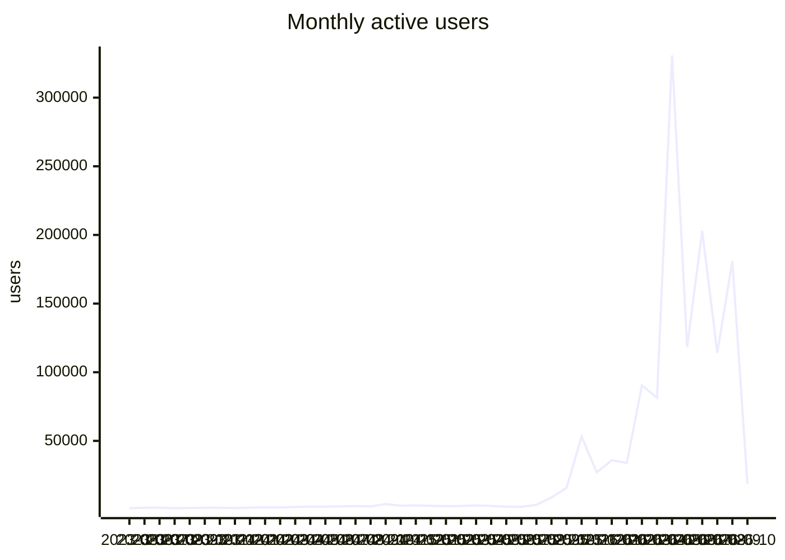

# VFB usage report

Generated 2026-10-05 from aggregate Google Analytics 4 counts for property 375054915, covering 2023-05-10 to 2026-10-04. Source tables: [`analytics/ga4/`](analytics/ga4/). Only summed counts are stored; nothing here identifies a user.

**Reading the numbers.** A large and growing share of 'users' and 'sessions' is automated traffic that loads one page and leaves within a second. Engaged hours (time with the page in the foreground) is barely touched by that traffic and is the most reliable measure of real use; seconds per session shows how bot-heavy a row is.

## Yearly totals

| year | peak monthly users | sessions | screenPageViews | engaged hours | sec/session |
|---|---|---|---|---|---|
| 2023 | 1,332 | 13,668 | 42,490 | 172.9 | 45.5 |
| 2024 | 4,045 | 62,091 | 465,976 | 1,046.3 | 60.7 |
| 2025 | 53,078 | 174,980 | 961,769 | 1,240.7 | 25.5 |
| 2026 | 330,801 | 1,291,677 | 3,393,443 | 3,550.1 | 9.9 |

## Monthly trend

| month | activeUsers | newUsers | sessions | screenPageViews | engaged hours | sec/session |
|---|---|---|---|---|---|---|
| 2024-11 | 2,756 | 2,307 | 7,746 | 71,342 | 131.2 | 61.0 |
| 2024-12 | 2,996 | 2,325 | 6,433 | 42,248 | 80.3 | 45.0 |
| 2025-01 | 2,711 | 1,830 | 7,149 | 57,703 | 94.5 | 47.6 |
| 2025-02 | 2,483 | 1,473 | 6,460 | 69,682 | 130.5 | 72.7 |
| 2025-03 | 2,594 | 1,923 | 7,298 | 70,667 | 93.3 | 46.0 |
| 2025-04 | 2,961 | 2,158 | 5,752 | 46,050 | 107.5 | 67.3 |
| 2025-05 | 2,634 | 1,976 | 5,584 | 49,953 | 203.4 | 131.1 |
| 2025-06 | 2,044 | 1,803 | 5,615 | 39,033 | 60.9 | 39.0 |
| 2025-07 | 1,950 | 1,514 | 6,599 | 43,636 | 67.9 | 37.0 |
| 2025-08 | 3,396 | 3,134 | 8,653 | 67,983 | 113.5 | 47.2 |
| 2025-09 | 8,753 | 10,370 | 15,167 | 293,319 | 97.7 | 23.2 |
| 2025-10 | 15,773 | 15,259 | 19,431 | 62,052 | 89.3 | 16.5 |
| 2025-11 | 53,078 | 51,557 | 55,532 | 92,601 | 97.5 | 6.3 |
| 2025-12 | 27,089 | 26,632 | 30,314 | 69,090 | 84.8 | 10.1 |
| 2026-01 | 35,882 | 35,655 | 41,654 | 84,515 | 93.1 | 8.0 |
| 2026-02 | 33,896 | 33,815 | 38,136 | 81,618 | 89.5 | 8.5 |
| 2026-03 | 90,461 | 89,967 | 95,391 | 204,564 | 189.0 | 7.1 |
| 2026-04 | 81,384 | 81,647 | 85,778 | 152,209 | 110.6 | 4.6 |
| 2026-05 | 330,801 | 328,117 | 328,909 | 419,823 | 495.2 | 5.4 |
| 2026-06 | 118,372 | 120,130 | 125,861 | 215,401 | 120.8 | 3.5 |
| 2026-07 | 202,893 | 200,564 | 203,206 | 285,273 | 141.3 | 2.5 |
| 2026-08 | 114,152 | 116,038 | 121,133 | 261,249 | 223.3 | 6.6 |
| 2026-09 | 180,888 | 183,665 | 230,953 | 1,586,357 | 1,963.3 | 30.6 |
| 2026-10 | 18,793 | 18,175 | 20,863 | 102,434 | 123.9 | 21.4 |

## By site, last 12 months

Page views with no host name are the v2 viewer's in-app term changes and are counted under the viewer.

| site | sessions | screenPageViews | engaged hours | sec/session |
|---|---|---|---|---|
| v2 viewer | 543,872 | 2,437,863 | 2,382.0 | 15.8 |
| www / docs | 705,047 | 791,706 | 917.6 | 4.7 |
| other VFB services | 191,440 | 202,066 | 450.7 | 8.5 |
| CATMAID | 38,072 | 37,905 | 37.9 | 3.6 |
| other / mirrors | 83,238 | 8,077 | 17.6 | 0.8 |
| legacy Edinburgh hosts | 139,087 | 139,544 | 15.8 | 0.4 |
| VFBchat | 21 | 25 | 0.0 | 0.5 |

## Countries, last 12 months

Ranked by engaged hours. 210 countries in total.

| country | users (sum of months) | sessions | engaged hours | sec/session |
|---|---|---|---|---|
| United States | 103,018 | 141,428 | 1,203.5 | 30.6 |
| United Kingdom | 14,972 | 24,724 | 627.5 | 91.4 |
| Germany | 13,403 | 21,074 | 178.8 | 30.5 |
| India | 13,609 | 16,400 | 168.3 | 36.9 |
| Puerto Rico | 212 | 1,639 | 154.5 | 339.3 |
| China | 228,477 | 231,298 | 131.7 | 2.0 |
| Canada | 6,897 | 10,255 | 93.8 | 32.9 |
| Brazil | 18,245 | 19,739 | 76.4 | 13.9 |
| Russia | 5,843 | 7,443 | 70.0 | 33.8 |
| Australia | 3,600 | 5,476 | 63.3 | 41.6 |
| Singapore | 793,159 | 787,216 | 59.8 | 0.3 |
| Japan | 9,325 | 11,209 | 53.8 | 17.3 |
| Türkiye | 4,896 | 6,085 | 45.1 | 26.7 |
| France | 3,921 | 5,377 | 43.1 | 28.9 |
| Mexico | 6,105 | 6,823 | 41.9 | 22.1 |
| Poland | 3,213 | 4,207 | 40.0 | 34.2 |
| Spain | 2,770 | 3,709 | 36.1 | 35.0 |
| Italy | 2,338 | 2,959 | 33.5 | 40.7 |
| South Korea | 1,460 | 2,849 | 31.7 | 40.1 |
| Pakistan | 4,031 | 4,237 | 30.2 | 25.7 |
| Indonesia | 12,298 | 12,817 | 28.5 | 8.0 |
| Netherlands | 2,965 | 3,627 | 27.4 | 27.2 |
| (not set) | 933 | 891 | 26.4 | 106.9 |
| Chile | 2,398 | 2,881 | 26.0 | 32.5 |
| Philippines | 4,669 | 4,974 | 23.6 | 17.1 |
| Israel | 1,447 | 2,085 | 22.5 | 38.9 |
| Argentina | 4,542 | 4,931 | 21.5 | 15.7 |
| Taiwan | 886 | 1,543 | 21.5 | 50.1 |
| Ukraine | 3,442 | 3,915 | 19.1 | 17.6 |
| Czechia | 1,014 | 1,385 | 16.9 | 44.0 |

## Cities, last 12 months

GA4 has no institution or network dimension, so city is the nearest proxy for where labs are. Cities with fewer than 5 users in a month are not stored. Data-centre cities (Ashburn, Council Bluffs, Singapore and similar) show up with near-zero seconds per session.

| city | country | months seen | sessions | engaged hours | sec/session |
|---|---|---|---|---|---|
| Dunblane | United Kingdom | 1 | 84 | 361.1 | 15,475.0 |
| San Juan | Puerto Rico | 6 | 688 | 51.8 | 270.8 |
| Singapore | Singapore | 13 | 766,723 | 50.5 | 0.2 |
| London | United Kingdom | 13 | 4,539 | 38.3 | 30.3 |
| New York | United States | 13 | 3,941 | 32.5 | 29.7 |
| Los Angeles | United States | 13 | 2,693 | 26.8 | 35.8 |
| Chicago | United States | 13 | 4,915 | 25.1 | 18.4 |
| Frederick | United States | 1 | 17 | 24.7 | 5,235.5 |
| Munich | Germany | 11 | 457 | 24.3 | 191.7 |
| Moscow | Russia | 11 | 2,164 | 23.2 | 38.5 |
| Bengaluru | India | 11 | 1,741 | 21.0 | 43.4 |
| Karachi | Pakistan | 9 | 854 | 20.9 | 88.3 |
| Cambridge | United Kingdom | 12 | 1,818 | 18.7 | 37.0 |
| San Jose | United States | 13 | 4,314 | 16.7 | 13.9 |
| Istanbul | Türkiye | 12 | 2,065 | 16.7 | 29.0 |
| Cologne | Germany | 11 | 707 | 15.8 | 80.4 |
| Sydney | Australia | 9 | 1,653 | 15.5 | 33.7 |
| Miami | United States | 10 | 646 | 15.2 | 84.5 |
| Toronto | Canada | 13 | 1,472 | 14.5 | 35.5 |
| Boston | United States | 13 | 1,851 | 14.5 | 28.1 |
| Phoenix | United States | 9 | 3,553 | 14.5 | 14.7 |
| Edinburgh | United Kingdom | 10 | 359 | 14.3 | 143.3 |
| Santiago | Chile | 11 | 1,529 | 14.0 | 32.9 |
| Athens | United States | 4 | 302 | 13.9 | 166.0 |
| Houston | United States | 13 | 1,854 | 13.5 | 26.2 |
| Melbourne | Australia | 9 | 1,242 | 13.5 | 39.0 |
| Dallas | United States | 13 | 1,583 | 13.4 | 30.6 |
| Flint Hill | United States | 7 | 4,079 | 13.4 | 11.8 |
| Atlanta | United States | 12 | 1,009 | 12.5 | 44.8 |
| Philadelphia | United States | 13 | 1,189 | 12.2 | 37.0 |
| Hong Kong | Hong Kong | 13 | 12,995 | 11.8 | 3.3 |
| Shanghai | China | 13 | 7,655 | 11.6 | 5.5 |
| Warsaw | Poland | 13 | 1,406 | 11.3 | 28.9 |
| Seoul | South Korea | 13 | 1,019 | 11.3 | 39.9 |
| Berlin | Germany | 13 | 960 | 11.0 | 41.4 |
| Brisbane | Australia | 8 | 803 | 10.8 | 48.6 |
| Rostock | Germany | 2 | 144 | 10.7 | 268.7 |
| Beijing | China | 13 | 2,362 | 10.2 | 15.6 |
| Paris | France | 13 | 1,029 | 10.1 | 35.5 |
| Vienna | Austria | 13 | 634 | 9.8 | 55.4 |
| Seattle | United States | 12 | 1,191 | 9.7 | 29.4 |
| Shenzhen | China | 13 | 1,782 | 9.4 | 19.1 |
| Mexico City | Mexico | 10 | 1,285 | 8.9 | 25.0 |
| Sao Paulo | Brazil | 11 | 1,710 | 8.6 | 18.1 |
| Ashburn | United States | 13 | 4,755 | 8.6 | 6.5 |
| Mumbai | India | 12 | 872 | 8.5 | 35.2 |
| San Francisco | United States | 11 | 1,335 | 8.3 | 22.5 |
| Delhi | India | 9 | 1,066 | 8.2 | 27.5 |
| Leipzig | Germany | 11 | 452 | 7.8 | 62.1 |
| Bristol | United Kingdom | 9 | 309 | 7.7 | 89.9 |

## Most viewed terms

Taken from the term id in viewer URLs and `/reports/` and `/term/` pages. The adult brain template leads because it is the default scene, not because people search for it.

### Last 30 days

| term | label | views | engaged hours | days seen |
|---|---|---|---|---|
| VFB_00101567 | JRC2018Unisex | 494,009 | 847.6 | 30 |
| FBbt_00003624 | adult brain | 56,266 | 27.6 | 30 |
| FBbt_00003748 | medulla | 45,503 | 20.9 | 30 |
| FBbt_00003681 | adult lateral accessory lobe | 39,726 | 15.9 | 30 |
| FBbt_00040041 | vest | 33,608 | 12.4 | 30 |
| FBbt_00005093 | nervous system | 28,005 | 11.3 | 30 |
| FBbt_00040043 | anterior ventrolateral protocerebrum | 27,289 | 11.5 | 30 |
| FBbt_00045048 | saddle | 27,144 | 8.3 | 30 |
| FBbt_00003004 | adult | 26,366 | 10.1 | 30 |
| FBbt_00003680 | nodulus | 26,119 | 4.4 | 30 |
| FBbt_00047887 | adult central brain | 20,675 | 5.2 | 30 |
| FBbt_00040042 | posterior ventrolateral protocerebrum | 19,557 | 6.8 | 30 |
| FBbt_00003678 | ellipsoid body | 14,619 | 5.6 | 30 |
| FBbt_00014013 | adult gnathal ganglion | 14,470 | 5.1 | 30 |
| FBbt_00045027 | wedge | 14,184 | 4.9 | 30 |
| VFB_00108w0p | BANC:brain_neuropil on JRC2018Unisex | 12,518 | 5.1 | 28 |
| FBbt_00007050 | adult cerebrum | 11,977 | 3.0 | 30 |
| FBbt_00045050 | flange | 10,646 | 3.8 | 30 |
| FBbt_00003632 | adult central complex | 9,856 | 2.1 | 30 |
| VFB_00102140 | LAL on JRC2018Unisex adult brain | 9,620 | 3.1 | 29 |
| VFB_00102107 | ME on JRC2018Unisex adult brain | 9,559 | 4.3 | 30 |
| FBbt_00003679 | fan-shaped body | 9,040 | 3.4 | 30 |
| FBbt_00110636 | adult cerebral ganglion | 8,966 | 2.7 | 30 |
| VFB_00102212 | VES on JRC2018Unisex adult brain | 8,876 | 3.1 | 29 |
| FBbt_00053384 | adult primary visual center | 8,821 | 3.6 | 30 |

### Last 12 months

| term | label | views | engaged hours | days seen |
|---|---|---|---|---|
| VFB_00101567 | JRC2018Unisex | 729,255 | 1,471.9 | 365 |
| FBbt_00003624 | adult brain | 65,678 | 39.0 | 329 |
| FBbt_00003748 | medulla | 57,477 | 35.5 | 342 |
| FBbt_00003681 | adult lateral accessory lobe | 46,866 | 25.7 | 336 |
| FBbt_00040041 | vest | 39,493 | 21.0 | 322 |
| FBbt_00005093 | nervous system | 33,420 | 17.6 | 300 |
| FBbt_00040043 | anterior ventrolateral protocerebrum | 33,169 | 17.7 | 294 |
| FBbt_00045048 | saddle | 31,699 | 14.3 | 298 |
| FBbt_00003004 | adult | 30,050 | 14.7 | 278 |
| FBbt_00003680 | nodulus | 29,742 | 7.4 | 241 |
| FBbt_00047887 | adult central brain | 24,291 | 8.5 | 273 |
| FBbt_00040042 | posterior ventrolateral protocerebrum | 22,517 | 10.9 | 278 |
| FBbt_00003678 | ellipsoid body | 18,397 | 11.7 | 282 |
| VFB_jrchk7yg | WEDPN2A_R (FlyEM-HB:885788485) | 17,804 | 5.6 | 139 |
| FBbt_00014013 | adult gnathal ganglion | 17,483 | 11.6 | 271 |
| VFB_00050000 | L1 larval CNS ssTEM - Cardona/Janelia | 16,725 | 27.6 | 318 |
| FBbt_00045027 | wedge | 16,623 | 7.8 | 271 |
| FBbt_00007050 | adult cerebrum | 14,724 | 5.7 | 256 |
| VFB_00102107 | ME on JRC2018Unisex adult brain | 13,840 | 10.3 | 235 |
| FBbt_00045050 | flange | 12,614 | 6.1 | 237 |
| VFB_00108w0p | BANC:brain_neuropil on JRC2018Unisex | 12,518 | 5.1 | 28 |
| VFB_00102140 | LAL on JRC2018Unisex adult brain | 11,857 | 5.3 | 184 |
| FBbt_00003632 | adult central complex | 11,828 | 4.1 | 192 |
| FBbt_00110636 | adult cerebral ganglion | 11,449 | 4.3 | 236 |
| FBbt_00003679 | fan-shaped body | 11,363 | 6.3 | 254 |

### All time

| term | label | views | engaged hours | days seen |
|---|---|---|---|---|
| VFB_00101567 | JRC2018Unisex | 920,423 | 1,700.2 | 963 |
| FBbt_00003624 | adult brain | 78,489 | 61.9 | 850 |
| FBbt_00003748 | medulla | 66,818 | 55.5 | 841 |
| FBbt_00003681 | adult lateral accessory lobe | 53,145 | 39.2 | 813 |
| FBbt_00040041 | vest | 45,538 | 32.1 | 785 |
| FBbt_00040043 | anterior ventrolateral protocerebrum | 38,266 | 27.4 | 708 |
| FBbt_00045048 | saddle | 35,955 | 22.8 | 719 |
| FBbt_00005093 | nervous system | 34,891 | 19.8 | 421 |
| FBbt_00003004 | adult | 32,344 | 17.0 | 461 |
| FBbt_00003680 | nodulus | 31,430 | 11.1 | 514 |
| FBbt_00047887 | adult central brain | 28,725 | 14.7 | 635 |
| FBbt_00040042 | posterior ventrolateral protocerebrum | 25,728 | 17.9 | 661 |
| VFB_00050000 | L1 larval CNS ssTEM - Cardona/Janelia | 24,259 | 40.1 | 781 |
| FBbt_00003678 | ellipsoid body | 21,364 | 18.0 | 620 |
| FBbt_00014013 | adult gnathal ganglion | 21,088 | 19.7 | 620 |
| FBbt_00045027 | wedge | 19,200 | 13.7 | 616 |
| VFB_jrchk7yg | WEDPN2A_R (FlyEM-HB:885788485) | 17,975 | 6.3 | 152 |
| FBbt_00007050 | adult cerebrum | 17,465 | 9.8 | 534 |
| VFB_00102107 | ME on JRC2018Unisex adult brain | 17,416 | 14.8 | 510 |
| VFB_00030867 | adult mushroom body on adult brain template JFRC2 | 16,686 | 12.9 | 426 |
| FBbt_00003679 | fan-shaped body | 16,465 | 12.2 | 576 |
| FBbt_00045050 | flange | 14,516 | 10.3 | 515 |
| VFB_00102140 | LAL on JRC2018Unisex adult brain | 14,427 | 8.8 | 402 |
| FBbt_00110636 | adult cerebral ganglion | 13,904 | 7.3 | 520 |
| FBbt_00003632 | adult central complex | 13,685 | 7.7 | 388 |

### Templates in use, last 12 months

| template | label | views |
|---|---|---|
| VFB_00101567 | JRC2018Unisex | 1,189,601 |
| VFB_00050000 | L1 larval CNS ssTEM - Cardona/Janelia | 33,025 |
| VFB_00017894 | adult brain template JFRC2 | 17,503 |
| VFB_00200000 | JRC2018UnisexVNC | 11,939 |
| VFB_00049000 | L3 CNS template - Wood2018 | 8,868 |
| VFB_00110000 | Adult Head (McKellar2020) | 3,109 |
| VFB_00101384 | JRC_FlyEM_Hemibrain | 2,150 |
| FBbt_00003624 | adult brain | 1,383 |
| VFB_00120000 | Adult T1 Leg (Kuan2020) | 1,277 |
| VFB_00030786 | adult brain template Ito2014 | 899 |

## Website and documentation pages, last 12 months

| pagePath | screenPageViews | engaged hours |
|---|---|---|
| / | 172,984 | 526.6 |
| /docs/ | 16,378 | 37.4 |
| /about/ | 5,589 | 24.5 |
| /blog/releases/catmaid/ | 508 | 22.0 |
| /docs/overview/ | 3,592 | 20.8 |
| /docs/data/ | 5,335 | 17.5 |
| /docs/tutorials/vfb-mcp-guide/ | 1,581 | 9.3 |
| /docs/website-features/3dviewer/ | 2,284 | 8.7 |
| /hosted/ | 2,557 | 5.1 |
| /docs/tutorials/ | 2,171 | 5.0 |
| /docs/contribution-guidelines/ | 1,121 | 4.5 |
| /about/whichfly/ | 423 | 4.5 |
| /docs/concepts/flylight_tiles/ | 578 | 3.4 |
| /docs/tutorials/apis/ | 713 | 3.3 |
| /docs/apis/ | 643 | 3.2 |
| /about/hosted/ | 937 | 3.1 |
| /docs/website-features/search_query/ | 676 | 2.9 |
| /blog/news/ | 1,319 | 2.9 |
| /blog/2026/09/06/vfb-self-led-learning-sessions-a-free-online-workshop-open-to-everyone/ | 851 | 2.6 |
| /docs/website-features/ | 908 | 2.5 |
| /docs/concepts/ | 509 | 2.4 |
| /docs/concepts/neuron-counts/ | 266 | 2.2 |
| /docs/data/em/ | 396 | 2.1 |
| /docs/tutorials/apis/vfb_api_overview/ | 327 | 2.1 |
| /docs/concepts/cell_types/ | 350 | 2.1 |
| /search/ | 593 | 2.0 |
| /docs/tools/ | 356 | 1.9 |
| /docs/concepts/bridging/ | 219 | 1.9 |
| /docs/data/connectivity/ | 260 | 1.7 |
| /blog/2025/12/17/neurofly-2026-21st-biennial-european-drosophila-neurobiology-conference/ | 461 | 1.7 |

## How people arrive

Engaged sessions by channel and year.

| channel | 2023 | 2024 | 2025 | 2026 |
|---|---|---|---|---|
| (other) | 0 | 0 | 0 | 0 |
| AI Assistant | 0 | 0 | 0 | 2,241 |
| Cross-network | 0 | 0 | 0 | 2 |
| Direct | 1,628 | 10,737 | 124,445 | 1,098,751 |
| Organic Search | 3,198 | 18,605 | 30,520 | 165,763 |
| Organic Shopping | 0 | 3 | 2 | 0 |
| Organic Social | 7 | 454 | 125 | 1,322 |
| Organic Video | 0 | 2 | 0 | 39 |
| Referral | 495 | 18,973 | 11,071 | 8,504 |
| Unassigned | 0 | 6 | 60 | 1,460 |

Top sources, last 12 months.

| sessionSource | sessions | engaged hours |
|---|---|---|
| google | 162,627 | 2,054.7 |
| (direct) | 1,194,878 | 1,158.1 |
| bing | 10,722 | 228.8 |
| (not set) | 8,889 | 50.8 |
| chatgpt.com | 2,649 | 38.9 |
| yahoo | 680 | 29.4 |
| cn.bing.com | 774 | 27.6 |
| duckduckgo | 2,216 | 25.7 |
| flybase.org | 955 | 15.8 |
| splitgal4.janelia.org | 1,599 | 15.7 |
| codex.flywire.ai | 1,935 | 13.7 |
| gemini.google.com | 514 | 11.7 |
| ecosia.org | 710 | 8.6 |
| github.com | 598 | 8.6 |
| moodle.carleton.edu | 120 | 6.3 |
| science.org | 151 | 5.9 |
| trafficheap.com | 502 | 5.8 |
| trafficheap.cc | 502 | 5.8 |
| en.wikipedia.org | 321 | 5.3 |
| janelia.org | 241 | 4.6 |
| neuronbridge.janelia.org | 124 | 4.3 |
| yandex.ru | 234 | 3.9 |
| search.brave.com | 249 | 3.9 |
| flweb.janelia.org | 248 | 3.4 |
| doubao.com | 76 | 3.4 |

## Queries run in the viewer, last 12 months

| query | runs |
|---|---|
| allalignedimages | 3,471 |
| imagesneurons | 930 |
| alldatasets | 504 |
| aligneddatasets | 479 |
| neuronsparthere | 391 |
| listallavailableimages | 388 |
| partsof | 224 |
| painteddomains | 220 |
| neuronssynaptic | 113 |
| subclassesof | 112 |
| neuronneuronconnectivit | 83 |
| neuronspresynaptichere | 76 |
| neuronspostsynaptichere | 70 |
| datasetimages | 66 |
| transgeneexpressionhere | 55 |
| expressioncluster | 52 |
| tractsnervesinnervating | 43 |
| similarmorphologyto | 38 |
| lineageclonesin | 30 |
| termsforpub | 27 |
| findstocks | 24 |
| neuronregionconnectivit | 19 |
| upstreamclassconnectivi | 18 |
| anatscrnaseqquery | 15 |
| splitstargeting | 12 |

## VFBchat and MCP

| month | chat_query | mcp_tool_call |
|---|---|---|
| 2026-02 | 70 | 492 |
| 2026-03 | 354 | 2,258 |
| 2026-04 | 575 | 7,992 |
| 2026-05 | 17 | 971 |
| 2026-06 | 358 | 30,858 |
| 2026-07 | 9 | 18,938 |
| 2026-08 | 1,017 | 89,583 |
| 2026-09 | 797 | 84,835 |
| 2026-10 | 36 | 842 |

## Viewer reliability

| month | session_start | disconnected | reconnected-resumed | reconnect-failed-reloading | reconnect-exhausted | disconnects per 100 sessions |
|---|---|---|---|---|---|---|
| 2025-05 | 2,675 | 1,436 | 0 | 101 | 0 | 53.7 |
| 2025-06 | 3,466 | 1,365 | 0 | 12 | 0 | 39.4 |
| 2025-07 | 4,662 | 2,057 | 0 | 18 | 0 | 44.1 |
| 2025-08 | 6,571 | 1,680 | 0 | 17 | 0 | 25.6 |
| 2025-09 | 6,265 | 1,170 | 0 | 24 | 0 | 18.7 |
| 2025-10 | 7,777 | 1,232 | 0 | 17 | 0 | 15.8 |
| 2025-11 | 8,460 | 1,163 | 0 | 24 | 0 | 13.7 |
| 2025-12 | 10,434 | 1,359 | 0 | 8 | 0 | 13.0 |
| 2026-01 | 21,913 | 1,530 | 0 | 30 | 0 | 7.0 |
| 2026-02 | 24,790 | 1,536 | 0 | 31 | 0 | 6.2 |
| 2026-03 | 23,808 | 5,059 | 0 | 465 | 0 | 21.2 |
| 2026-04 | 23,996 | 2,933 | 0 | 33 | 0 | 12.2 |
| 2026-05 | 55,407 | 2,314 | 0 | 44 | 0 | 4.2 |
| 2026-06 | 23,505 | 2,149 | 0 | 158 | 0 | 9.1 |
| 2026-07 | 45,208 | 2,280 | 0 | 49 | 0 | 5.0 |
| 2026-08 | 24,841 | 3,675 | 0 | 530 | 0 | 14.8 |
| 2026-09 | 51,588 | 75,199 | 30,436 | 38,791 | 1,919 | 145.8 |
| 2026-10 | 4,265 | 6,774 | 2,333 | 4,285 | 59 | 158.8 |

Load times from the timing suffix on viewer events (months with at least 100 samples).

| month | event | n | median s | p95 s |
|---|---|---|---|---|
| 2026-09 | direct-geom:obj:ok | 61,923 | 1.4 | 25.4 |
| 2026-10 | direct-geom:obj:ok | 9,620 | 1.6 | 54.5 |
| 2026-09 | direct-terminfo:ok | 109,210 | 0.4 | 3.0 |
| 2026-10 | direct-terminfo:ok | 18,248 | 0.4 | 15.9 |
| 2026-09 | startup-first-term | 50,164 | 5.2 | 58.0 |
| 2026-10 | startup-first-term | 8,149 | 5.1 | 58.0 |
| 2026-09 | startup-model | 54,086 | 2.8 | 25.0 |
| 2026-10 | startup-model | 9,092 | 2.7 | 8.9 |
| 2026-09 | term-load:ok | 104,726 | 1.0 | 45.0 |
| 2026-10 | term-load:ok | 16,783 | 0.9 | 55.0 |

## Outbound links clicked, last 12 months

| linkDomain | clicks |
|---|---|
| neuronbridge.janelia.org | 1,413 |
| pypi.org | 1,166 |
| virtualflybrain.org | 884 |
| github.com | 807 |
| v2.virtualflybrain.org | 622 |
| insectbraindb.org | 538 |
| flweb.janelia.org | 428 |
| colab.research.google.com | 330 |
| translate.google.com | 288 |
| doi.org | 272 |
| flybase.org | 179 |
| chat.virtualflybrain.org | 78 |
| virtualflybrain.bsky.social | 75 |
| codex.flywire.ai | 72 |
| google.com | 57 |
| vfb3-mcp.virtualflybrain.org | 50 |
| neurofly.org | 48 |
| neuprint.janelia.org | 40 |
| janelia.org | 38 |
| ncbi.nlm.nih.gov | 21 |

## Devices and browsers, last 12 months

| deviceCategory | browser | sessions | engaged hours |
|---|---|---|---|
| desktop | Chrome | 1,264,978 | 2,379.3 |
| desktop | Edge | 17,675 | 385.2 |
| mobile | Chrome | 41,611 | 295.6 |
| desktop | Safari | 12,680 | 186.4 |
| desktop | Firefox | 10,627 | 185.7 |
| desktop | Opera | 12,353 | 151.3 |
| mobile | Safari | 29,225 | 139.3 |
| tablet | Chrome | 2,269 | 29.5 |
| mobile | Firefox | 1,134 | 10.0 |
| mobile | Samsung Internet | 1,357 | 9.8 |
| tablet | Safari | 834 | 9.6 |
| desktop | YaBrowser | 474 | 7.5 |

## What this data cannot show

- **Institutions.** GA4 dropped the network-domain dimension and never exposes IP addresses. City is as close as it gets.
- **Search terms typed into VFB.** The viewer does not send a `search` event, so `searchTerm` is empty. Term popularity above comes from term ids in URLs.
- **Event detail.** No custom dimensions are registered on the property, so event parameters (`event_label`, `event_category`, and the VFBchat and MCP parameters such as tool name and topic) are discarded from reports. Registration is not retroactive.
- **Yearly unique users.** Users do not add up across days or months; only daily and monthly uniques are stored.
