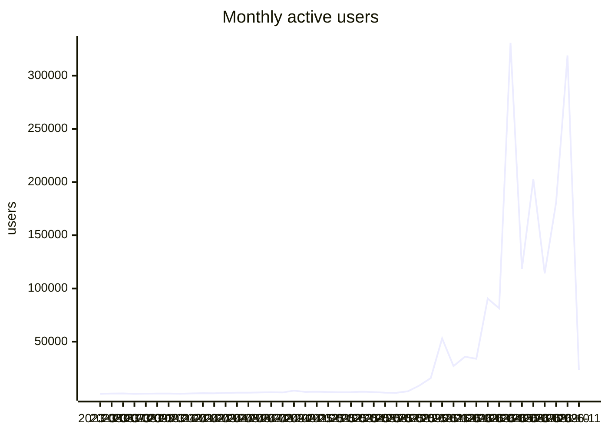

# VFB usage report

Generated 2026-11-03 from aggregate Google Analytics 4 counts for property 375054915, covering 2023-05-10 to 2026-11-02. Source tables: [`analytics/ga4/`](analytics/ga4/). Only summed counts are stored; nothing here identifies a user.

**Reading the numbers.** A large and growing share of 'users' and 'sessions' is automated traffic that loads one page and leaves within a second. Engaged hours (time with the page in the foreground) is barely touched by that traffic and is the most reliable measure of real use; seconds per session shows how bot-heavy a row is.

## Yearly totals

| year | peak monthly users | sessions | screenPageViews | engaged hours | sec/session |
|---|---|---|---|---|---|
| 2023 | 1,332 | 13,668 | 42,490 | 172.9 | 45.5 |
| 2024 | 4,045 | 62,091 | 465,976 | 1,046.3 | 60.7 |
| 2025 | 53,078 | 174,980 | 961,769 | 1,240.7 | 25.5 |
| 2026 | 330,801 | 1,623,794 | 4,351,044 | 4,276.5 | 9.5 |

## Monthly trend

```mermaid
xychart-beta
    title "Engaged hours per month"
    x-axis ["2023-05", "2023-06", "2023-07", "2023-08", "2023-09", "2023-10", "2023-11", "2023-12", "2024-01", "2024-02", "2024-03", "2024-04", "2024-05", "2024-06", "2024-07", "2024-08", "2024-09", "2024-10", "2024-11", "2024-12", "2025-01", "2025-02", "2025-03", "2025-04", "2025-05", "2025-06", "2025-07", "2025-08", "2025-09", "2025-10", "2025-11", "2025-12", "2026-01", "2026-02", "2026-03", "2026-04", "2026-05", "2026-06", "2026-07", "2026-08", "2026-09", "2026-10", "2026-11"]
    y-axis "hours"
    line [34.4, 51.4, 14.5, 5.6, 16.4, 27.8, 17.3, 5.6, 16.0, 5.2, 18.8, 66.8, 117.3, 88.8, 215.3, 51.6, 109.2, 145.8, 131.2, 80.3, 94.5, 130.5, 93.3, 107.5, 203.4, 60.9, 67.9, 113.5, 97.7, 89.3, 97.5, 84.8, 93.1, 89.5, 189.0, 110.6, 495.2, 120.8, 141.3, 223.3, 1963.3, 813.6, 36.8]
```

```mermaid
xychart-beta
    title "Monthly active users"
    x-axis ["2023-05", "2023-06", "2023-07", "2023-08", "2023-09", "2023-10", "2023-11", "2023-12", "2024-01", "2024-02", "2024-03", "2024-04", "2024-05", "2024-06", "2024-07", "2024-08", "2024-09", "2024-10", "2024-11", "2024-12", "2025-01", "2025-02", "2025-03", "2025-04", "2025-05", "2025-06", "2025-07", "2025-08", "2025-09", "2025-10", "2025-11", "2025-12", "2026-01", "2026-02", "2026-03", "2026-04", "2026-05", "2026-06", "2026-07", "2026-08", "2026-09", "2026-10", "2026-11"]
    y-axis "users"
    line [967, 1268, 1332, 960, 1106, 1297, 1242, 1087, 1362, 1557, 1492, 1863, 2053, 2072, 2280, 2479, 2250, 4045, 2756, 2996, 2711, 2483, 2594, 2961, 2634, 2044, 1950, 3396, 8753, 15773, 53078, 27089, 35882, 33896, 90461, 81384, 330801, 118372, 202893, 114152, 180888, 319023, 23428]
```

| month | activeUsers | newUsers | sessions | screenPageViews | engaged hours | sec/session |
|---|---|---|---|---|---|---|
| 2024-12 | 2,996 | 2,325 | 6,433 | 42,248 | 80.3 | 45.0 |
| 2025-01 | 2,711 | 1,830 | 7,149 | 57,703 | 94.5 | 47.6 |
| 2025-02 | 2,483 | 1,473 | 6,460 | 69,682 | 130.5 | 72.7 |
| 2025-03 | 2,594 | 1,923 | 7,298 | 70,667 | 93.3 | 46.0 |
| 2025-04 | 2,961 | 2,158 | 5,752 | 46,050 | 107.5 | 67.3 |
| 2025-05 | 2,634 | 1,976 | 5,584 | 49,953 | 203.4 | 131.1 |
| 2025-06 | 2,044 | 1,803 | 5,615 | 39,033 | 60.9 | 39.0 |
| 2025-07 | 1,950 | 1,514 | 6,599 | 43,636 | 67.9 | 37.0 |
| 2025-08 | 3,396 | 3,134 | 8,653 | 67,983 | 113.5 | 47.2 |
| 2025-09 | 8,753 | 10,370 | 15,167 | 293,319 | 97.7 | 23.2 |
| 2025-10 | 15,773 | 15,259 | 19,431 | 62,052 | 89.3 | 16.5 |
| 2025-11 | 53,078 | 51,557 | 55,532 | 92,601 | 97.5 | 6.3 |
| 2025-12 | 27,089 | 26,632 | 30,314 | 69,090 | 84.8 | 10.1 |
| 2026-01 | 35,882 | 35,655 | 41,654 | 84,515 | 93.1 | 8.0 |
| 2026-02 | 33,896 | 33,815 | 38,136 | 81,618 | 89.5 | 8.5 |
| 2026-03 | 90,461 | 89,967 | 95,391 | 204,564 | 189.0 | 7.1 |
| 2026-04 | 81,384 | 81,647 | 85,778 | 152,209 | 110.6 | 4.6 |
| 2026-05 | 330,801 | 328,117 | 328,909 | 419,823 | 495.2 | 5.4 |
| 2026-06 | 118,372 | 120,130 | 125,861 | 215,401 | 120.8 | 3.5 |
| 2026-07 | 202,893 | 200,564 | 203,206 | 285,273 | 141.3 | 2.5 |
| 2026-08 | 114,152 | 116,038 | 121,133 | 261,249 | 223.3 | 6.6 |
| 2026-09 | 180,888 | 183,665 | 230,953 | 1,586,357 | 1,963.3 | 30.6 |
| 2026-10 | 319,023 | 302,918 | 333,450 | 996,586 | 813.6 | 8.8 |
| 2026-11 | 23,428 | 18,831 | 23,582 | 63,506 | 36.8 | 5.6 |

## By site, last 12 months

Page views with no host name are the v2 viewer's in-app term changes and are counted under the viewer.

| site | sessions | screenPageViews | engaged hours | sec/session |
|---|---|---|---|---|
| v2 viewer | 821,646 | 3,162,068 | 2,865.5 | 12.6 |
| www / docs | 862,747 | 962,572 | 1,057.9 | 4.4 |
| other VFB services | 187,213 | 198,790 | 455.8 | 8.8 |
| CATMAID | 38,597 | 38,460 | 43.4 | 4.0 |
| other / mirrors | 83,874 | 8,874 | 20.7 | 0.9 |
| legacy Edinburgh hosts | 141,517 | 141,998 | 15.6 | 0.4 |
| VFBchat | 26 | 30 | 0.0 | 0.4 |

## Countries, last 12 months

Ranked by engaged hours. 212 countries in total.

| country | users (sum of months) | sessions | engaged hours | sec/session |
|---|---|---|---|---|
| United States | 121,526 | 162,009 | 1,383.8 | 30.7 |
| United Kingdom | 17,136 | 27,652 | 717.7 | 93.4 |
| Germany | 14,797 | 22,369 | 192.0 | 30.9 |
| India | 15,015 | 18,110 | 189.9 | 37.8 |
| China | 291,311 | 294,481 | 177.5 | 2.2 |
| Puerto Rico | 238 | 1,594 | 148.6 | 335.5 |
| Canada | 7,962 | 11,606 | 107.0 | 33.2 |
| Hong Kong | 136,732 | 136,473 | 104.1 | 2.7 |
| Brazil | 20,380 | 22,001 | 83.5 | 13.7 |
| Australia | 4,272 | 6,385 | 74.2 | 41.8 |
| Russia | 6,303 | 8,214 | 73.7 | 32.3 |
| Chile | 2,721 | 3,287 | 61.4 | 67.2 |
| Singapore | 873,723 | 866,857 | 59.9 | 0.2 |
| Japan | 9,865 | 11,796 | 56.3 | 17.2 |
| Poland | 3,768 | 4,963 | 48.2 | 35.0 |
| France | 4,458 | 5,974 | 47.7 | 28.7 |
| Türkiye | 5,260 | 6,556 | 47.6 | 26.2 |
| Mexico | 6,882 | 7,693 | 46.1 | 21.6 |
| Spain | 3,196 | 4,291 | 43.0 | 36.1 |
| Italy | 2,667 | 3,373 | 38.5 | 41.1 |
| Indonesia | 13,251 | 13,856 | 33.7 | 8.8 |
| South Korea | 1,613 | 3,118 | 33.4 | 38.6 |
| Pakistan | 4,324 | 4,562 | 32.2 | 25.4 |
| Netherlands | 3,318 | 4,095 | 31.2 | 27.4 |
| Philippines | 5,201 | 5,576 | 28.8 | 18.6 |
| (not set) | 1,030 | 986 | 26.4 | 96.4 |
| Argentina | 5,105 | 5,558 | 25.5 | 16.5 |
| Thailand | 2,479 | 3,007 | 23.3 | 27.9 |
| Israel | 1,599 | 2,276 | 23.2 | 36.7 |
| Taiwan | 955 | 1,627 | 21.7 | 48.0 |

## Cities, last 12 months

GA4 has no institution or network dimension, so city is the nearest proxy for where labs are. Cities with fewer than 5 users in a month are not stored. Data-centre cities (Ashburn, Council Bluffs, Singapore and similar) show up with near-zero seconds per session.

| city | country | months seen | sessions | engaged hours | sec/session |
|---|---|---|---|---|---|
| Dunblane | United Kingdom | 1 | 84 | 361.1 | 15,475.0 |
| Hong Kong | Hong Kong | 13 | 135,004 | 101.1 | 2.7 |
| San Juan | Puerto Rico | 7 | 702 | 51.9 | 266.2 |
| Singapore | Singapore | 13 | 846,117 | 51.3 | 0.2 |
| Santiago | Chile | 11 | 1,736 | 46.3 | 96.0 |
| London | United Kingdom | 13 | 5,041 | 44.1 | 31.5 |
| New York | United States | 13 | 4,416 | 36.6 | 29.8 |
| Los Angeles | United States | 13 | 3,066 | 28.7 | 33.7 |
| Chicago | United States | 13 | 5,287 | 26.6 | 18.1 |
| Urumqi | China | 5 | 68,650 | 26.5 | 1.4 |
| Frederick | United States | 1 | 17 | 24.7 | 5,235.5 |
| Moscow | Russia | 11 | 2,419 | 24.4 | 36.4 |
| Munich | Germany | 10 | 477 | 23.9 | 180.6 |
| Bengaluru | India | 11 | 1,948 | 23.6 | 43.6 |
| Karachi | Pakistan | 9 | 925 | 21.4 | 83.2 |
| Round Rock | United States | 2 | 50 | 21.2 | 1,525.3 |
| San Jose | United States | 13 | 5,073 | 20.2 | 14.3 |
| Phoenix | United States | 9 | 4,559 | 19.7 | 15.5 |
| Edinburgh | United Kingdom | 9 | 456 | 18.9 | 149.2 |
| Cambridge | United Kingdom | 12 | 1,847 | 18.9 | 36.8 |
| Istanbul | Türkiye | 12 | 2,227 | 17.8 | 28.8 |
| Sydney | Australia | 10 | 1,868 | 17.6 | 33.8 |
| Flint Hill | United States | 7 | 5,287 | 17.2 | 11.7 |
| Athens | United States | 4 | 386 | 16.9 | 157.4 |
| Melbourne | Australia | 9 | 1,430 | 16.2 | 40.8 |
| Cologne | Germany | 10 | 730 | 15.9 | 78.3 |
| Miami | United States | 10 | 737 | 15.8 | 77.4 |
| Houston | United States | 13 | 2,014 | 15.7 | 28.1 |
| Dallas | United States | 13 | 1,863 | 15.4 | 29.7 |
| Toronto | Canada | 13 | 1,670 | 15.1 | 32.6 |
| Boston | United States | 13 | 1,962 | 15.1 | 27.7 |
| Atlanta | United States | 13 | 1,171 | 14.8 | 45.4 |
| Beijing | China | 13 | 4,721 | 14.0 | 10.7 |
| Brisbane | Australia | 9 | 1,018 | 13.6 | 48.3 |
| Warsaw | Poland | 13 | 1,601 | 13.5 | 30.3 |
| Berlin | Germany | 12 | 1,033 | 12.0 | 42.0 |
| Shanghai | China | 12 | 7,594 | 11.4 | 5.4 |
| Paris | France | 12 | 1,117 | 11.4 | 36.9 |
| Seoul | South Korea | 12 | 1,076 | 11.2 | 37.6 |
| Seattle | United States | 12 | 1,349 | 10.9 | 29.1 |
| Rostock | Germany | 2 | 144 | 10.7 | 268.7 |
| Shenzhen | China | 12 | 1,793 | 10.5 | 21.0 |
| Philadelphia | United States | 13 | 1,265 | 10.5 | 29.8 |
| Bangkok | Thailand | 9 | 1,313 | 10.4 | 28.6 |
| Des Moines | United States | 10 | 3,594 | 10.2 | 10.2 |
| Mumbai | India | 11 | 969 | 10.0 | 37.1 |
| Ashburn | United States | 13 | 5,340 | 9.8 | 6.6 |
| Mexico City | Mexico | 11 | 1,454 | 9.6 | 23.8 |
| San Francisco | United States | 10 | 1,401 | 9.5 | 24.4 |
| Sao Paulo | Brazil | 11 | 1,930 | 9.5 | 17.7 |

## Most viewed terms

Taken from the term id in viewer URLs and `/reports/` and `/term/` pages. The adult brain template leads because it is the default scene, not because people search for it.

### Last 30 days

| term | label | views | engaged hours | days seen |
|---|---|---|---|---|
| VFB_00101567 | JRC2018Unisex | 246,989 | 212.7 | 30 |
| FBbt_00003624 | adult brain | 26,061 | 11.4 | 30 |
| FBbt_00003748 | medulla | 12,230 | 4.5 | 30 |
| FBbt_00003681 | adult lateral accessory lobe | 9,658 | 3.1 | 30 |
| VFB_00108w0p | BANC:brain_neuropil on JRC2018Unisex | 8,059 | 3.3 | 30 |
| FBbt_00005093 | nervous system | 8,054 | 2.7 | 30 |
| FBbt_00040041 | vest | 7,446 | 2.0 | 30 |
| FBbt_00040043 | anterior ventrolateral protocerebrum | 6,385 | 2.2 | 30 |
| FBbt_00045048 | saddle | 6,320 | 49.9 | 30 |
| FBbt_00007146 | adult deutocerebrum | 6,001 | 0.1 | 29 |
| FBbt_00003004 | adult | 5,447 | 2.1 | 30 |
| FBbt_00003680 | nodulus | 5,302 | 0.9 | 30 |
| FBbt_00047887 | adult central brain | 4,747 | 1.2 | 30 |
| FBbt_00040042 | posterior ventrolateral protocerebrum | 4,494 | 1.7 | 30 |
| VFBexp_FBtp0121 |  | 4,088 | 0.4 | 29 |
| VFBexp_FBtp0122 |  | 3,913 | 0.6 | 26 |
| VFBexp_FBtp0104 |  | 3,760 | 0.3 | 22 |
| FBbt_00045027 | wedge | 3,719 | 1.1 | 30 |
| VFBexp_FBtp0103 |  | 3,706 | 0.5 | 22 |
| VFBexp_FBtp0101 |  | 3,574 | 0.4 | 22 |
| FBbt_00003678 | ellipsoid body | 3,565 | 1.3 | 30 |
| VFBexp_FBtp0105 |  | 3,557 | 0.4 | 22 |
| VFBexp_FBtp0100 |  | 3,450 | 0.3 | 21 |
| FBbt_00014013 | adult gnathal ganglion | 3,346 | 1.1 | 30 |
| VFBexp_FBtp0102 |  | 3,310 | 0.3 | 21 |

### Last 12 months

| term | label | views | engaged hours | days seen |
|---|---|---|---|---|
| VFB_00101567 | JRC2018Unisex | 961,926 | 1,661.3 | 365 |
| FBbt_00003624 | adult brain | 90,288 | 49.4 | 335 |
| FBbt_00003748 | medulla | 68,749 | 39.2 | 346 |
| FBbt_00003681 | adult lateral accessory lobe | 55,794 | 28.0 | 341 |
| FBbt_00040041 | vest | 46,393 | 22.4 | 326 |
| FBbt_00005093 | nervous system | 40,987 | 19.7 | 309 |
| FBbt_00040043 | anterior ventrolateral protocerebrum | 39,176 | 19.6 | 305 |
| FBbt_00045048 | saddle | 37,656 | 63.9 | 307 |
| FBbt_00003004 | adult | 35,150 | 16.5 | 290 |
| FBbt_00003680 | nodulus | 33,976 | 8.1 | 251 |
| FBbt_00047887 | adult central brain | 28,726 | 9.5 | 283 |
| FBbt_00040042 | posterior ventrolateral protocerebrum | 26,787 | 12.4 | 294 |
| FBbt_00003678 | ellipsoid body | 21,664 | 12.7 | 291 |
| VFB_jrchk7yg | WEDPN2A_R (FlyEM-HB:885788485) | 20,898 | 5.9 | 166 |
| FBbt_00014013 | adult gnathal ganglion | 20,614 | 12.4 | 278 |
| VFB_00108w0p | BANC:brain_neuropil on JRC2018Unisex | 20,288 | 8.3 | 57 |
| FBbt_00045027 | wedge | 20,100 | 8.7 | 280 |
| VFB_00050000 | L1 larval CNS ssTEM - Cardona/Janelia | 18,116 | 30.8 | 324 |
| FBbt_00007050 | adult cerebrum | 17,184 | 6.2 | 264 |
| VFB_00102107 | ME on JRC2018Unisex adult brain | 16,233 | 11.0 | 248 |
| FBbt_00045050 | flange | 14,650 | 6.5 | 246 |
| FBbt_00003632 | adult central complex | 13,820 | 4.7 | 209 |
| FBbt_00110636 | adult cerebral ganglion | 13,503 | 5.2 | 252 |
| FBbt_00053384 | adult primary visual center | 13,444 | 6.0 | 213 |
| FBbt_00003679 | fan-shaped body | 13,093 | 6.5 | 264 |

### All time

| term | label | views | engaged hours | days seen |
|---|---|---|---|---|
| VFB_00101567 | JRC2018Unisex | 1,162,536 | 1,901.8 | 992 |
| FBbt_00003624 | adult brain | 103,506 | 72.8 | 879 |
| FBbt_00003748 | medulla | 78,509 | 59.8 | 870 |
| FBbt_00003681 | adult lateral accessory lobe | 62,302 | 42.2 | 842 |
| FBbt_00040041 | vest | 52,658 | 33.9 | 814 |
| FBbt_00040043 | anterior ventrolateral protocerebrum | 44,397 | 29.5 | 737 |
| FBbt_00005093 | nervous system | 42,603 | 22.3 | 450 |
| FBbt_00045048 | saddle | 42,039 | 72.7 | 748 |
| FBbt_00003004 | adult | 37,564 | 19.1 | 490 |
| FBbt_00003680 | nodulus | 35,790 | 12.0 | 543 |
| FBbt_00047887 | adult central brain | 33,306 | 15.9 | 664 |
| FBbt_00040042 | posterior ventrolateral protocerebrum | 30,051 | 19.6 | 690 |
| VFB_00050000 | L1 larval CNS ssTEM - Cardona/Janelia | 25,949 | 43.6 | 810 |
| FBbt_00003678 | ellipsoid body | 24,800 | 19.3 | 649 |
| FBbt_00014013 | adult gnathal ganglion | 24,322 | 20.7 | 649 |
| FBbt_00045027 | wedge | 22,783 | 14.7 | 645 |
| VFB_jrchk7yg | WEDPN2A_R (FlyEM-HB:885788485) | 21,069 | 6.6 | 179 |
| VFB_00108w0p | BANC:brain_neuropil on JRC2018Unisex | 20,288 | 8.3 | 57 |
| VFB_00102107 | ME on JRC2018Unisex adult brain | 20,117 | 15.8 | 538 |
| FBbt_00007050 | adult cerebrum | 20,073 | 10.4 | 563 |
| FBbt_00003679 | fan-shaped body | 18,505 | 12.6 | 605 |
| VFB_00030867 | adult mushroom body on adult brain template JFRC2 | 17,475 | 13.1 | 449 |
| FBbt_00045050 | flange | 16,701 | 10.9 | 544 |
| FBbt_00110636 | adult cerebral ganglion | 16,039 | 8.3 | 549 |
| FBbt_00003632 | adult central complex | 15,736 | 8.4 | 417 |

### Templates in use, last 12 months

| template | label | views |
|---|---|---|
| VFB_00101567 | JRC2018Unisex | 1,529,650 |
| VFB_00050000 | L1 larval CNS ssTEM - Cardona/Janelia | 35,884 |
| VFB_00017894 | adult brain template JFRC2 | 18,895 |
| VFB_00200000 | JRC2018UnisexVNC | 18,118 |
| VFB_00049000 | L3 CNS template - Wood2018 | 9,527 |
| VFB_00101384 | JRC_FlyEM_Hemibrain | 4,483 |
| VFB_00110000 | Adult Head (McKellar2020) | 3,517 |
| VFB_00120000 | Adult T1 Leg (Kuan2020) | 2,160 |
| FBbt_00003624 | adult brain | 1,383 |
| VFB_00100000 | adult VNS template - Court2018 | 1,236 |

## Website and documentation pages, last 12 months

| pagePath | screenPageViews | engaged hours |
|---|---|---|
| / | 215,606 | 621.2 |
| /docs/ | 19,589 | 45.0 |
| /about/ | 6,505 | 28.2 |
| /docs/overview/ | 4,222 | 24.0 |
| /blog/releases/catmaid/ | 531 | 22.4 |
| /docs/data/ | 6,445 | 21.3 |
| /docs/tutorials/vfb-mcp-guide/ | 1,885 | 10.9 |
| /docs/website-features/3dviewer/ | 2,812 | 10.3 |
| /docs/tutorials/ | 2,649 | 6.2 |
| /hosted/ | 3,027 | 6.0 |
| /docs/contribution-guidelines/ | 1,410 | 5.7 |
| /about/whichfly/ | 524 | 5.2 |
| /docs/tutorials/apis/ | 805 | 3.7 |
| /docs/apis/ | 760 | 3.7 |
| /docs/website-features/search_query/ | 846 | 3.7 |
| /docs/concepts/flylight_tiles/ | 631 | 3.6 |
| /blog/news/ | 1,612 | 3.5 |
| /blog/2026/09/06/vfb-self-led-learning-sessions-a-free-online-workshop-open-to-everyone/ | 1,125 | 3.2 |
| /docs/website-features/ | 1,158 | 3.0 |
| /docs/concepts/ | 584 | 2.7 |
| /docs/data/em/ | 502 | 2.5 |
| /docs/tutorials/apis/vfb_api_overview/ | 376 | 2.4 |
| /docs/concepts/neuron-counts/ | 305 | 2.4 |
| /docs/concepts/cell_types/ | 380 | 2.3 |
| /about/hosted/ | 928 | 2.3 |
| /docs/tutorials/website/similarityscore/ | 348 | 2.3 |
| /docs/tools/ | 424 | 2.2 |
| /docs/website-features/download/ | 555 | 2.0 |
| /docs/tutorials/website/bulkdownloads/ | 515 | 2.0 |
| /about/whatisvfb/ | 626 | 2.0 |

## How people arrive

Engaged sessions by channel and year.

| channel | 2023 | 2024 | 2025 | 2026 |
|---|---|---|---|---|
| AI Assistant | 0 | 0 | 0 | 2,482 |
| Direct | 1,628 | 10,737 | 124,445 | 1,381,731 |
| Organic Search | 3,198 | 18,605 | 30,520 | 193,938 |
| Organic Shopping | 0 | 3 | 2 | 0 |
| Organic Social | 7 | 454 | 125 | 1,415 |
| Organic Video | 0 | 2 | 0 | 140 |
| Referral | 495 | 18,973 | 11,071 | 9,664 |
| Unassigned | 0 | 6 | 60 | 1,480 |

Top sources, last 12 months.

| sessionSource | sessions | engaged hours |
|---|---|---|
| google | 186,305 | 2,434.7 |
| (direct) | 1,456,515 | 1,328.0 |
| bing | 13,601 | 284.4 |
| (not set) | 27,356 | 67.5 |
| chatgpt.com | 2,767 | 38.3 |
| yahoo | 814 | 31.4 |
| duckduckgo | 2,707 | 31.3 |
| cn.bing.com | 818 | 28.4 |
| splitgal4.janelia.org | 1,557 | 14.6 |
| flybase.org | 933 | 14.4 |
| codex.flywire.ai | 1,834 | 14.3 |
| gemini.google.com | 566 | 13.4 |
| ecosia.org | 796 | 10.1 |
| github.com | 632 | 9.3 |
| moodle.carleton.edu | 120 | 6.3 |
| trafficheap.cc | 502 | 5.8 |
| trafficheap.com | 502 | 5.8 |
| en.wikipedia.org | 331 | 5.3 |
| science.org | 156 | 5.3 |
| janelia.org | 194 | 5.1 |
| search.brave.com | 297 | 4.8 |
| yandex.ru | 251 | 4.0 |
| neuronbridge.janelia.org | 93 | 3.9 |
| translate.google.com | 212 | 3.4 |
| doubao.com | 79 | 3.4 |

## Queries run in the viewer, last 12 months

| query | runs |
|---|---|
| neuronneuronconnectivit | 7,201 |
| neuronregionconnectivit | 5,261 |
| allalignedimages | 4,976 |
| similarmorphologyto | 3,966 |
| listallavailableimages | 3,834 |
| imagesneurons | 2,518 |
| findstocks | 2,479 |
| anatomyexpressedin | 2,353 |
| neuronsparthere | 934 |
| epfrag | 915 |
| alldatasets | 865 |
| aligneddatasets | 844 |
| upstreamclassconnectivi | 626 |
| similarmorphologytonb | 625 |
| downstreamclassconnecti | 602 |
| partsof | 552 |
| similarmorphologytopart | 394 |
| painteddomains | 374 |
| subclassesof | 368 |
| neuronssynaptic | 281 |
| transgeneexpressionhere | 233 |
| neuronspostsynaptichere | 207 |
| neuronspresynaptichere | 190 |
| targetneurons | 181 |
| datasetimages | 146 |

## VFBchat and MCP

| month | chat_query | mcp_tool_call |
|---|---|---|
| 2026-02 | 70 | 492 |
| 2026-03 | 354 | 2,258 |
| 2026-04 | 575 | 7,992 |
| 2026-05 | 17 | 971 |
| 2026-06 | 358 | 30,858 |
| 2026-07 | 9 | 18,938 |
| 2026-08 | 1,017 | 89,583 |
| 2026-09 | 797 | 84,835 |
| 2026-10 | 224 | 28,191 |
| 2026-11 | 1 | 1,018 |

## Viewer reliability

| month | session_start | disconnected | reconnected-resumed | reconnect-failed-reloading | reconnect-exhausted | disconnects per 100 sessions |
|---|---|---|---|---|---|---|
| 2025-06 | 3,466 | 1,365 | 0 | 12 | 0 | 39.4 |
| 2025-07 | 4,662 | 2,057 | 0 | 18 | 0 | 44.1 |
| 2025-08 | 6,571 | 1,680 | 0 | 17 | 0 | 25.6 |
| 2025-09 | 6,265 | 1,170 | 0 | 24 | 0 | 18.7 |
| 2025-10 | 7,777 | 1,232 | 0 | 17 | 0 | 15.8 |
| 2025-11 | 8,460 | 1,163 | 0 | 24 | 0 | 13.7 |
| 2025-12 | 10,434 | 1,359 | 0 | 8 | 0 | 13.0 |
| 2026-01 | 21,913 | 1,530 | 0 | 30 | 0 | 7.0 |
| 2026-02 | 24,790 | 1,536 | 0 | 31 | 0 | 6.2 |
| 2026-03 | 23,808 | 5,059 | 0 | 465 | 0 | 21.2 |
| 2026-04 | 23,996 | 2,933 | 0 | 33 | 0 | 12.2 |
| 2026-05 | 55,407 | 2,314 | 0 | 44 | 0 | 4.2 |
| 2026-06 | 23,505 | 2,149 | 0 | 158 | 0 | 9.1 |
| 2026-07 | 45,208 | 2,280 | 0 | 49 | 0 | 5.0 |
| 2026-08 | 24,841 | 3,675 | 0 | 530 | 0 | 14.8 |
| 2026-09 | 51,588 | 75,199 | 30,436 | 38,791 | 1,919 | 145.8 |
| 2026-10 | 142,443 | 15,122 | 6,573 | 7,432 | 588 | 10.6 |
| 2026-11 | 11,551 | 1 | 0 | 0 | 1 | 0.0 |

Load times from the timing suffix on viewer events (months with at least 100 samples).

| month | event | n | median s | p95 s |
|---|---|---|---|---|
| 2026-09 | direct-geom:obj:ok | 61,923 | 1.4 | 25.4 |
| 2026-10 | direct-geom:obj:ok | 107,017 | 3.7 | 8.1 |
| 2026-11 | direct-geom:obj:ok | 8,816 | 3.9 | 6.6 |
| 2026-09 | direct-terminfo:ok | 109,210 | 0.4 | 3.0 |
| 2026-10 | direct-terminfo:ok | 271,878 | 0.7 | 2.4 |
| 2026-11 | direct-terminfo:ok | 19,962 | 0.7 | 1.8 |
| 2026-09 | startup-first-term | 50,164 | 5.2 | 58.0 |
| 2026-10 | startup-first-term | 100,642 | 6.1 | 16.0 |
| 2026-11 | startup-first-term | 8,725 | 6.0 | 11.0 |
| 2026-09 | startup-model | 54,086 | 2.8 | 25.0 |
| 2026-10 | startup-model | 158,414 | 1.3 | 5.2 |
| 2026-11 | startup-model | 12,232 | 1.3 | 2.9 |
| 2026-09 | term-load:ok | 104,726 | 1.0 | 45.0 |
| 2026-10 | term-load:ok | 167,247 | 3.9 | 11.0 |
| 2026-11 | term-load:ok | 11,045 | 4.5 | 8.4 |

## Outbound links clicked, last 12 months

| linkDomain | clicks |
|---|---|
| neuronbridge.janelia.org | 1,423 |
| virtualflybrain.org | 1,416 |
| pypi.org | 1,352 |
| github.com | 932 |
| v2.virtualflybrain.org | 687 |
| insectbraindb.org | 636 |
| flweb.janelia.org | 436 |
| colab.research.google.com | 390 |
| translate.google.com | 368 |
| doi.org | 350 |
| flybase.org | 202 |
| chat.virtualflybrain.org | 94 |
| codex.flywire.ai | 83 |
| virtualflybrain.bsky.social | 81 |
| google.com | 57 |
| vfb3-mcp.virtualflybrain.org | 55 |
| neurofly.org | 50 |
| neuprint.janelia.org | 45 |
| janelia.org | 43 |
| ncbi.nlm.nih.gov | 28 |

## Devices and browsers, last 12 months

| deviceCategory | browser | sessions | engaged hours |
|---|---|---|---|
| desktop | Chrome | 1,551,998 | 2,806.9 |
| desktop | Edge | 21,431 | 450.8 |
| mobile | Chrome | 47,275 | 343.6 |
| desktop | Safari | 15,013 | 207.6 |
| desktop | Firefox | 11,656 | 203.5 |
| desktop | Opera | 14,083 | 172.1 |
| mobile | Safari | 33,701 | 161.2 |
| tablet | Chrome | 2,781 | 36.7 |
| tablet | Safari | 1,009 | 12.5 |
| mobile | Firefox | 1,254 | 11.0 |
| mobile | Samsung Internet | 1,565 | 11.0 |
| desktop | YaBrowser | 516 | 7.9 |

## What this data cannot show

- **Institutions.** GA4 dropped the network-domain dimension and never exposes IP addresses. City is as close as it gets.
- **Search terms typed into VFB.** The viewer does not send a `search` event, so `searchTerm` is empty. Term popularity above comes from term ids in URLs.
- **Event detail.** No custom dimensions are registered on the property, so event parameters (`event_label`, `event_category`, and the VFBchat and MCP parameters such as tool name and topic) are discarded from reports. Registration is not retroactive.
- **Yearly unique users.** Users do not add up across days or months; only daily and monthly uniques are stored.
