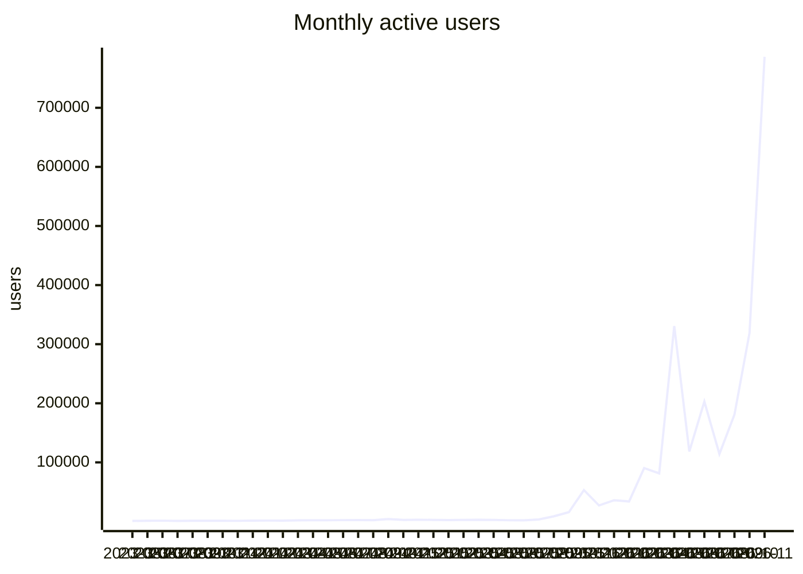

# VFB usage report

Generated 2026-11-28 from aggregate Google Analytics 4 counts for property 375054915, covering 2023-05-10 to 2026-11-27. Source tables: [`analytics/ga4/`](analytics/ga4/). Only summed counts are stored; nothing here identifies a user.

**Reading the numbers.** A large and growing share of 'users' and 'sessions' is automated traffic that loads one page and leaves within a second. Engaged hours (time with the page in the foreground) is barely touched by that traffic and is the most reliable measure of real use; seconds per session shows how bot-heavy a row is.

## Yearly totals

| year | peak monthly users | sessions | screenPageViews | engaged hours | sec/session |
|---|---|---|---|---|---|
| 2023 | 1,332 | 13,668 | 42,490 | 172.9 | 45.5 |
| 2024 | 4,045 | 62,091 | 465,976 | 1,046.3 | 60.7 |
| 2025 | 53,078 | 174,980 | 961,769 | 1,240.7 | 25.5 |
| 2026 | 786,362 | 2,399,275 | 5,922,047 | 4,921.6 | 7.4 |

## Monthly trend

```mermaid
xychart-beta
    title "Engaged hours per month"
    x-axis ["2023-05", "2023-06", "2023-07", "2023-08", "2023-09", "2023-10", "2023-11", "2023-12", "2024-01", "2024-02", "2024-03", "2024-04", "2024-05", "2024-06", "2024-07", "2024-08", "2024-09", "2024-10", "2024-11", "2024-12", "2025-01", "2025-02", "2025-03", "2025-04", "2025-05", "2025-06", "2025-07", "2025-08", "2025-09", "2025-10", "2025-11", "2025-12", "2026-01", "2026-02", "2026-03", "2026-04", "2026-05", "2026-06", "2026-07", "2026-08", "2026-09", "2026-10", "2026-11"]
    y-axis "hours"
    line [34.4, 51.4, 14.5, 5.6, 16.4, 27.8, 17.3, 5.6, 16.0, 5.2, 18.8, 66.8, 117.3, 88.8, 215.3, 51.6, 109.2, 145.8, 131.2, 80.3, 94.5, 130.5, 93.3, 107.5, 203.4, 60.9, 67.9, 113.5, 97.7, 89.3, 97.5, 84.8, 93.1, 89.5, 189.0, 110.6, 495.2, 120.8, 141.3, 223.3, 1963.3, 813.6, 681.9]
```

```mermaid
xychart-beta
    title "Monthly active users"
    x-axis ["2023-05", "2023-06", "2023-07", "2023-08", "2023-09", "2023-10", "2023-11", "2023-12", "2024-01", "2024-02", "2024-03", "2024-04", "2024-05", "2024-06", "2024-07", "2024-08", "2024-09", "2024-10", "2024-11", "2024-12", "2025-01", "2025-02", "2025-03", "2025-04", "2025-05", "2025-06", "2025-07", "2025-08", "2025-09", "2025-10", "2025-11", "2025-12", "2026-01", "2026-02", "2026-03", "2026-04", "2026-05", "2026-06", "2026-07", "2026-08", "2026-09", "2026-10", "2026-11"]
    y-axis "users"
    line [967, 1268, 1332, 960, 1106, 1297, 1242, 1087, 1362, 1557, 1492, 1863, 2053, 2072, 2280, 2479, 2250, 4045, 2756, 2996, 2711, 2483, 2594, 2961, 2634, 2044, 1950, 3396, 8753, 15773, 53078, 27089, 35882, 33896, 90461, 81384, 330801, 118372, 202893, 114152, 180888, 319023, 786362]
```

| month | activeUsers | newUsers | sessions | screenPageViews | engaged hours | sec/session |
|---|---|---|---|---|---|---|
| 2024-12 | 2,996 | 2,325 | 6,433 | 42,248 | 80.3 | 45.0 |
| 2025-01 | 2,711 | 1,830 | 7,149 | 57,703 | 94.5 | 47.6 |
| 2025-02 | 2,483 | 1,473 | 6,460 | 69,682 | 130.5 | 72.7 |
| 2025-03 | 2,594 | 1,923 | 7,298 | 70,667 | 93.3 | 46.0 |
| 2025-04 | 2,961 | 2,158 | 5,752 | 46,050 | 107.5 | 67.3 |
| 2025-05 | 2,634 | 1,976 | 5,584 | 49,953 | 203.4 | 131.1 |
| 2025-06 | 2,044 | 1,803 | 5,615 | 39,033 | 60.9 | 39.0 |
| 2025-07 | 1,950 | 1,514 | 6,599 | 43,636 | 67.9 | 37.0 |
| 2025-08 | 3,396 | 3,134 | 8,653 | 67,983 | 113.5 | 47.2 |
| 2025-09 | 8,753 | 10,370 | 15,167 | 293,319 | 97.7 | 23.2 |
| 2025-10 | 15,773 | 15,259 | 19,431 | 62,052 | 89.3 | 16.5 |
| 2025-11 | 53,078 | 51,557 | 55,532 | 92,601 | 97.5 | 6.3 |
| 2025-12 | 27,089 | 26,632 | 30,314 | 69,090 | 84.8 | 10.1 |
| 2026-01 | 35,882 | 35,655 | 41,654 | 84,515 | 93.1 | 8.0 |
| 2026-02 | 33,896 | 33,815 | 38,136 | 81,618 | 89.5 | 8.5 |
| 2026-03 | 90,461 | 89,967 | 95,391 | 204,564 | 189.0 | 7.1 |
| 2026-04 | 81,384 | 81,647 | 85,778 | 152,209 | 110.6 | 4.6 |
| 2026-05 | 330,801 | 328,117 | 328,909 | 419,823 | 495.2 | 5.4 |
| 2026-06 | 118,372 | 120,130 | 125,861 | 215,401 | 120.8 | 3.5 |
| 2026-07 | 202,893 | 200,564 | 203,206 | 285,273 | 141.3 | 2.5 |
| 2026-08 | 114,152 | 116,038 | 121,133 | 261,249 | 223.3 | 6.6 |
| 2026-09 | 180,888 | 183,665 | 230,953 | 1,586,357 | 1,963.3 | 30.6 |
| 2026-10 | 319,023 | 302,918 | 333,450 | 996,586 | 813.6 | 8.8 |
| 2026-11 | 786,362 | 723,422 | 801,891 | 1,634,452 | 681.9 | 3.1 |

## By site, last 12 months

Page views with no host name are the v2 viewer's in-app term changes and are counted under the viewer.

| site | sessions | screenPageViews | engaged hours | sec/session |
|---|---|---|---|---|
| v2 viewer | 1,490,002 | 4,329,034 | 3,302.3 | 8.0 |
| www / docs | 1,196,713 | 1,299,740 | 1,151.9 | 3.5 |
| other VFB services | 209,504 | 241,288 | 564.7 | 9.7 |
| CATMAID | 39,328 | 39,189 | 47.3 | 4.3 |
| other / mirrors | 84,103 | 9,234 | 21.9 | 0.9 |
| legacy Edinburgh hosts | 164,609 | 165,223 | 15.9 | 0.3 |
| VFBchat | 26 | 30 | 0.0 | 0.4 |

## Countries, last 12 months

Ranked by engaged hours. 212 countries in total.

| country | users (sum of months) | sessions | engaged hours | sec/session |
|---|---|---|---|---|
| United States | 155,098 | 196,867 | 1,500.9 | 27.4 |
| United Kingdom | 21,500 | 32,626 | 740.8 | 81.7 |
| China | 639,607 | 646,858 | 386.8 | 2.2 |
| Hong Kong | 403,247 | 401,155 | 254.3 | 2.3 |
| Germany | 17,548 | 25,471 | 207.9 | 29.4 |
| India | 15,862 | 19,119 | 199.1 | 37.5 |
| Puerto Rico | 258 | 1,616 | 148.7 | 331.2 |
| Canada | 8,822 | 12,623 | 115.3 | 32.9 |
| Brazil | 25,650 | 27,276 | 88.9 | 11.7 |
| Australia | 4,652 | 6,966 | 80.7 | 41.7 |
| Russia | 6,814 | 8,895 | 75.5 | 30.6 |
| Singapore | 1,018,809 | 1,008,284 | 69.7 | 0.2 |
| Chile | 3,139 | 3,723 | 64.5 | 62.3 |
| Japan | 10,859 | 12,847 | 60.1 | 16.9 |
| Poland | 4,031 | 5,354 | 51.6 | 34.7 |
| France | 5,402 | 7,001 | 51.1 | 26.3 |
| Türkiye | 5,669 | 7,001 | 50.3 | 25.9 |
| Mexico | 8,167 | 9,012 | 48.3 | 19.3 |
| Spain | 3,686 | 4,829 | 45.5 | 33.9 |
| Italy | 2,947 | 3,692 | 39.9 | 38.9 |
| South Korea | 1,754 | 3,351 | 37.3 | 40.0 |
| Indonesia | 15,130 | 15,765 | 36.6 | 8.4 |
| Netherlands | 3,649 | 4,487 | 34.0 | 27.3 |
| Pakistan | 4,981 | 5,242 | 33.2 | 22.8 |
| Philippines | 6,021 | 6,440 | 31.1 | 17.4 |
| New Zealand | 853 | 1,103 | 27.1 | 88.6 |
| Argentina | 6,449 | 6,923 | 27.0 | 14.1 |
| (not set) | 1,084 | 1,040 | 26.4 | 91.6 |
| Thailand | 3,200 | 3,751 | 25.3 | 24.3 |
| Israel | 1,782 | 2,494 | 24.3 | 35.1 |

## Cities, last 12 months

GA4 has no institution or network dimension, so city is the nearest proxy for where labs are. Cities with fewer than 5 users in a month are not stored. Data-centre cities (Ashburn, Council Bluffs, Singapore and similar) show up with near-zero seconds per session.

| city | country | months seen | sessions | engaged hours | sec/session |
|---|---|---|---|---|---|
| Dunblane | United Kingdom | 1 | 84 | 361.1 | 15,475.0 |
| Hong Kong | Hong Kong | 13 | 397,549 | 251.1 | 2.3 |
| Kashgar Prefecture | China | 3 | 187,699 | 87.3 | 1.7 |
| Singapore | Singapore | 13 | 908,101 | 57.4 | 0.2 |
| San Juan | Puerto Rico | 8 | 714 | 51.9 | 261.9 |
| Santiago | Chile | 12 | 1,934 | 48.7 | 90.6 |
| London | United Kingdom | 13 | 5,547 | 46.9 | 30.4 |
| Beijing | China | 13 | 24,923 | 42.8 | 6.2 |
| New York | United States | 13 | 5,408 | 39.3 | 26.2 |
| Los Angeles | United States | 13 | 3,436 | 31.2 | 32.7 |
| Urumqi | China | 5 | 76,163 | 30.9 | 1.5 |
| Chicago | United States | 13 | 5,703 | 27.7 | 17.5 |
| Harbin | China | 5 | 15,207 | 25.2 | 6.0 |
| Moscow | Russia | 11 | 2,560 | 24.9 | 35.0 |
| Frederick | United States | 1 | 17 | 24.7 | 5,235.5 |
| Bengaluru | India | 11 | 2,059 | 24.6 | 43.0 |
| Munich | Germany | 11 | 524 | 24.2 | 166.6 |
| Karachi | Pakistan | 10 | 1,054 | 22.0 | 75.1 |
| Athens | United States | 5 | 470 | 21.9 | 167.7 |
| San Jose | United States | 13 | 5,511 | 21.4 | 14.0 |
| Round Rock | United States | 2 | 50 | 21.2 | 1,525.3 |
| Phoenix | United States | 9 | 4,966 | 20.9 | 15.2 |
| Edinburgh | United Kingdom | 10 | 543 | 20.9 | 138.6 |
| Cambridge | United Kingdom | 13 | 1,913 | 19.6 | 36.8 |
| Sydney | Australia | 10 | 2,013 | 19.1 | 34.2 |
| Auckland | New Zealand | 8 | 484 | 19.0 | 141.4 |
| Istanbul | Türkiye | 12 | 2,366 | 18.7 | 28.5 |
| Flint Hill | United States | 7 | 5,559 | 17.9 | 11.6 |
| Cologne | Germany | 11 | 786 | 17.8 | 81.6 |
| Melbourne | Australia | 9 | 1,556 | 17.4 | 40.2 |
| Houston | United States | 13 | 2,294 | 16.6 | 26.1 |
| Dallas | United States | 13 | 2,020 | 16.3 | 29.0 |
| Miami | United States | 11 | 861 | 16.1 | 67.2 |
| Toronto | Canada | 13 | 1,804 | 15.9 | 31.7 |
| Atlanta | United States | 13 | 1,333 | 15.7 | 42.4 |
| Boston | United States | 13 | 2,069 | 15.7 | 27.4 |
| Brisbane | Australia | 9 | 1,173 | 14.6 | 44.8 |
| Warsaw | Poland | 13 | 1,706 | 14.4 | 30.4 |
| Berlin | Germany | 13 | 1,126 | 12.5 | 40.1 |
| Shanghai | China | 13 | 7,768 | 12.1 | 5.6 |
| Seattle | United States | 12 | 1,455 | 12.0 | 29.7 |
| Paris | France | 13 | 1,203 | 11.8 | 35.2 |
| Seoul | South Korea | 13 | 1,132 | 11.7 | 37.1 |
| Bangkok | Thailand | 9 | 1,554 | 11.4 | 26.4 |
| Ashburn | United States | 13 | 7,422 | 11.4 | 5.5 |
| Des Moines | United States | 11 | 3,939 | 11.1 | 10.1 |
| Philadelphia | United States | 13 | 1,607 | 11.1 | 24.8 |
| Hangzhou | China | 13 | 6,163 | 11.0 | 6.4 |
| Shenzhen | China | 13 | 1,872 | 10.8 | 20.8 |
| Mumbai | India | 12 | 1,028 | 10.7 | 37.4 |

## Most viewed terms

Taken from the term id in viewer URLs and `/reports/` and `/term/` pages. The adult brain template leads because it is the default scene, not because people search for it.

### Last 30 days

| term | label | views | engaged hours | days seen |
|---|---|---|---|---|
| VFB_00101567 | JRC2018Unisex | 598,271 | 106.2 | 30 |
| FBbt_00003624 | adult brain | 10,663 | 2.8 | 30 |
| VFB_00108w0p | BANC:brain_neuropil on JRC2018Unisex | 9,333 | 4.0 | 30 |
| FBbt_00003748 | medulla | 6,161 | 1.9 | 30 |
| FBbt_00003681 | adult lateral accessory lobe | 5,335 | 1.3 | 30 |
| VFBexp_FBtp0122 |  | 4,493 | 0.7 | 30 |
| VFBexp_FBtp0105 |  | 4,405 | 0.8 | 30 |
| VFBexp_FBtp0104 |  | 4,229 | 0.8 | 30 |
| VFBexp_FBtp0101 |  | 4,216 | 0.8 | 30 |
| VFBexp_FBtp0121 |  | 4,175 | 0.7 | 30 |
| FBbt_00005093 | nervous system | 4,166 | 1.2 | 30 |
| VFBexp_FBtp0106 |  | 4,048 | 0.8 | 30 |
| VFBexp_FBtp0103 |  | 4,044 | 0.8 | 30 |
| VFBexp_FBtp0102 |  | 3,999 | 0.8 | 30 |
| FBbt_00040041 | vest | 3,970 | 1.1 | 30 |
| FBbt_00040043 | anterior ventrolateral protocerebrum | 3,962 | 0.9 | 30 |
| VFBexp_FBtp0100 |  | 3,943 | 0.8 | 30 |
| VFBexp_FBtp0123 |  | 3,563 | 0.6 | 30 |
| VFBexp_FBtp0107 |  | 3,556 | 0.7 | 30 |
| VFBexp_FBtp0124 |  | 3,272 | 0.6 | 30 |
| FBbt_00045048 | saddle | 3,263 | 0.7 | 30 |
| VFB_jrchk7yg | WEDPN2A_R (FlyEM-HB:885788485) | 2,827 | 0.2 | 28 |
| FBbt_00003004 | adult | 2,748 | 0.6 | 30 |
| VFBexp_FBtp0099 |  | 2,680 | 0.5 | 30 |
| FBbt_00040042 | posterior ventrolateral protocerebrum | 2,523 | 0.7 | 30 |

### Last 12 months

| term | label | views | engaged hours | days seen |
|---|---|---|---|---|
| VFB_00101567 | JRC2018Unisex | 1,484,307 | 1,737.8 | 365 |
| FBbt_00003624 | adult brain | 97,474 | 51.0 | 338 |
| FBbt_00003748 | medulla | 73,166 | 39.4 | 347 |
| FBbt_00003681 | adult lateral accessory lobe | 59,567 | 28.9 | 346 |
| FBbt_00040041 | vest | 49,281 | 23.0 | 334 |
| FBbt_00005093 | nervous system | 43,940 | 20.5 | 317 |
| FBbt_00040043 | anterior ventrolateral protocerebrum | 42,052 | 19.9 | 312 |
| FBbt_00045048 | saddle | 39,997 | 64.1 | 313 |
| FBbt_00003004 | adult | 37,134 | 16.8 | 302 |
| FBbt_00003680 | nodulus | 35,016 | 7.8 | 263 |
| FBbt_00047887 | adult central brain | 30,362 | 9.6 | 295 |
| FBbt_00040042 | posterior ventrolateral protocerebrum | 28,527 | 12.5 | 303 |
| VFB_00108w0p | BANC:brain_neuropil on JRC2018Unisex | 27,240 | 10.9 | 82 |
| FBbt_00003678 | ellipsoid body | 23,221 | 13.0 | 300 |
| VFB_jrchk7yg | WEDPN2A_R (FlyEM-HB:885788485) | 23,126 | 6.1 | 187 |
| FBbt_00014013 | adult gnathal ganglion | 22,094 | 12.6 | 289 |
| FBbt_00045027 | wedge | 21,721 | 9.1 | 293 |
| VFB_00050000 | L1 larval CNS ssTEM - Cardona/Janelia | 18,582 | 32.3 | 326 |
| FBbt_00007050 | adult cerebrum | 18,111 | 6.5 | 275 |
| VFB_00102107 | ME on JRC2018Unisex adult brain | 17,273 | 11.1 | 262 |
| FBbt_00045050 | flange | 15,415 | 6.5 | 257 |
| FBbt_00003632 | adult central complex | 14,673 | 5.1 | 226 |
| FBbt_00045051 | cantle | 14,508 | 2.3 | 226 |
| FBbt_00053384 | adult primary visual center | 14,434 | 6.2 | 231 |
| FBbt_00110636 | adult cerebral ganglion | 14,264 | 5.4 | 267 |

### All time

| term | label | views | engaged hours | days seen |
|---|---|---|---|---|
| VFB_00101567 | JRC2018Unisex | 1,691,120 | 1,987.4 | 1,017 |
| FBbt_00003624 | adult brain | 110,991 | 74.7 | 904 |
| FBbt_00003748 | medulla | 83,322 | 61.3 | 895 |
| FBbt_00003681 | adult lateral accessory lobe | 66,227 | 43.3 | 867 |
| FBbt_00040041 | vest | 55,693 | 34.8 | 839 |
| FBbt_00040043 | anterior ventrolateral protocerebrum | 47,402 | 30.2 | 762 |
| FBbt_00005093 | nervous system | 45,657 | 23.2 | 475 |
| FBbt_00045048 | saddle | 44,468 | 73.2 | 773 |
| FBbt_00003004 | adult | 39,625 | 19.5 | 515 |
| FBbt_00003680 | nodulus | 36,910 | 12.1 | 567 |
| FBbt_00047887 | adult central brain | 35,045 | 16.2 | 689 |
| FBbt_00040042 | posterior ventrolateral protocerebrum | 31,900 | 20.1 | 715 |
| VFB_00108w0p | BANC:brain_neuropil on JRC2018Unisex | 27,240 | 10.9 | 82 |
| VFB_00050000 | L1 larval CNS ssTEM - Cardona/Janelia | 26,818 | 45.7 | 835 |
| FBbt_00003678 | ellipsoid body | 26,588 | 19.9 | 674 |
| FBbt_00014013 | adult gnathal ganglion | 25,861 | 21.3 | 674 |
| FBbt_00045027 | wedge | 24,460 | 15.1 | 670 |
| VFB_jrchk7yg | WEDPN2A_R (FlyEM-HB:885788485) | 23,465 | 6.8 | 203 |
| VFB_00102107 | ME on JRC2018Unisex adult brain | 21,309 | 16.2 | 563 |
| FBbt_00007050 | adult cerebrum | 21,092 | 10.9 | 588 |
| FBbt_00003679 | fan-shaped body | 19,534 | 13.0 | 630 |
| FBbt_00045050 | flange | 17,532 | 11.1 | 569 |
| VFB_00030867 | adult mushroom body on adult brain template JFRC2 | 17,528 | 13.1 | 456 |
| FBbt_00110636 | adult cerebral ganglion | 16,855 | 8.5 | 574 |
| FBbt_00003632 | adult central complex | 16,623 | 8.8 | 442 |

### Templates in use, last 12 months

| template | label | views |
|---|---|---|
| VFB_00101567 | JRC2018Unisex | 2,034,689 |
| VFB_00050000 | L1 larval CNS ssTEM - Cardona/Janelia | 39,020 |
| VFB_00200000 | JRC2018UnisexVNC | 26,255 |
| VFB_00017894 | adult brain template JFRC2 | 20,337 |
| VFB_00049000 | L3 CNS template - Wood2018 | 10,681 |
| VFB_00101384 | JRC_FlyEM_Hemibrain | 6,835 |
| VFB_00110000 | Adult Head (McKellar2020) | 3,422 |
| VFB_00120000 | Adult T1 Leg (Kuan2020) | 2,220 |
| VFB_00100000 | adult VNS template - Court2018 | 1,405 |
| FBbt_00003624 | adult brain | 1,385 |

## Website and documentation pages, last 12 months

| pagePath | screenPageViews | engaged hours |
|---|---|---|
| / | 233,925 | 662.5 |
| /docs/ | 20,903 | 48.4 |
| /about/ | 6,898 | 30.3 |
| /docs/overview/ | 4,522 | 25.4 |
| /docs/data/ | 6,969 | 22.8 |
| /blog/releases/catmaid/ | 564 | 22.6 |
| /docs/tutorials/vfb-mcp-guide/ | 2,029 | 11.5 |
| /docs/website-features/3dviewer/ | 3,051 | 11.1 |
| /docs/tutorials/ | 2,870 | 6.8 |
| /hosted/ | 3,219 | 6.7 |
| /docs/contribution-guidelines/ | 1,481 | 5.9 |
| /about/whichfly/ | 564 | 5.7 |
| /docs/data/download-connectomes/ | 615 | 4.1 |
| /blog/news/ | 1,780 | 4.1 |
| /docs/website-features/search_query/ | 946 | 4.1 |
| /docs/tutorials/apis/ | 838 | 3.9 |
| /docs/apis/ | 801 | 3.8 |
| /docs/concepts/flylight_tiles/ | 643 | 3.7 |
| /blog/2026/09/06/vfb-self-led-learning-sessions-a-free-online-workshop-open-to-everyone/ | 1,222 | 3.5 |
| /docs/website-features/ | 1,262 | 3.3 |
| /docs/concepts/ | 613 | 2.8 |
| /docs/concepts/neuron-counts/ | 361 | 2.7 |
| /docs/data/em/ | 547 | 2.6 |
| /docs/website-features/download/ | 676 | 2.5 |
| /docs/tutorials/apis/vfb_api_overview/ | 390 | 2.5 |
| /docs/concepts/cell_types/ | 410 | 2.4 |
| /docs/tutorials/website/bulkdownloads/ | 591 | 2.3 |
| /docs/tutorials/website/similarityscore/ | 358 | 2.3 |
| /about/hosted/ | 908 | 2.3 |
| /about/whatisvfb/ | 683 | 2.2 |

## How people arrive

Engaged sessions by channel and year.

| channel | 2023 | 2024 | 2025 | 2026 |
|---|---|---|---|---|
| AI Assistant | 0 | 0 | 0 | 2,717 |
| Direct | 1,628 | 10,737 | 124,445 | 2,075,230 |
| Organic Search | 3,198 | 18,605 | 30,520 | 206,573 |
| Organic Shopping | 0 | 3 | 2 | 0 |
| Organic Social | 7 | 454 | 125 | 1,470 |
| Organic Video | 0 | 2 | 0 | 159 |
| Referral | 495 | 18,973 | 11,071 | 10,468 |
| Unassigned | 0 | 6 | 60 | 1,537 |

Top sources, last 12 months.

| sessionSource | sessions | engaged hours |
|---|---|---|
| google | 196,478 | 2,559.4 |
| (direct) | 2,107,142 | 1,687.6 |
| bing | 14,741 | 302.0 |
| (not set) | 91,950 | 111.8 |
| chatgpt.com | 2,906 | 39.8 |
| yahoo | 894 | 34.9 |
| duckduckgo | 2,881 | 33.1 |
| cn.bing.com | 838 | 29.3 |
| splitgal4.janelia.org | 1,573 | 14.8 |
| gemini.google.com | 588 | 13.9 |
| codex.flywire.ai | 1,460 | 13.6 |
| flybase.org | 916 | 13.5 |
| ecosia.org | 816 | 10.2 |
| github.com | 662 | 9.5 |
| moodle.carleton.edu | 120 | 6.3 |
| trafficheap.cc | 502 | 5.8 |
| trafficheap.com | 502 | 5.8 |
| en.wikipedia.org | 355 | 5.6 |
| science.org | 149 | 5.4 |
| search.brave.com | 310 | 5.0 |
| janelia.org | 146 | 4.4 |
| yandex.ru | 252 | 4.0 |
| neuronbridge.janelia.org | 76 | 3.8 |
| cell.com | 227 | 3.7 |
| translate.google.com | 223 | 3.6 |

## Queries run in the viewer, last 12 months

| query | runs |
|---|---|
| neuronneuronconnectivit | 30,759 |
| neuronregionconnectivit | 28,753 |
| similarmorphologyto | 20,606 |
| listallavailableimages | 8,594 |
| findstocks | 6,400 |
| allalignedimages | 5,764 |
| similarmorphologytonb | 5,757 |
| anatomyexpressedin | 5,242 |
| similarmorphologytopart | 4,285 |
| imagesneurons | 3,228 |
| epfrag | 2,203 |
| downstreamclassconnecti | 1,819 |
| upstreamclassconnectivi | 1,580 |
| neuronsparthere | 1,405 |
| similarmorphologytonbex | 1,083 |
| alldatasets | 1,023 |
| aligneddatasets | 987 |
| partsof | 857 |
| subclassesof | 796 |
| transgeneexpressionhere | 697 |
| expressioncluster | 518 |
| neuronssynaptic | 441 |
| targetneurons | 438 |
| painteddomains | 435 |
| neuronspostsynaptichere | 373 |

## VFBchat and MCP

| month | chat_query | mcp_tool_call |
|---|---|---|
| 2026-02 | 70 | 492 |
| 2026-03 | 354 | 2,258 |
| 2026-04 | 575 | 7,992 |
| 2026-05 | 17 | 971 |
| 2026-06 | 358 | 30,858 |
| 2026-07 | 9 | 18,938 |
| 2026-08 | 1,017 | 89,583 |
| 2026-09 | 797 | 84,835 |
| 2026-10 | 224 | 28,191 |
| 2026-11 | 74 | 16,657 |

## Viewer reliability

| month | session_start | disconnected | reconnected-resumed | reconnect-failed-reloading | reconnect-exhausted | disconnects per 100 sessions |
|---|---|---|---|---|---|---|
| 2025-06 | 3,466 | 1,365 | 0 | 12 | 0 | 39.4 |
| 2025-07 | 4,662 | 2,057 | 0 | 18 | 0 | 44.1 |
| 2025-08 | 6,571 | 1,680 | 0 | 17 | 0 | 25.6 |
| 2025-09 | 6,265 | 1,170 | 0 | 24 | 0 | 18.7 |
| 2025-10 | 7,777 | 1,232 | 0 | 17 | 0 | 15.8 |
| 2025-11 | 8,460 | 1,163 | 0 | 24 | 0 | 13.7 |
| 2025-12 | 10,434 | 1,359 | 0 | 8 | 0 | 13.0 |
| 2026-01 | 21,913 | 1,530 | 0 | 30 | 0 | 7.0 |
| 2026-02 | 24,790 | 1,536 | 0 | 31 | 0 | 6.2 |
| 2026-03 | 23,808 | 5,059 | 0 | 465 | 0 | 21.2 |
| 2026-04 | 23,996 | 2,933 | 0 | 33 | 0 | 12.2 |
| 2026-05 | 55,407 | 2,314 | 0 | 44 | 0 | 4.2 |
| 2026-06 | 23,505 | 2,149 | 0 | 158 | 0 | 9.1 |
| 2026-07 | 45,208 | 2,280 | 0 | 49 | 0 | 5.0 |
| 2026-08 | 24,841 | 3,675 | 0 | 530 | 0 | 14.8 |
| 2026-09 | 51,588 | 75,199 | 30,436 | 38,791 | 1,919 | 145.8 |
| 2026-10 | 142,443 | 15,122 | 6,573 | 7,432 | 588 | 10.6 |
| 2026-11 | 350,497 | 24 | 0 | 0 | 3 | 0.0 |

Load times from the timing suffix on viewer events (months with at least 100 samples).

| month | event | n | median s | p95 s |
|---|---|---|---|---|
| 2026-09 | direct-geom:obj:ok | 61,923 | 1.4 | 25.4 |
| 2026-10 | direct-geom:obj:ok | 107,017 | 3.7 | 8.1 |
| 2026-11 | direct-geom:obj:ok | 184,393 | 3.7 | 6.4 |
| 2026-09 | direct-terminfo:ok | 109,210 | 0.4 | 3.0 |
| 2026-10 | direct-terminfo:ok | 271,878 | 0.7 | 2.4 |
| 2026-11 | direct-terminfo:ok | 435,904 | 0.8 | 4.5 |
| 2026-09 | startup-first-term | 50,164 | 5.2 | 58.0 |
| 2026-10 | startup-first-term | 100,642 | 6.1 | 16.0 |
| 2026-11 | startup-first-term | 190,186 | 6.0 | 13.0 |
| 2026-09 | startup-model | 54,086 | 2.8 | 25.0 |
| 2026-10 | startup-model | 158,414 | 1.3 | 5.2 |
| 2026-11 | startup-model | 345,886 | 1.3 | 2.9 |
| 2026-09 | term-load:ok | 104,726 | 1.0 | 45.0 |
| 2026-10 | term-load:ok | 167,247 | 3.9 | 11.0 |
| 2026-11 | term-load:ok | 231,313 | 4.6 | 11.0 |

## Outbound links clicked, last 12 months

| linkDomain | clicks |
|---|---|
| virtualflybrain.org | 1,694 |
| neuronbridge.janelia.org | 1,438 |
| pypi.org | 1,422 |
| github.com | 994 |
| v2.virtualflybrain.org | 707 |
| insectbraindb.org | 679 |
| flweb.janelia.org | 445 |
| colab.research.google.com | 425 |
| translate.google.com | 398 |
| doi.org | 395 |
| flybase.org | 221 |
| zenodo.org | 154 |
| chat.virtualflybrain.org | 103 |
| virtualflybrain.bsky.social | 89 |
| codex.flywire.ai | 89 |
| vfb3-mcp.virtualflybrain.org | 60 |
| neuprint.janelia.org | 57 |
| google.com | 57 |
| janelia.org | 53 |
| neurofly.org | 51 |

## Devices and browsers, last 12 months

| deviceCategory | browser | sessions | engaged hours |
|---|---|---|---|
| desktop | Chrome | 2,270,487 | 3,268.6 |
| desktop | Edge | 22,907 | 480.4 |
| mobile | Chrome | 50,042 | 364.3 |
| desktop | Safari | 15,986 | 220.0 |
| desktop | Firefox | 12,006 | 212.3 |
| desktop | Opera | 14,832 | 181.0 |
| mobile | Safari | 35,705 | 170.4 |
| tablet | Chrome | 2,998 | 39.2 |
| tablet | Safari | 1,098 | 13.4 |
| mobile | Samsung Internet | 1,646 | 11.7 |
| mobile | Firefox | 1,311 | 11.4 |
| desktop | YaBrowser | 532 | 7.9 |

## What this data cannot show

- **Institutions.** GA4 dropped the network-domain dimension and never exposes IP addresses. City is as close as it gets.
- **Search terms typed into VFB.** The viewer does not send a `search` event, so `searchTerm` is empty. Term popularity above comes from term ids in URLs.
- **Event detail.** No custom dimensions are registered on the property, so event parameters (`event_label`, `event_category`, and the VFBchat and MCP parameters such as tool name and topic) are discarded from reports. Registration is not retroactive.
- **Yearly unique users.** Users do not add up across days or months; only daily and monthly uniques are stored.
